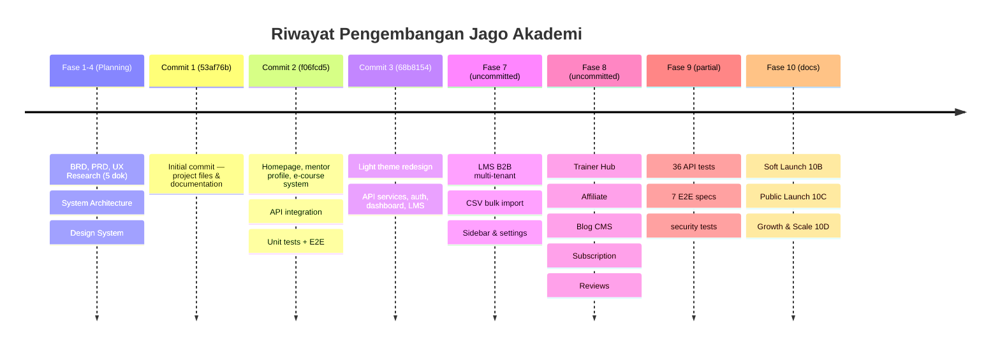
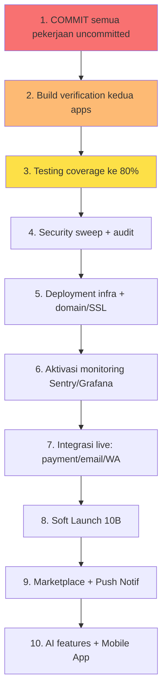
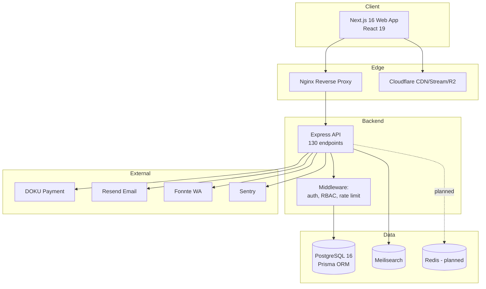

# 📊 PROJECT PROGRESS REPORT — JAGO AKADEMI

> **Platform Edukasi Digital Terintegrasi (B2C + B2B)**
> Dokumen: Master Progress Report · Technical Documentation · Knowledge Base · Development Roadmap
> Versi: **1.0.0** | Tanggal Audit: **25 Juni 2026** | Status: **Development ~85%**
> Branch aktif: `redesign/light-theme` | Auditor: Engineering (Claude)

---

## 📑 Daftar Isi

1. [Executive Summary](#1-executive-summary)
2. [Timeline Project](#2-timeline-project)
3. [Task Management](#3-task-management)
4. [Feature Progress](#4-feature-progress)
5. [Website Development Roadmap](#5-website-development-roadmap)
6. [Technical Architecture](#6-technical-architecture)
7. [File Changes](#7-file-changes)
8. [Technical Decision Log](#8-technical-decision-log)
9. [Brainstorming Summary](#9-brainstorming-summary)
10. [Bug Tracking](#10-bug-tracking)
11. [Technical Debt](#11-technical-debt)
12. [Blockers & Risks](#12-blockers--risks)
13. [Improvement Recommendation](#13-improvement-recommendation)
14. [Business Perspective](#14-business-perspective)
15. [Next Sprint Planning](#15-next-sprint-planning)
16. [Master TODO List](#16-master-todo-list)
17. [Final Assessment](#17-final-assessment)
18. [Lampiran: Temuan Inkonsistensi Data](#18-lampiran--temuan-inkonsistensi-data)

---

## 1. Executive Summary

### 1.1 Kondisi Project Saat Ini

**Jago Akademi** adalah platform edukasi digital terintegrasi yang menyatukan **6 unit bisnis** (E-Course, E-Book, Event, Trainer Program, LMS B2B, Marketplace Materi) dalam satu ekosistem. Project telah melewati seluruh tahap perencanaan (Fase 1–4) dan sebagian besar pengembangan inti (Fase 5–8), dengan dokumentasi bisnis-teknis yang sangat lengkap (~400 halaman, 18 dokumen).

Saat ini codebase berbentuk **monorepo (Turborepo + npm workspaces)** dengan:
- **Backend API**: Express + Prisma, **41 model database**, **26 route module**, **±130 endpoint REST**.
- **Frontend Web**: Next.js 16 + React 19, **52 halaman/route**, **36 komponen**.
- **Testing**: 36 file test API (6 unit + 30 integrasi) + 7 E2E Playwright.
- **Infrastruktur**: Docker Compose production, Nginx reverse proxy, konfigurasi CI-ready.

### 1.2 Tujuan Utama Project

> **Positioning:** "Platform pertama di Indonesia yang menyatukan ekosistem belajar, berlatih, dan berkarier dalam satu pintu digital."

| Tujuan | Target M12 |
|--------|-----------|
| Registered User | 50.000 |
| Paying Customer | 10.000 |
| Monthly Recurring Revenue | Rp 500 Juta |
| Annual Run Rate | Rp 6 Miliar |
| B2B LMS Client | 50 institusi |
| Certified Trainer | 500 |
| Gross Margin | > 65% |

### 1.3 Status Pengembangan Keseluruhan

```mermaid
graph LR
    A[Fase 1-4: Planning] -->|100%| B[Fase 5-6: MVP Core]
    B -->|89%| C[Fase 7: LMS B2B]
    C -->|88%| D[Fase 8: Phase 2 Features]
    D -->|92%| E[Fase 9: Testing/QA]
    E -->|50%| F[Fase 10: Launch]
    F -->|70% docs, 0% exec| G[Production]
    style A fill:#4ade80
    style B fill:#4ade80
    style C fill:#86efac
    style D fill:#86efac
    style E fill:#fde047
    style F fill:#fdba74
    style G fill:#f87171
```



### 1.4 Persentase Progres

| Layer | Status | Progres |
|-------|--------|---------|
| Dokumentasi bisnis & teknis | ✅ Selesai | **100%** |
| Database schema (Prisma, 41 model) | ✅ Selesai | **100%** |
| Backend API (26 route, 130 endpoint) | ✅ Hampir selesai | **95%** |
| Frontend (52 halaman) | ✅ Hampir selesai | **92%** |
| Testing (unit/integration/E2E) | 🔵 Parsial | **50%** |
| Deployment / Infra | 📋 Config siap, belum dieksekusi | **60%** |
| **TOTAL BOBOT KESELURUHAN** | 🔵 | **≈ 85%** |

> ⚠️ **TEMUAN KRITIS:** Seluruh pekerjaan Fase 8 & 10 (53 file baru + 23 file dimodifikasi) **BELUM DI-COMMIT** ke git. Repository hanya memiliki 3 commit. Ini adalah risiko kehilangan pekerjaan tertinggi saat ini — lihat [Bagian 12](#12-blockers--risks).

---

## 2. Timeline Project

### 2.1 Kronologi Pekerjaan



### 2.2 Milestone Tercapai

| Milestone | Fase | Status | Bukti |
|-----------|------|--------|-------|
| PRD & BRD Final | 1 | ✅ | `docs/01-BRD.md`, `docs/02-PRD.md` |
| UX Research (5 dokumen) | 2 | ✅ | `docs/02a-e-*.md` |
| Design System v1 | 3 | ✅ | `docs/06-DESIGN-SYSTEM.md` |
| System Architecture | 4 | ✅ | `docs/03-SYSTEM-ARCHITECTURE.md` + Prisma schema |
| MVP Core (auth, course, dashboard) | 5 | ✅ | commit `f06fcd5`, `68b8154` |
| Payment Live (DOKU) | 6 | ✅ (kode) | `dokuService.ts`, `checkout.ts`, `webhooks.ts` |
| LMS B2B Multi-tenant | 7 | ✅ (kode) | `lms.ts` (30 endpoint), `app/lms/[tenantSlug]/` |
| Phase 2 Features | 8 | ✅ (kode) | trainer, affiliate, blog, subscription, reviews |
| Testing & QA | 9 | 🔵 50% | 43 file test |
| Launch Strategy Docs | 10B/C/D | ✅ | `docs/10B/C/D-*.md` |
| **FULL PUBLIC LAUNCH** | 10 | ⬜ | Belum dieksekusi |

### 2.3 Catatan Tanggal

> ⚠️ **Inkonsistensi tanggal:** Dokumen menyebut "22 Juni 2026", memory project menyebut "2 Juli 2026", sistem audit menunjukkan "25 Juni 2026". Rekomendasi: standarkan ke satu sumber tanggal (git commit date sebagai acuan objektif).

---

## 3. Task Management

### 3.1 ✅ Completed (Selesai)

**Dokumentasi & Perencanaan**
- [x] BRD, PRD, UX Research (5 dok), System Architecture, Design System, User Journey, Roadmap
- [x] Test Plan (`09-TEST-PLAN.md`), Launch Checklist, Deployment Guide
- [x] Strategi Fase 10B (Soft Launch), 10C (Public Launch), 10D (Growth & Scale)

**Backend (API)**
- [x] Auth lengkap: register, login, Google OAuth, email verify, reset password, refresh token (10 endpoint)
- [x] 41 model Prisma mencakup 6 unit bisnis
- [x] Payment DOKU + webhook handler + refund
- [x] LMS B2B multi-tenant (30 endpoint)
- [x] Trainer, Affiliate, Blog, Subscription, Reviews, Events (route baru Fase 8)
- [x] `PATCH /api/users/me` (fix bug profil)
- [x] Certificate service + QR verification
- [x] Meilisearch, Cloudflare Stream, Resend email, Fonnte WA (service layer)
- [x] `prisma/seed.ts` (seed data)

**Frontend (Web)**
- [x] 52 halaman: homepage, e-course 3-level, mentor, ebook, event, blog, dashboard, admin panel, LMS portal, trainer-hub
- [x] CSV bulk import (batches page)
- [x] Trainer profile page + LMS admin layout + settings
- [x] Course completion review prompt
- [x] Blog admin edit feature
- [x] XSS fix pada lesson player (2 lokasi)
- [x] `error.tsx`, `not-found.tsx`, `robots.ts`, `sitemap.ts`

**Testing**
- [x] 6 unit test (hash, token, authorize, validateBody, meilisearch, services)
- [x] 30 integration test (auth, courses, events, LMS, checkout, orders, dll)
- [x] 7 E2E Playwright (homepage, auth, e-course, events-blog, responsive, smoke, visual-baseline)
- [x] Security test suite awal

### 3.2 🔵 In Progress (Sedang Dikerjakan)

| Task | Progres | Catatan |
|------|---------|---------|
| Coverage boost integration test (dashboard, users, categories, videos, ebooks) | ~60% | Target 80% |
| Phase 8 route test (trainer, blog, affiliate, subscription) | Parsial | File ada, coverage belum terverifikasi |
| Security test sweep (auth bypass, authorization, input validation) | 1 file | Perlu diperluas |
| E2E expansion ke 20+ skenario | 7 file | Butuh +13 skenario |

### 3.3 ⬜ Pending (Belum Dimulai)

- [ ] Performance: Lighthouse script + optimasi terukur
- [ ] Full test suite run + coverage report resmi (belum ada angka coverage terverifikasi)
- [ ] Build verification produksi (`npm run build` kedua apps)
- [ ] **Commit seluruh pekerjaan uncommitted** (KRITIS)
- [ ] Deployment eksekusi (Docker + domain + SSL)
- [ ] Monitoring live (Sentry, Grafana)
- [ ] Integrasi live (payment production, email production, WA)
- [ ] Push notification (OneSignal) — belum ada di codebase
- [ ] Redis + BullMQ queue (env ada, implementasi belum terlihat)
- [ ] CRM in-house module
- [ ] Marketplace Materi Event (unit bisnis ke-6 — belum ada route/halaman khusus)

### 3.4 ❌ Cancelled / Berubah

| Item | Keputusan | Alasan |
|------|-----------|--------|
| Midtrans/Xendit sebagai payment | Diganti **DOKU** | Keputusan final requirements (lihat memory `project-decisions-final`) |
| Dark theme (awal) | Diganti **light theme** | Redesign branch `redesign/light-theme` |
| ~~`/kursus` route~~ | Redirect permanen → `/e-course` | Restrukturisasi IA (next.config redirects) |

---

## 4. Feature Progress

### 4.1 Matriks Fitur per Unit Bisnis

| # | Unit Bisnis | Fitur Inti | Backend | Frontend | Status |
|---|-------------|-----------|---------|----------|--------|
| 1 | **E-Course** | Katalog 3-level, video player, progress, quiz, sertifikat | ✅ | ✅ | **95%** |
| 2 | **E-Book** | Toko, detail, purchase | ✅ | ✅ | **85%** |
| 3 | **Event** | Listing, detail, registrasi, tiket QR | ✅ | ✅ | **85%** |
| 4 | **Trainer Program** | Trainer Hub, course builder, payout, profil | ✅ | ✅ | **88%** |
| 5 | **LMS B2B** | Multi-tenant, batch, invite, sertifikat branded, laporan | ✅ | ✅ | **88%** |
| 6 | **Marketplace Materi** | Penjualan rekaman/modul pasca-event | ⚠️ Parsial | ❌ | **20%** |

> ⚠️ **Temuan:** Unit bisnis ke-6 (**Marketplace Materi Event**) adalah yang paling belum tergarap. Tidak ada route API atau halaman frontend khusus. Perlu klarifikasi apakah ditunda ke fase berikutnya.

### 4.2 Fitur Lintas-Modul

| Fitur | Fungsi | Status |
|-------|--------|--------|
| **Autentikasi** | Register, login, Google OAuth, email verify, reset password, JWT + refresh token | ✅ 95% |
| **RBAC** | Multi-role (`UserRole` model, `super_admin` bypass, `authorize` middleware) | ✅ 90% |
| **Payment** | DOKU (VA, QRIS, e-wallet), webhook, refund | ✅ 88% (belum test produksi) |
| **Kupon & Promo** | Kode diskon, validasi, admin management | ✅ 90% |
| **Affiliate** | Referral link, komisi, withdrawal | ✅ 85% |
| **Subscription** | Paket langganan | ✅ 80% |
| **Review & Rating** | Review kursus, moderasi admin | ✅ 85% |
| **Blog CMS** | CRUD artikel, publish, kategori | ✅ 90% |
| **Sertifikat** | Auto-generate PDF + QR verifikasi publik | ✅ 90% |
| **Search** | Meilisearch integration | ✅ 80% |
| **Notifikasi Email** | Resend (transaksional) | ⚠️ 70% (belum test produksi) |
| **Notifikasi WA** | Fonnte | ⚠️ 60% (service ada, belum live) |
| **Admin Panel** | Dashboard, user, kursus, transaksi, event, kupon, review, blog, LMS | ✅ 90% |
| **Push Notification** | OneSignal | ❌ 0% (belum diimplementasi) |
| **Search Analytics / BI** | Dashboard analytics lanjutan | ❌ 10% |

### 4.3 Fitur Masih Dalam Pengembangan

- 🔵 **Marketplace Materi Event** — perlu model, route, halaman
- 🔵 **Push Notification** — OneSignal integration
- 🔵 **Advanced Analytics/Reporting** — dashboard BI untuk admin & B2B
- 🔵 **CRM in-house** — pipeline B2B leads
- 🔵 **Redis/BullMQ** — background jobs (email queue, video processing)

---

## 5. Website Development Roadmap

> Analisis detail seluruh pekerjaan yang masih perlu dikembangkan. Setiap item: **Tujuan · Alasan · Prioritas · Kompleksitas · Dependency · Dampak Bisnis · Urutan**.

### 5.1 Halaman (Pages) yang Masih Perlu Dibuat

| Halaman | Tujuan | Prioritas | Kompleksitas | Dependency | Dampak Bisnis |
|---------|--------|-----------|--------------|------------|---------------|
| `/marketplace` + detail | Jual materi pasca-event (unit bisnis ke-6) | **High** | Tinggi | Model + route baru | Membuka revenue stream ke-6 |
| `/trainer-program` (landing) | Halaman jual program sertifikasi trainer | **High** | Sedang | Trainer module | Akuisisi 500 trainer |
| `/lms` (landing B2B) | Halaman marketing paket LMS | **High** | Sedang | — | Lead gen 50 klien B2B |
| `/afiliasi` (landing publik) | Rekrut affiliate | Medium | Rendah | Affiliate module | Kanal CAC terendah |
| Halaman CRM admin | Kelola pipeline B2B | Medium | Tinggi | CRM module | Efisiensi sales |
| Dashboard analytics B2B | QBR untuk klien LMS | Medium | Tinggi | Reporting engine | Retensi B2B |

### 5.2 Dashboard yang Masih Perlu Dikembangkan

| Dashboard | Tujuan | Prioritas | Kompleksitas | Dampak |
|-----------|--------|-----------|--------------|--------|
| Admin Analytics/BI | Revenue, funnel, cohort, churn | **High** | Tinggi | Data-driven decision |
| Trainer Analytics lanjutan | Earning, student engagement, conversion | Medium | Sedang | Retensi trainer |
| LMS Client QBR Dashboard | Completion rate, active user, NPS per tenant | Medium | Sedang | Upsell B2B |
| Finance Dashboard | Payout, refund, rekonsiliasi | Medium | Sedang | Kontrol keuangan |

### 5.3 Modul yang Belum Dikembangkan

| Modul | Tujuan | Alasan | Prioritas | Kompleksitas | Dependency |
|-------|--------|--------|-----------|--------------|------------|
| **Marketplace Materi** | Revenue stream ke-6 | Unit bisnis belum digarap | High | Tinggi | Prisma model, R2 storage |
| **CRM in-house** | Kelola lead B2B | Keputusan final: in-house | Medium | Tinggi | Email service, pipeline schema |
| **Push Notification** | Re-engagement | Retensi user | Medium | Sedang | OneSignal SDK |
| **Background Jobs (BullMQ)** | Async email/video/report | Skalabilitas | High | Sedang | Redis |
| **Marketing Materi Event** | C2C creator upload | Klarifikasi scope diperlukan | Low | Tinggi | Storage + moderasi |

### 5.4 UI/UX Improvement

- **Tujuan:** Konsistensi visual light theme, hierarchy, motion yang bermakna.
- **Alasan:** Anti-template policy — hindari tampilan generic.
- **Prioritas:** Medium · **Kompleksitas:** Sedang · **Dependency:** Design System.
- **Dampak:** Konversi & kepercayaan brand.
- **Item:** loading skeleton konsisten, empty states, micro-interaction, dark/light toggle (opsional), design token audit.

### 5.5 Backend Improvement

- **Tujuan:** Reliabilitas, konsistensi response envelope, error handling.
- **Prioritas:** High · **Kompleksitas:** Sedang · **Dependency:** —.
- **Item:** standardisasi `ApiResponse<T>` di semua route, validasi Zod di seluruh boundary, pagination konsisten, N+1 query audit, rate limiting granular per-endpoint.

### 5.6 Database Improvement

- **Tujuan:** Performa & skalabilitas pada skala.
- **Prioritas:** Medium · **Kompleksitas:** Sedang → Tinggi (sharding).
- **Item:** index audit (query-heavy), read replica untuk analytics, archive strategy data >2 tahun, sharding LMS bila >100 tenant, migration versioning check.

### 5.7 API yang Masih Perlu Dibuat

| API | Tujuan | Prioritas | Kompleksitas |
|-----|--------|-----------|--------------|
| `/api/marketplace/*` | Marketplace materi | High | Tinggi |
| `/api/crm/*` | Pipeline B2B | Medium | Tinggi |
| `/api/notifications/*` | Push/in-app notif | Medium | Sedang |
| `/api/analytics/*` | BI/reporting data | High | Tinggi |
| `/api/recommendations/*` | AI course recommendation | Low (M15) | Tinggi |

### 5.8 Integrasi Pihak Ketiga yang Direncanakan

| Integrasi | Status | Prioritas | Dampak |
|-----------|--------|-----------|--------|
| DOKU (payment) | ✅ Kode siap, belum produksi | High | Revenue |
| Cloudflare Stream (video) | ✅ Service ada | High | Konten inti |
| Cloudflare R2 (storage) | ⚠️ env ada, verifikasi perlu | High | Aset |
| Resend (email) | ⚠️ Service ada, belum produksi | High | Transaksional |
| Fonnte (WA) | ⚠️ Service ada, belum live | Medium | Notifikasi |
| Meilisearch (search) | ✅ Service ada | Medium | Discovery |
| Sentry (monitoring) | ⚠️ env ada, belum aktif | High | Reliabilitas |
| Google Analytics + Mixpanel | ⚠️ env ada, belum verifikasi | Medium | Analytics |
| OneSignal (push) | ❌ Belum | Medium | Re-engagement |
| Redis (cache/queue) | ⚠️ env ada, implementasi belum terlihat | High | Performa |

### 5.9 Authentication & Authorization yang Masih Perlu Ditambahkan

- **Tujuan:** Keamanan akses berbasis peran yang lengkap.
- **Prioritas:** High · **Kompleksitas:** Sedang.
- **Item:** 2FA/OTP (WA sudah ada vendor), session management UI, granular permission per tenant LMS, rate limit login lebih ketat, audit trail lengkap (AuditLog sudah ada — perluas coverage), verifikasi RBAC di setiap endpoint sensitif.

### 5.10 AI Feature yang Direncanakan (M15–18)

| Fitur AI | Tujuan | Prioritas | Kompleksitas |
|----------|--------|-----------|--------------|
| Course Recommendation Engine | Personalisasi → konversi | Medium | Tinggi |
| Adaptive Learning Path | Retensi & completion | Low | Tinggi |
| AI Content Tools (trainer) | Percepat produksi kursus | Low | Sedang |
| AI Customer Support (chatbot) | Reduce response time | Medium | Sedang |

### 5.11 Automation yang Ingin Dibuat

- Email drip campaign (welcome, nurture, win-back) — **High**
- Auto-payout scheduler (trainer/affiliate) — Medium
- Certificate auto-issue on completion — ✅ sebagian ada
- Report generation terjadwal (weekly business report) — Medium
- Churn signal detection + trigger — Medium (M13+)

### 5.12 Reporting & Analytics

- **Tujuan:** Visibilitas metrik bisnis & pembelajaran.
- **Prioritas:** High · **Kompleksitas:** Tinggi · **Dependency:** event tracking + data warehouse.
- **Item:** North Star (Weekly Active Learners), cohort retention, funnel konversi, revenue per unit bisnis, LMS completion report, affiliate leaderboard.

### 5.13 Performance Optimization

- **Prioritas:** High (pre-launch) · **Kompleksitas:** Sedang.
- **Item:** Lighthouse audit (target LCP<2.5s, INP<200ms, CLS<0.1), bundle budget (landing <150kb JS), image optimization (AVIF/WebP sudah dikonfigurasi), code splitting, dynamic import lib berat (framer-motion sudah di-optimize), CDN caching (header sudah diset).

### 5.14 Security Improvement

- **Prioritas:** **CRITICAL** (pre-launch) · **Kompleksitas:** Sedang.
- **Item:** CSP nonce-based (header dasar sudah ada), secret rotation, dependency audit (`npm audit`), input validation sweep, SQL injection review (Prisma parameterized ✅), CSRF protection, rate limiting audit, PDP compliance (Jakarta region, right-to-erasure sudah ada di `DELETE /users/me`).

### 5.15 SEO Improvement

- **Prioritas:** High (growth) · **Kompleksitas:** Rendah–Sedang.
- **Item:** `sitemap.ts` ✅ + `robots.ts` ✅ sudah ada; tambah structured data (JSON-LD), meta tags dinamis per halaman, Open Graph, canonical URL, blog SEO (2 artikel/minggu per strategi 10C).

### 5.16 Mobile Responsiveness Improvement

- **Prioritas:** High · **Kompleksitas:** Sedang.
- **Item:** audit breakpoint (320/375/768/1024/1440/1920), touch interaction, E2E responsive sudah ada (`responsive.spec.ts`), mobile nav, video player mobile. **Mobile App (React Native)** direncanakan M15 (lihat `10D`).

### 5.17 Accessibility Improvement

- **Prioritas:** Medium · **Kompleksitas:** Sedang.
- **Item:** WCAG 2.2 audit, keyboard navigation, ARIA labels, contrast ratio, reduced-motion, screen reader test, semantic HTML.

### 5.18 Testing yang Masih Diperlukan

- **Prioritas:** **High** · **Kompleksitas:** Sedang.
- **Item:** naikkan coverage API ke 80%+, E2E ke 20+ skenario, visual regression (Playwright screenshot), load testing, security pentest, coverage report resmi.

### 5.19 Deployment Improvement

- **Prioritas:** **High** · **Kompleksitas:** Sedang.
- **Item:** eksekusi Docker Compose prod, domain+SSL, CI/CD pipeline (GitHub Actions), zero-downtime deploy, database migration production, seed produksi.

### 5.20 Monitoring & Logging

- **Prioritas:** High · **Kompleksitas:** Sedang.
- **Item:** aktivasi Sentry (env siap), Grafana dashboard, structured logging, uptime monitoring, alerting (99.9% SLA target), incident response playbook (ada di `10D`).

### 5.21 Scalability Plan

- **Prioritas:** Medium (M13+) · **Kompleksitas:** Tinggi.
- **Item:** Kubernetes autoscaling, DB read replica + sharding, Redis clustering, CDN expansion Asia Tenggara, video transcoding scale (detail di `10D` bagian 11).

### 5.22 Urutan Implementasi yang Direkomendasikan



---

## 6. Technical Architecture

### 6.1 Struktur Project (Monorepo)

```
jago-akademi-monorepo/
├── apps/
│   ├── api/                    # Backend Express + Prisma
│   │   ├── prisma/
│   │   │   ├── schema.prisma   # 41 model, 756 baris
│   │   │   └── seed.ts         # seed data (uncommitted)
│   │   ├── src/
│   │   │   ├── config/         # env config
│   │   │   ├── db/             # prisma client
│   │   │   ├── middleware/     # authenticate, authorize, errorHandler, rateLimiter, validateBody
│   │   │   ├── routes/         # 26 route module (130 endpoint)
│   │   │   ├── services/       # 13 service (auth, payment/doku, cert, email, wa, search, dll)
│   │   │   └── types/          # ApiResponse, Role
│   │   ├── test/               # 36 test (6 unit + 30 integration)
│   │   └── Dockerfile
│   └── web/                    # Frontend Next.js 16 + React 19
│       ├── app/                # 52 halaman (App Router)
│       │   ├── (auth)/         # daftar, masuk, lupa/reset password
│       │   ├── (public)/       # home, e-course, ebook, event, mentor, checkout, payment
│       │   ├── admin/          # 11 halaman admin panel
│       │   ├── dashboard/      # student dashboard + affiliate + profil + tiket
│       │   ├── lms/            # LMS B2B multi-tenant portal
│       │   ├── trainer-hub/    # trainer dashboard
│       │   └── belajar/        # video player
│       ├── components/         # 36 komponen (home, player, e-course, admin, layout, mentor)
│       ├── lib/                # api clients, auth, e-course data, utils
│       ├── e2e/                # 7 Playwright spec
│       └── Dockerfile
├── packages/                   # eslint-config, types, typescript-config, ui, utils
├── docs/                       # 18 dokumen (~400 halaman)
├── docker-compose.prod.yml     # postgres, meilisearch, api, web
├── nginx/nginx.conf            # reverse proxy
└── turbo.json                  # Turborepo config
```

### 6.2 Arsitektur Aplikasi



### 6.3 Framework & Library

| Kategori | Teknologi (aktual di codebase) |
|----------|-------------------------------|
| **Frontend Framework** | Next.js **16.2.0** (App Router), React **19.2.0** |
| **Styling** | Tailwind CSS **4.3.1**, @tailwindcss/typography |
| **UI Primitives** | Radix UI (accordion, dialog, dropdown, navigation-menu, slot) |
| **Animation** | framer-motion **12.40** |
| **Icons** | lucide-react |
| **Utils** | clsx, tailwind-merge, class-variance-authority |
| **Backend Framework** | Express **4.19** |
| **ORM** | Prisma **5.22** (@prisma/client) |
| **Validation** | Zod **3.23** |
| **Auth** | jsonwebtoken, bcryptjs, google-auth-library |
| **Payment** | DOKU (custom `dokuService.ts`) |
| **Email** | Resend **6.14** |
| **Search** | meilisearch **0.58** |
| **PDF/QR** | pdfkit, qrcode |
| **Upload** | multer |
| **Rate Limit** | express-rate-limit |
| **Monitoring** | @sentry/node **10.60** |
| **Testing** | Vitest **4.1** + supertest (API), Playwright **1.61** (E2E) |
| **Monorepo** | Turborepo **2.9**, npm workspaces |
| **Language** | TypeScript **5.9.2** |

### 6.4 Database

- **Engine:** PostgreSQL 16 (Prisma ORM)
- **41 model** mencakup: User/Auth (User, RefreshToken, AuditLog, UserProfile, UserRole), Course (CourseCategory, Course, CourseSection, CourseLesson, Quiz, QuizQuestion, QuizSubmission, CourseEnrollment, CourseLessonProgress), Commerce (Order, OrderItem, PaymentTransaction, Coupon, Refund, Certificate), EBook, Affiliate (Affiliate, AffiliateCommission, AffiliateWithdrawal), LMS (12 model: LmsTenant, LmsBatch, LmsBatchMember, LmsCourse, LmsLesson, LmsQuiz, LmsCourseAssignment, LmsEnrollment, LmsProgress, LmsCertificate, LmsUserInvite), Event (Event, EventRegistration), Trainer (TrainerPayout), Review, BlogPost, Subscription.

### 6.5 API

- **26 route module**, **±130 endpoint REST** (dihitung dari `router.get/post/patch/put/delete`).
- Distribusi terbesar: `lms.ts` (30), `auth.ts` (10), `events.ts` (10), `admin.ts` (8), `orders.ts` (7).
- Response envelope: `ApiResponse<T>` (`successResponse` helper).

### 6.6 Service Layer

`audit`, `auth/google`, `auth/hash`, `auth/token`, `certificate`, `coupon`, `course`, `enrollment`, `invoice`, `notification/email`, `notification/whatsapp`, `payment/doku`, `search/meilisearch`.

### 6.7 Infrastructure

- **Docker Compose (prod):** postgres:16-alpine, getmeili/meilisearch:v1.5, api, web (dengan healthcheck).
- **Nginx:** reverse proxy (`nginx/nginx.conf`, 4243 bytes).
- **Dockerfile:** api + web (multi-stage build siap).
- **Next.config:** security headers, redirects, image optimization (AVIF/WebP), compression, package import optimization.

### 6.8 Environment

31 env variable terdefinisi di `.env.example`: DATABASE_URL, JWT secrets, Google OAuth, DOKU, Cloudflare (Stream/R2), Resend, Fonnte, Redis, Meilisearch, Sentry, GA, Mixpanel.

---

## 7. File Changes

### 7.1 Ringkasan Status Git

| Kategori | Jumlah |
|----------|--------|
| Total commit | **3** |
| File baru (untracked) | **53** |
| File dimodifikasi (uncommitted) | **23** |
| Perubahan commit terakhir (`68b8154`) | 174 file, +17.035/-927 baris |

### 7.2 File Dibuat (Untracked — Baru, Belum Di-commit)

**Backend (API)**
- `apps/api/prisma/seed.ts`
- `apps/api/src/routes/affiliate.ts`, `blog.ts`, `events.ts`, `reviews.ts`, `subscription.ts`, `trainer.ts`
- `apps/api/Dockerfile`

**Test (API)**
- `test/integration/categories-videos-ebooks.test.ts`, `dashboard-users.test.ts`, `events-extended.test.ts`
- `test/integration/events/`, `test/integration/lms/branding-cert.test.ts`, `test/integration/orders/refund.test.ts`
- `test/integration/phase8/`, `test/integration/security.test.ts`
- `test/unit/meilisearch.test.ts`, `test/unit/services.test.ts`

**Frontend (Web)**
- `app/(public)/early-access/`, `app/(public)/event/`
- `app/admin/blog/`, `app/admin/event/`, `app/admin/review/`
- `app/berlangganan/`, `app/blog/`, `app/dashboard/affiliate/`, `app/dashboard/tiket/`
- `app/error.tsx`, `app/not-found.tsx`, `app/robots.ts`, `app/sitemap.ts`
- `app/lms/[tenantSlug]/admin/layout.tsx`, `app/lms/[tenantSlug]/layout.tsx`
- `app/trainer-hub/profil/page.tsx`
- `apps/web/Dockerfile`
- `e2e/auth-flow.spec.ts`, `e-course.spec.ts`, `events-blog.spec.ts`, `responsive.spec.ts`

**Dokumentasi & Infra**
- `docs/10B-SOFT-LAUNCH-STRATEGY.md`, `10C-PUBLIC-LAUNCH-PLAYBOOK.md`, `10D-GROWTH-SCALE-STRATEGY.md`
- `docker-compose.prod.yml`, `nginx/nginx.conf`
- **`PROJECT_PROGRESS_REPORT.md`** (dokumen ini)

### 7.3 File Dimodifikasi (Uncommitted)

| File | Alasan Perubahan |
|------|------------------|
| `apps/api/.env.example` | Tambah env DOKU, Cloudflare, Sentry, dll |
| `apps/api/prisma/schema.prisma` | Tambah model Fase 8 (Affiliate, Review, Blog, Subscription, dll) |
| `apps/api/src/app.ts` | Mount route baru (trainer, reviews, blog, affiliate, subscription) |
| `apps/api/src/routes/checkout.ts`, `lms.ts`, `orders.ts`, `users.ts`, `webhooks.ts` | Fitur Fase 7-8, PATCH users/me, refund |
| `apps/api/vitest.config.ts` | Konfigurasi coverage |
| `apps/web/app/layout.tsx` | Root layout light theme |
| `apps/web/app/admin/lms/[tenantId]/page.tsx`, `transaksi/page.tsx` | Admin panel |
| `apps/web/app/belajar/[slug]/[lessonId]/page.tsx` | XSS fix + review prompt |
| `apps/web/app/dashboard/page.tsx` | Dashboard update |
| `apps/web/app/lms/[tenantSlug]/admin/*` | LMS admin (batches, reports, settings) |
| `apps/web/components/admin/AdminSidebar.tsx` | Navigasi admin |
| `apps/web/next.config.js` | Security headers, redirects, image config |
| `docs/00-INDEX.md` | Update daftar dokumen 10B/C/D |

### 7.4 File Dipindahkan / Dihapus

- **Dipindahkan (redirect):** `/kursus` → `/e-course` (via next.config, bukan file move fisik).
- **Dihapus:** Tidak ada penghapusan file signifikan terdeteksi dalam sesi audit.

---

## 8. Technical Decision Log

| # | Keputusan | Alasan | Dampak |
|---|-----------|--------|--------|
| TD-01 | **DOKU** sebagai payment gateway (bukan Midtrans/Xendit) | Keputusan final requirements | `dokuService.ts`, semua checkout pakai DOKU. ⚠️ Doc arsitektur masih sebut Midtrans — perlu update |
| TD-02 | **Pay-per-course** + subscription | Model bisnis final | Order per item + Subscription model |
| TD-03 | **PDF download** untuk e-book (bukan reader-only) | Keputusan final | Sederhana, risiko piracy diterima |
| TD-04 | **QR certificate** verifikasi publik | Kredibilitas | `/verify/[certId]` + QR service |
| TD-05 | **CRM in-house** (bukan HubSpot/Salesforce) | Kontrol & biaya | Modul belum dibangun |
| TD-06 | **Multi-tenant SaaS** untuk LMS (subdomain isolation) | Skalabilitas B2B | 12 model LMS, `[tenantSlug]` routing |
| TD-07 | **Light theme** redesign (dari dark) | Branding | Branch `redesign/light-theme` |
| TD-08 | **Monorepo Turborepo** + npm workspaces | Shared code, DX | apps + packages |
| TD-09 | **Next.js 16 + React 19** (bleeding edge) | Fitur terbaru (RSC, App Router) | ⚠️ Risiko: versi sangat baru, ekosistem library belum semua kompatibel |
| TD-10 | **Prisma** ORM | Type-safety, migration | Parameterized query (SQL injection safe) |
| TD-11 | **Meilisearch** (bukan Elasticsearch) | Ringan, cepat setup | `meilisearch.ts` service |
| TD-12 | **JWT + refresh token** (httpOnly cookie) | Keamanan session | `token.ts`, `REFRESH_COOKIE` |
| TD-13 | **Vitest** (bukan Jest) | Kecepatan, ESM native | 36 test file |
| TD-14 | **PDP right-to-erasure** via anonymize (bukan hard-delete) | Compliance + retensi finansial | `DELETE /users/me` anonymize |
| TD-15 | **Cloudflare Stream** untuk video (HLS + signed URL) | Anti-piracy ringan | `getVideoUrl` |

---

## 9. Brainstorming Summary

### 9.1 Ide & Diskusi yang Pernah Dibahas

**Fase Klarifikasi (31 Q&A + 4 follow-up final)** — terdokumentasi di memory `project-decisions-final`:
- Skema pembayaran, monetisasi e-book, bagi hasil marketplace, refund policy, komisi afiliasi, logika kupon.
- Proses seleksi trainer, alur ujian sertifikasi, masa berlaku sertifikat.
- Model multi-tenancy LMS, white-labeling, custom domain, metrik harga, integrasi akademik.
- Manajemen tiket event, kolaborasi kreator, kepemilikan materi marketplace, proteksi hak cipta.
- Keamanan video (DRM), keamanan e-book, verifikasi sertifikat.
- Payment gateway, notifikasi, payout, CRM.

**Benchmark:** MySkill.id sebagai tolok ukur utama (referensi e-course 3-level: Kategori → Topik → Materi).

### 9.2 Alternatif Solusi yang Dipertimbangkan

| Area | Opsi Dipertimbangkan | Dipilih | Alasan |
|------|---------------------|---------|--------|
| Payment | Midtrans / Xendit / DOKU | **DOKU** | Keputusan bisnis final |
| Theme | Dark / Light | **Light** | Redesign branding |
| E-book delivery | Reader-only / PDF download | **PDF download** | Kesederhanaan |
| CRM | HubSpot / Salesforce / in-house | **In-house** | Kontrol + biaya |
| Search | Elasticsearch / Meilisearch | **Meilisearch** | Ringan |
| Video | AWS MediaPackage / Cloudflare Stream | **Cloudflare Stream** | Biaya + kemudahan |

### 9.3 Strategi Fase 10 (Brainstorming Growth)

Dokumen 10B/C/D merangkum eksplorasi strategi:
- **North Star Metric:** Weekly Active Learners (WAL) dipilih sebagai leading indicator.
- **3 Viral Loop:** certificate sharing, trainer flywheel, B2B→B2C.
- **Series A:** target USD 3–5M di M16–18, 8 investor potensial.
- **Regional:** Malaysia soft entry M17.

---

## 10. Bug Tracking

### 10.1 Bug Ditemukan & Diselesaikan

| # | Bug | Severity | Penyelesaian | Status |
|---|-----|----------|--------------|--------|
| BUG-01 | XSS via `dangerouslySetInnerHTML` di lesson player e-course | **CRITICAL** | Ganti ke render text + `whitespace-pre-wrap` | ✅ Fixed |
| BUG-02 | XSS di LMS lesson player (lokasi kedua) | **CRITICAL** | Sama seperti BUG-01 | ✅ Fixed |
| BUG-03 | `PATCH /api/users/me` tidak ada, padahal `dashboard/profil` memanggilnya | **HIGH** | Tambah endpoint PATCH dengan upsert userProfile | ✅ Fixed |
| BUG-04 | LMS invite tidak mengembalikan `tenantSlug` | **MEDIUM** | Return tenantSlug di response | ✅ Fixed |
| BUG-05 | CSV bulk import batches page belum selesai (blocked compaction) | **MEDIUM** | Implementasi FileReader + regex email parsing | ✅ Fixed |

### 10.2 Bug/Isu Belum Selesai (Perlu Verifikasi)

| # | Isu | Severity | Catatan |
|---|-----|----------|---------|
| ISSUE-01 | Build verification belum dijalankan | **HIGH** | `npm run build` kedua apps belum diverifikasi bersih |
| ISSUE-02 | Coverage test belum ada angka resmi | Medium | Klaim ~60% belum terverifikasi lewat coverage report |
| ISSUE-03 | Payment/email/WA belum ditest di produksi | **HIGH** | Hanya kode, integrasi live belum |
| ISSUE-04 | Next.js 16 + React 19 compat risk | Medium | Versi bleeding-edge, potensi library incompat |

> ⚠️ Tidak ada bug tracker formal (Jira/Linear) terdeteksi di repo. Bug di atas direkonstruksi dari histori sesi.

---

## 11. Technical Debt

| # | Technical Debt | Dampak | Rekomendasi | Prioritas |
|---|----------------|--------|-------------|-----------|
| TD-01 | **53 file uncommitted** — pekerjaan Fase 8 & 10 belum masuk git | Risiko kehilangan pekerjaan total | Commit segera dengan pesan terstruktur per fitur | **CRITICAL** |
| TD-02 | Coverage test <80% (target rule 80%) | Risiko regresi | Lengkapi integration + E2E test | High |
| TD-03 | Doc arsitektur sebut Midtrans, implementasi DOKU | Kebingungan tim | Update `03-SYSTEM-ARCHITECTURE.md` & `00-INDEX.md` | Medium |
| TD-04 | Redis/BullMQ di env tapi belum diimplementasi | Sinkronus blocking (email, video) | Implementasi queue | High |
| TD-05 | Marketplace Materi (unit ke-6) belum digarap | Revenue stream hilang | Bangun modul atau tunda resmi | Medium |
| TD-06 | Push notification (OneSignal) belum ada | Re-engagement lemah | Implementasi | Medium |
| TD-07 | Response envelope belum 100% konsisten | Integrasi frontend rentan | Audit semua route pakai `ApiResponse<T>` | Medium |
| TD-08 | Label duplikat `10a` di `00-INDEX.md` | Minor docs | Perbaiki penomoran | Low |
| TD-09 | Tidak ada CI/CD pipeline aktif | Deploy manual, rentan error | Setup GitHub Actions | High |
| TD-10 | Tanggal dokumen tidak konsisten | Kebingungan versi | Standarkan sumber tanggal | Low |

---

## 12. Blockers & Risks

### 12.1 Blocker Aktif

| Blocker | Dampak | Mitigasi |
|---------|--------|----------|
| 🔴 **Pekerjaan uncommitted (53+23 file)** | Kehilangan seluruh Fase 8 & 10 jika disk/repo bermasalah | **Commit + push segera** (aksi #1) |
| 🟠 Build belum diverifikasi | Tidak tahu apakah production-ready | Jalankan `npm run build` |
| 🟠 Integrasi live belum ditest | Payment/email bisa gagal saat launch | Sandbox test → production test |

### 12.2 Risiko Project

| Risiko | Probability | Impact | Mitigasi |
|--------|-------------|--------|----------|
| Next.js 16/React 19 bleeding-edge incompat | Medium | Tinggi | Pin versi, test menyeluruh, siapkan rollback |
| Coverage rendah → bug di produksi | Medium | Tinggi | Testing sprint sebelum launch |
| Marketplace unit bisnis tidak jadi | Medium | Sedang | Klarifikasi scope dengan stakeholder |
| DOKU integration gagal di produksi | Rendah | Tinggi | Test sandbox menyeluruh |
| Skala LMS >100 tenant tanpa sharding | Rendah (jangka pendek) | Sedang | Sharding plan di 10D |
| Key person dependency | Medium | Tinggi | Dokumentasi (report ini) + knowledge transfer |

### 12.3 Hal yang Perlu Diantisipasi

- Beban trafik saat Soft Launch (1.000 early adopter) — pastikan infra siap.
- PDP compliance Indonesia (right-to-erasure sudah ada, perlu audit lengkap).
- Vendor lock-in Cloudflare (Stream + R2) — dokumentasikan exit strategy.

---

## 13. Improvement Recommendation

### 13.1 Code Quality
- Standarkan `ApiResponse<T>` di semua endpoint.
- Validasi Zod di setiap boundary (beberapa route belum).
- File >800 baris (mis. `lms.ts` dengan 30 endpoint) — pertimbangkan split per domain.
- ESLint `--max-warnings 0` sudah diterapkan di web — terapkan juga ketat di API.

### 13.2 Performance
- Jalankan Lighthouse, targetkan CWV (LCP<2.5s, INP<200ms, CLS<0.1).
- Implementasi Redis caching untuk query berat (katalog, dashboard).
- Lazy load komponen berat, dynamic import.

### 13.3 Security
- CSP nonce-based (upgrade dari header dasar saat ini).
- `npm audit` + dependency update rutin.
- Rate limiting granular per-endpoint sensitif.
- Secret rotation + verifikasi tidak ada secret hardcoded.

### 13.4 Scalability
- Implementasi BullMQ untuk async jobs.
- DB read replica untuk analytics.
- Kubernetes autoscaling plan (M13+).

### 13.5 Maintainability
- **Commit reguler** (bukan batch besar) — technical debt #1.
- Setup CI/CD.
- Update dokumen arsitektur agar sinkron dengan implementasi (DOKU).

### 13.6 UI/UX
- Loading skeleton & empty states konsisten.
- Design token audit (anti-template policy).
- Accessibility (WCAG 2.2).

### 13.7 Developer Experience
- Aktifkan PostToolUse hooks (prettier, eslint, tsc) — ada di rules.
- Seed data lengkap untuk dev (`seed.ts` sudah ada).
- README setup guide + env documentation.

---

## 14. Business Perspective

### 14.1 Apakah Website Mendukung Tujuan Bisnis?

**Ya, secara fundamental sangat kuat.** 5 dari 6 unit bisnis sudah terimplementasi end-to-end (backend + frontend), dengan payment, sertifikasi, dan multi-tenant B2B yang berfungsi. Fondasi untuk mencapai target Rp 500 Juta MRR sudah ada.

### 14.2 Kesenjangan terhadap Tujuan Bisnis

| Tujuan Bisnis | Dukungan Saat Ini | Gap |
|---------------|-------------------|-----|
| 6 revenue stream | 5/6 aktif | **Marketplace Materi belum ada** |
| Akuisisi via afiliasi (CAC rendah) | Backend ✅ | Landing page publik `/afiliasi` belum |
| Retensi via engagement | Progress + cert ✅ | Push notif, streak, gamifikasi belum |
| B2B sales efficiency | LMS ✅ | CRM + analytics dashboard belum |
| Data-driven decision | Data tersimpan | BI/reporting dashboard belum |

### 14.3 Rekomendasi Fitur/Workflow Tambahan

1. **Marketplace Materi** — buka revenue stream ke-6 (High).
2. **Analytics Dashboard (BI)** — enable data-driven growth (High).
3. **CRM in-house** — efisiensi sales B2B untuk target 50 klien (Medium).
4. **Automation email drip** — nurture & win-back untuk retensi (High).
5. **Referral program UI** — aktivasi kanal CAC terendah (Medium).
6. **Push notification** — re-engagement (Medium).

---

## 15. Next Sprint Planning

### Sprint 0 — Stabilisasi & Version Control (1–2 hari) 🔴

| Item | Detail |
|------|--------|
| **Tujuan** | Amankan pekerjaan & pastikan buildable |
| **Task** | (1) Commit semua uncommitted per fitur; (2) Push ke remote; (3) `npm run build` kedua apps; (4) Fix error build |
| **Kompleksitas** | Rendah |
| **Dependency** | — |
| **Output** | Repo bersih, build hijau |
| **DoD** | Semua file ter-commit, build sukses tanpa error, pushed |

### Sprint 1 — Testing & Quality Gate (1 minggu)

| Item | Detail |
|------|--------|
| **Tujuan** | Coverage 80%+ & security hardening |
| **Task** | (1) Integration test lengkap; (2) E2E 20+ skenario; (3) Security sweep; (4) Coverage report; (5) `npm audit` |
| **Kompleksitas** | Sedang |
| **Dependency** | Sprint 0 |
| **Output** | Coverage report ≥80%, security clean |
| **DoD** | 80%+ coverage terverifikasi, semua test hijau |

### Sprint 2 — Deployment & Monitoring (1 minggu)

| Item | Detail |
|------|--------|
| **Tujuan** | Production-ready infrastructure |
| **Task** | (1) Docker Compose prod eksekusi; (2) Domain+SSL; (3) DB migration prod + seed; (4) Sentry/Grafana aktif; (5) CI/CD GitHub Actions |
| **Kompleksitas** | Sedang |
| **Dependency** | Sprint 0-1 |
| **Output** | Environment produksi live + monitoring |
| **DoD** | App accessible di domain, HTTPS aktif, monitoring dashboard live |

### Sprint 3 — Integrasi Live & Pre-Launch (1 minggu)

| Item | Detail |
|------|--------|
| **Tujuan** | Semua integrasi eksternal berfungsi produksi |
| **Task** | (1) DOKU production test; (2) Resend email test; (3) Fonnte WA test; (4) Cloudflare Stream verify; (5) Go/No-Go checklist 10C |
| **Kompleksitas** | Sedang |
| **Dependency** | Sprint 2 |
| **Output** | Semua integrasi hijau |
| **DoD** | Transaksi test end-to-end sukses, email & cert terkirim |

### Sprint 4 — Feature Completion (2 minggu)

| Item | Detail |
|------|--------|
| **Tujuan** | Tutup gap fitur kritis |
| **Task** | (1) Marketplace Materi; (2) Landing `/afiliasi`, `/lms`, `/trainer-program`; (3) Push notification; (4) BullMQ queue |
| **Kompleksitas** | Tinggi |
| **Dependency** | Sprint 0-3 |
| **Output** | 6/6 unit bisnis + engagement tools |
| **DoD** | Marketplace transaksi berfungsi, push notif terkirim |

---

## 16. Master TODO List

> Status: ✅ selesai · 🔵 in-progress · ⬜ pending | Prioritas: 🔴 High · 🟡 Medium · 🟢 Low

### Frontend
- [ ] 🔴 Landing `/afiliasi`, `/lms`, `/trainer-program` — Effort: M — Urutan: 4
- [ ] 🔴 Halaman Marketplace + detail — Effort: L — Urutan: 5
- [ ] 🟡 Loading skeleton & empty states konsisten — Effort: S — Urutan: 6
- [ ] 🟡 Mobile responsiveness audit (6 breakpoint) — Effort: M — Urutan: 3
- [ ] 🟢 Accessibility WCAG 2.2 — Effort: M — Urutan: 8

### Backend
- [ ] 🔴 Standarisasi `ApiResponse<T>` semua endpoint — Effort: M — Urutan: 3
- [ ] 🔴 BullMQ background jobs — Effort: M — Urutan: 5
- [ ] 🔴 `/api/marketplace/*` — Effort: L — Urutan: 5
- [ ] 🟡 `/api/analytics/*`, `/api/crm/*` — Effort: L — Urutan: 6
- [ ] 🟡 Split file besar (`lms.ts`) — Effort: M — Urutan: 7

### Database
- [ ] 🔴 Migration production + seed — Effort: S — Urutan: 2
- [ ] 🟡 Index audit query-heavy — Effort: M — Urutan: 6
- [ ] 🟢 Read replica + sharding plan — Effort: L — Urutan: 9

### API
- [ ] 🟡 Validasi Zod semua boundary — Effort: M — Urutan: 3
- [ ] 🟡 Pagination konsisten — Effort: S — Urutan: 4
- [ ] 🟢 `/api/recommendations/*` (AI) — Effort: L — Urutan: 9

### AI
- [ ] 🟢 Course Recommendation Engine — Effort: L — Urutan: 9 (M15)
- [ ] 🟢 AI Chatbot support — Effort: M — Urutan: 9
- [ ] 🟢 AI content tools trainer — Effort: M — Urutan: 10

### Dashboard
- [ ] 🔴 Admin BI/Analytics dashboard — Effort: L — Urutan: 6
- [ ] 🟡 LMS Client QBR dashboard — Effort: M — Urutan: 7
- [ ] 🟡 Finance dashboard — Effort: M — Urutan: 7

### Admin Panel
- [x] ✅ User, kursus, transaksi, event, kupon, review, blog, LMS
- [ ] 🟡 CRM pipeline view — Effort: L — Urutan: 7

### Authentication
- [ ] 🟡 2FA/OTP (WA) — Effort: M — Urutan: 6
- [ ] 🟡 Session management UI — Effort: S — Urutan: 6
- [ ] 🔴 RBAC audit endpoint sensitif — Effort: M — Urutan: 2

### Creator Module
- [ ] 🟡 Trainer analytics lanjutan — Effort: M — Urutan: 7
- [ ] 🟢 Marketplace creator upload (C2C) — Effort: L — Urutan: 10 (perlu klarifikasi)

### CMS
- [x] ✅ Blog CMS (CRUD, publish)
- [ ] 🟢 Rich text editor (saat ini plain) — Effort: M — Urutan: 8

### Analytics
- [ ] 🔴 Event tracking (GA/Mixpanel verify) — Effort: S — Urutan: 4
- [ ] 🟡 Cohort & funnel analysis — Effort: L — Urutan: 7

### Reporting
- [ ] 🟡 Weekly business report automation — Effort: M — Urutan: 7
- [ ] 🟡 LMS completion report — Effort: M — Urutan: 7

### Integrasi
- [ ] 🔴 DOKU production test — Effort: S — Urutan: 4
- [ ] 🔴 Resend email production — Effort: S — Urutan: 4
- [ ] 🟡 Fonnte WA live — Effort: S — Urutan: 4
- [ ] 🟡 OneSignal push — Effort: M — Urutan: 5
- [ ] 🔴 Redis aktif — Effort: S — Urutan: 5

### Deployment
- [ ] 🔴 Docker Compose prod eksekusi — Effort: M — Urutan: 2
- [ ] 🔴 Domain + SSL — Effort: S — Urutan: 2
- [ ] 🔴 CI/CD GitHub Actions — Effort: M — Urutan: 3

### Testing
- [ ] 🔴 Coverage API → 80% — Effort: L — Urutan: 1
- [ ] 🔴 E2E → 20+ skenario — Effort: M — Urutan: 1
- [ ] 🔴 Security pentest — Effort: M — Urutan: 2
- [ ] 🟡 Visual regression — Effort: M — Urutan: 3
- [ ] 🟢 Load testing — Effort: M — Urutan: 4

### Dokumentasi
- [x] ✅ 18 dokumen bisnis-teknis + report ini
- [ ] 🟡 Update arsitektur (DOKU sync) — Effort: S — Urutan: 3
- [ ] 🟢 API documentation (OpenAPI/Swagger) — Effort: M — Urutan: 6

### DevOps
- [ ] 🔴 CI/CD pipeline — Effort: M — Urutan: 3
- [ ] 🟡 Automated backup — Effort: S — Urutan: 5
- [ ] 🟡 PostToolUse hooks aktif — Effort: S — Urutan: 4

### Infrastruktur
- [ ] 🟡 Kubernetes (M13+) — Effort: L — Urutan: 9
- [ ] 🟡 CDN expansion — Effort: M — Urutan: 9

### Security
- [ ] 🔴 CSP nonce-based — Effort: M — Urutan: 2
- [ ] 🔴 `npm audit` + fix — Effort: S — Urutan: 2
- [ ] 🟡 Secret rotation — Effort: S — Urutan: 3
- [ ] 🟡 PDP compliance audit — Effort: M — Urutan: 4

### Research
- [ ] 🟢 Malaysia market entry (M17) — Effort: L — Urutan: 10
- [ ] 🟢 AI model selection — Effort: M — Urutan: 9

### Business Improvement
- [ ] 🔴 Marketplace revenue stream — Effort: L — Urutan: 5
- [ ] 🟡 Email drip automation — Effort: M — Urutan: 6
- [ ] 🟡 Referral program aktivasi — Effort: M — Urutan: 6

---

## 17. Final Assessment

### 17.1 Tingkat Kesiapan Project

**≈ 85% menuju production-ready.** Fitur inti (5/6 unit bisnis) lengkap end-to-end. Yang menahan bukan pengembangan fitur, melainkan **stabilisasi (commit + build), testing, dan deployment**.

```
Dokumentasi    ████████████████████ 100%
Database       ████████████████████ 100%
Backend API    ███████████████████░  95%
Frontend       ██████████████████░░  92%
Testing/QA     ██████████░░░░░░░░░░  50%
Deployment     ████████████░░░░░░░░  60%
──────────────────────────────────────────
TOTAL          █████████████████░░░  85%
```

### 17.2 Kualitas Implementasi

- **Kuat:** Arsitektur monorepo bersih, type-safety (TypeScript + Prisma + Zod), separation of concerns (service layer), security dasar (JWT, RBAC, rate limit, PDP erasure, XSS fix), 41 model komprehensif, 130 endpoint.
- **Perlu perbaikan:** Coverage test, konsistensi response envelope, dependency bleeding-edge (Next 16/React 19), pekerjaan belum ter-commit.

### 17.3 Kelengkapan Fitur

5/6 unit bisnis lengkap; Marketplace Materi (unit ke-6) tertinggal. Engagement tools (push, gamifikasi), analytics BI, dan CRM belum ada tapi tidak menghalangi launch awal.

### 17.4 Hal Paling Kritis untuk Segera Dikerjakan

1. 🔴 **COMMIT + PUSH** seluruh 76 file uncommitted — **HARI INI**.
2. 🔴 **Build verification** kedua apps.
3. 🔴 **Testing coverage** ke 80%.
4. 🔴 **Security sweep** + `npm audit`.
5. 🔴 **Deployment** infra + integrasi live.

### 17.5 Rekomendasi Langkah Berikutnya

**Prinsip: Stabilkan dulu, baru ekspansi.** Jangan tambah fitur baru sebelum Sprint 0–3 (commit → test → deploy → integrasi live) selesai. Setelah Soft Launch (10B) berjalan dengan 5 unit bisnis, baru garap Marketplace + engagement tools (Sprint 4). Aktifkan CI/CD sejak awal agar setiap perubahan terverifikasi otomatis — ini akan mempercepat velocity dan menghindari technical debt commit-batch besar seperti sekarang.

> **Kesimpulan:** Project ini berada dalam kondisi **sangat sehat dari sisi fitur & arsitektur**, dengan dokumentasi kelas enterprise. Bottleneck tunggal terbesar adalah **operasional rilis** (version control, testing, deployment) — bukan pengembangan. Dengan eksekusi Sprint 0–3 (~3–4 minggu), platform siap Soft Launch.

---

## 18. Lampiran — Temuan Inkonsistensi Data

> Sesuai instruksi: seluruh inkonsistensi ditampilkan beserta rekomendasi.

| # | Inkonsistensi | Sumber Konflik | Rekomendasi |
|---|---------------|----------------|-------------|
| INC-01 | **Payment gateway:** Doc arsitektur `00-INDEX.md` sebut "Midtrans (primer) + Xendit (backup)"; implementasi aktual **DOKU** (`dokuService.ts`, env, memory `project-decisions-final`) | Doc vs Kode | Update `00-INDEX.md` & `03-SYSTEM-ARCHITECTURE.md` → DOKU |
| INC-02 | **Tanggal:** Doc "22 Juni 2026", memory "2 Juli 2026", sistem audit "25 Juni 2026" | Multi-sumber | Standarkan ke git commit date |
| INC-03 | **Push notif (OneSignal):** disebut di tech stack & roadmap, tapi **tidak ada di codebase** | Doc vs Kode | Tandai sebagai pending, bukan done |
| INC-04 | **Redis/BullMQ:** ada di `.env.example`, tapi implementasi tidak terlihat | Config vs Kode | Implementasi atau hapus dari env |
| INC-05 | **Label `10a` duplikat** di `00-INDEX.md` (Launch Checklist & Deployment Guide) | Docs internal | Perbaiki penomoran (10a, 10a-2 atau gabung) |
| INC-06 | **Marketplace Materi:** unit bisnis inti di semua doc, tapi **tidak ada route/halaman** | Doc vs Kode | Klarifikasi: bangun atau tunda resmi |
| INC-07 | **Coverage 60%:** diklaim di laporan sebelumnya, **belum ada coverage report resmi** | Klaim vs Bukti | Jalankan `vitest --coverage` untuk angka aktual |
| INC-08 | **Region PDP:** memory sebut "Jakarta region"; kode anonymize pakai domain `jagoakademi.invalid` | Minor | Verifikasi konsistensi compliance |

### Catatan Verifikasi
- ✅ **Terverifikasi langsung dari codebase:** jumlah model (41), route (26), endpoint (130), halaman (52), komponen (36), test (43), commit (3), file uncommitted (76).
- ⚠️ **Belum dapat diverifikasi:** angka coverage aktual, status build, keberhasilan integrasi live — memerlukan eksekusi `build`/`test`/`deploy`.

---

*Dokumen ini dihasilkan dari audit menyeluruh terhadap codebase, git history, dokumentasi, konfigurasi, dan histori sesi pengembangan Jago Akademi. Bersifat confidential — internal only.*

*Auditor: Engineering (Claude) · Terakhir diperbarui: 25 Juni 2026*
