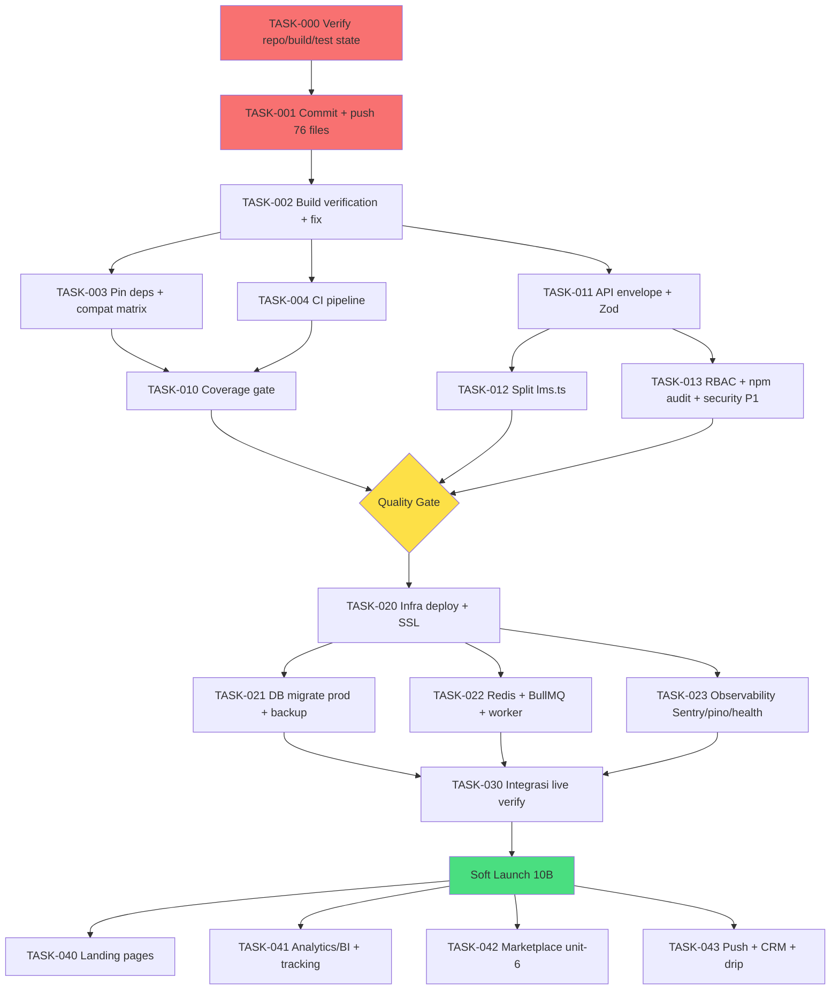

# 🏛️ JAGO AKADEMI — MASTER ENGINEERING BLUEPRINT & EXECUTION PLAN

> **PROJECT_PROGRESS_REPORT_V2.md**
> **Single Source of Truth (SSOT)** · **Master Engineering Blueprint** · **Master Execution Plan for Claude Code**
>
> Platform Edukasi Digital Terintegrasi (B2C + B2B) — 6 unit bisnis dalam satu ekosistem.
>
> | Field | Value |
> |-------|-------|
> | Versi Dokumen | **2.2.0** |
> | Supersedes | `PROJECT_PROGRESS_REPORT.md` v1.0.0 (25 Juni 2026); V2 v2.0.0, v2.1.0 |
> | Perubahan 2.1.0 | + EPIC 7 (7 fitur kompetitif hasil benchmark MySkill.id) — lihat §2.Y & Part VI EPIC 7 |
> | Perubahan 2.2.0 | + EPIC 8 (Pre-Launch Production Integrity — hasil audit live jagoakademi.com, 2 Jul 2026) — lihat §2.Z & Part VI EPIC 8 |
> | Tanggal | **2 Juli 2026** (`currentDate`, dijadikan acuan tunggal — lihat §A.2) |
> | Status Global | **Development ~85% (code) · ~55% production-ready** |
> | Branch aktif | `redesign/light-theme` |
> | Eksekutor | **Claude Code (agentic) + 1 human reviewer/approver** |
> | Bahasa | Bilingual — narasi Bahasa Indonesia, istilah teknis & instruksi eksekusi dalam English |
> | Sifat | Confidential — internal only |

---

## 📖 CARA MEMBACA DOKUMEN INI (READ ME FIRST)

Dokumen ini adalah **acuan utama & satu-satunya** untuk melanjutkan pengembangan Jago Akademi. Jika ada konflik antara dokumen ini dan dokumen lain (`PROJECT_PROGRESS_REPORT.md`, `docs/*.md`, memory, komentar kode), **dokumen ini yang menang** sampai diperbarui secara eksplisit.

**Struktur & urutan baca yang disarankan:**

1. **Part 0 — Meta & Ground Rules** → pahami legenda status, konvensi, dan aturan main.
2. **Part I — Verified Current State** → apa yang *benar-benar* sudah ada vs yang *diklaim*.
3. **Part II — Gap Analysis & Technical Solution Review** → setiap masalah + solusi implementatif.
4. **Part III — Master Engineering Blueprint** → arsitektur target (yang harus dituju).
5. **Part IV — Dependency-Based Roadmap** → urutan kerja berbasis dependency, bukan fitur.
6. **Part V — Development Strategy (Phases)**.
7. **Part VI — Master Execution Plan** → task siap-eksekusi untuk Claude Code (bagian terpenting).
8. **Part VII — Sprint Planning**.
9. **Part VIII — Risk Mitigation Plan**.
10. **Part IX — Claude Code Execution Instructions** → dibaca Claude Code sebelum menyentuh kode.
11. **Part X — Appendices** → resolusi inkonsistensi, decision log, glossary.

> **Untuk Claude Code:** mulai dari **Part IX**, lalu eksekusi **Part VI** sesuai urutan **Part IV**. Jangan pernah mengeksekusi task di luar urutan dependency tanpa persetujuan reviewer.

---

## PART 0 — META & GROUND RULES

### 0.1 Legenda Status

| Simbol | Arti | | Simbol | Arti |
|--------|------|---|--------|------|
| ✅ | Selesai & terverifikasi | | 🔴 | Prioritas Critical / High |
| ☑️ | Selesai (klaim, belum diverifikasi eksekusi) | | 🟡 | Prioritas Medium |
| 🔵 | In progress | | 🟢 | Prioritas Low |
| ⬜ | Belum dimulai | | ⚠️ | Perlu perhatian / risiko |
| ❌ | Tidak ada / belum diimplementasi | | 🧪 | Butuh verifikasi eksekusi |

### 0.2 Tingkat Kepercayaan Bukti (Evidence Tier)

Setiap klaim dalam dokumen ini diberi tier agar Claude Code tahu mana yang aman diasumsikan:

- **[V] Verified** — dapat dikonfirmasi dari struktur/kode (dinyatakan di laporan v1 sebagai hasil audit codebase langsung).
- **[C] Claimed** — dinyatakan di v1 tapi *belum* dibuktikan lewat eksekusi (`build`, `test`, `deploy`). Perlu 🧪 verifikasi.
- **[I] Inferred** — kesimpulan arsitektural dari dokumen ini; keputusan engineering, bukan fakta codebase.

> ⚠️ **Catatan penting untuk sesi ini:** Blueprint ini disusun dari `PROJECT_PROGRESS_REPORT.md`. Codebase fisik **tidak** tersedia di folder kerja saat dokumen ini dibuat, sehingga seluruh klaim ber-tier **[C]** wajib diverifikasi ulang oleh Claude Code sebagai **langkah pertama** (lihat TASK-000). Jangan menganggap "95% backend" sebagai kebenaran sampai `build` + `test --coverage` hijau.

### 0.3 Prinsip Engineering (Non-Negotiable)

1. **Stabilize before expand.** Tidak ada fitur baru sebelum repo aman (commit), buildable, dan tertest. Ekspansi hanya setelah Soft Launch stabil.
2. **Dependency-driven, not feature-driven.** Urutan kerja ditentukan oleh dependency graph (Part IV), bukan keinginan fitur.
3. **Every change verifiable.** Setiap task punya Acceptance Criteria + Validation Checklist yang bisa dieksekusi (perintah nyata), bukan opini.
4. **Small, reversible steps.** Commit kecil & sering. Task besar dipecah jadi subtask < 1 hari kerja agentic.
5. **Single source of truth.** Kode adalah kebenaran. Dokumen mengikuti kode; jika berbeda, perbaiki keduanya dalam satu PR.
6. **Security & data safety first.** Tidak ada shortcut pada auth, payment, dan data pengguna.

---

## PART I — VERIFIED CURRENT STATE (Kondisi Aktual, Direvisi Jujur)

### 1.1 Ringkasan Eksekutif

**Jago Akademi** adalah platform edukasi B2C+B2B (monorepo Turborepo) yang menyatukan 6 unit bisnis: **E-Course, E-Book, Event, Trainer Program, LMS B2B, dan Marketplace Materi**. Secara *fitur & arsitektur* project ini kuat: 5 dari 6 unit bisnis terimplementasi end-to-end, dokumentasi kelas enterprise (~400 halaman), dan fondasi teknis modern (Next.js 16, React 19, Express, Prisma, PostgreSQL).

Namun **v1 mencampur "code complete" dengan "production ready".** Ini koreksi paling penting dari V2:

> **Kesehatan fitur ≠ kesiapan rilis.** Codebase ~85% selesai, tetapi *production-readiness* realistis berada di **~55%** karena tiga pilar rilis belum tuntas: **version control (76 file uncommitted), verifikasi build/test (0 angka terverifikasi), dan deployment/integrasi live (0% dieksekusi).**

### 1.2 Dua Metrik yang Harus Dibedakan

| Metrik | Definisi | Nilai | Dasar |
|--------|----------|-------|-------|
| **Code Completeness** | Fitur yang kodenya ada di disk | **~85%** | [C] audit v1 |
| **Production Readiness** | Fitur yang terbukti jalan di produksi (committed, built, tested, deployed, integrated-live) | **~55%** | [I] revisi V2 |

Perbedaan ~30 poin inilah *seluruh pekerjaan tersisa*. Blueprint ini mengubah 30 poin itu menjadi task yang dapat dieksekusi.

### 1.3 Progress per Layer (Direvisi)

| Layer | Code | Prod-Ready | Catatan koreksi V2 |
|-------|------|-----------|---------------------|
| Dokumentasi bisnis-teknis | 100% [C] | 90% [I] | Ada inkonsistensi (DOKU vs Midtrans, tanggal) — bukan 100% akurat |
| Database schema (41 model) | 100% [C] | 70% [I] | Schema ada; migration produksi & index audit belum |
| Backend API (26 route, ~130 endpoint) | 95% [C] | 55% [I] | Belum ter-commit, belum ter-build-verify, coverage tak terbukti |
| Frontend (52 halaman) | 92% [C] | 55% [I] | Idem; build produksi belum diverifikasi |
| Testing (unit/integration/E2E) | 50% [C] | 35% [I] | Tidak ada coverage report resmi; angka 60% tak terbukti |
| Deployment / Infra | 60% [C] (config) | 15% [I] | Config siap, **0% dieksekusi**. Ini gap terbesar |
| Observability | 20% [I] | 5% [I] | Sentry env ada, belum aktif; tak ada dashboard/alert |
| **TOTAL** | **~85%** | **~55%** | — |

### 1.4 Temuan Kritis (P0 — Harus Ditangani Lebih Dulu)

| ID | Temuan | Severity | Referensi |
|----|--------|----------|-----------|
| **CRIT-01** | **76 file uncommitted** (53 baru + 23 modifikasi). Repo hanya 3 commit. Risiko kehilangan seluruh Fase 7-10. | 🔴 Blocker | §II-P0, TASK-000/001 |
| **CRIT-02** | **Build belum pernah diverifikasi** untuk kedua apps. Tidak diketahui apakah kompilasi bersih. | 🔴 Blocker | TASK-002 |
| **CRIT-03** | **Tidak ada coverage report resmi.** Klaim 60% tidak berbukti; tak ada quality gate. | 🔴 High | TASK-010 |
| **CRIT-04** | **Integrasi live (payment/email/WA/video/storage) 0% teruji** di lingkungan nyata. | 🔴 High | Sprint 3 |
| **CRIT-05** | **Tidak ada CI/CD.** Semua manual → sumber technical debt commit-batch besar. | 🔴 High | TASK-004 |
| **CRIT-06** | **Bleeding-edge stack** (Next 16.2 + React 19.2) tanpa lockfile-verify & fallback plan. | 🟡 Medium | RISK-T1 |
| **CRIT-07** | **Redis/BullMQ, OneSignal, Marketplace** ada di dokumen/env tapi **tidak di kode** (ghost features). | 🟡 Medium | §X INC-03/04/06 |

---

## PART II — GAP ANALYSIS & TECHNICAL SOLUTION REVIEW

> Format setiap temuan: **Penyebab · Dampak · Risiko · Solusi Terbaik · Alternatif · Rekomendasi Implementasi · Prioritas · Dependency · Effort · Expected Output**. Fokus implementatif, bukan teori. Effort memakai skala agentic: **S** (< 0.5 hari), **M** (0.5–1.5 hari), **L** (2–4 hari), **XL** (> 4 hari / harus dipecah).

### P0 — RELEASE-BLOCKING (Wajib selesai sebelum apa pun)

#### GAP-01 · 76 file uncommitted (CRIT-01)
- **Penyebab:** Commit dilakukan batch-besar; Fase 7-10 dikerjakan tanpa version control disiplin. Tidak ada CI yang memaksa commit.
- **Dampak:** Kehilangan total pekerjaan Fase 7-10 bila disk/repo korup. Tidak ada history, tidak bisa bisect bug, tidak bisa code review.
- **Risiko:** Katastrofik & ireversibel (kehilangan minggu kerja).
- **Solusi terbaik:** Commit bertahap **per domain fitur** (bukan satu commit raksasa), pesan Conventional Commits, lalu push ke remote. Verifikasi build *sebelum* push agar history tetap bisa di-bisect.
- **Alternatif:** Satu commit besar "WIP snapshot" untuk mengamankan cepat, lalu rebase-split. (Dipakai *hanya* jika ada indikasi risiko disk mendesak.)
- **Rekomendasi implementasi:** Lihat TASK-000 → TASK-001. Urutan commit: schema/prisma → services → routes → frontend pages → tests → infra/docs.
- **Prioritas:** 🔴 P0 · **Dependency:** — · **Effort:** M
- **Expected output:** Working tree bersih, ≥ 8 commit bermakna, `origin` sinkron, tag `pre-stabilization`.

#### GAP-02 · Build belum diverifikasi (CRIT-02)
- **Penyebab:** Fokus pada penulisan fitur; belum ada pipeline yang menjalankan `build`.
- **Dampak:** Tidak tahu apakah apps kompilasi. Type error / dependency mismatch bisa menyembunyikan kerusakan besar.
- **Risiko:** Deploy gagal; waktu terbuang saat launch.
- **Solusi terbaik:** `npm run build` di kedua apps (api + web) + `tsc --noEmit` + `eslint`. Perbaiki semua error. Bekukan lockfile.
- **Alternatif:** — (tidak ada; ini wajib).
- **Prioritas:** 🔴 P0 · **Dependency:** GAP-01 · **Effort:** M (S bila bersih, L bila banyak error React 19).
- **Expected output:** Dua build hijau, `tsc` 0 error, lockfile ter-commit.

#### GAP-03 · Bleeding-edge stack tanpa jaring pengaman (CRIT-06)
- **Penyebab:** Keputusan TD-09 memilih Next 16.2 + React 19.2 (sangat baru).
- **Dampak:** Library pihak ketiga (Radix, framer-motion, testing libs) bisa belum kompatibel penuh; breaking changes RSC.
- **Risiko:** Bug runtime sulit dilacak; upgrade path mahal.
- **Solusi terbaik:** (1) Pin **semua** versi exact (hapus `^`), commit lockfile. (2) Buat matriks kompatibilitas dependency kritis. (3) Siapkan fallback documented ke Next 15 LTS / React 18 bila blocker muncul. (4) Smoke test RSC + hydration di E2E.
- **Alternatif:** Downgrade preventif ke LTS sekarang (lebih aman, tapi kehilangan fitur & butuh rework).
- **Rekomendasi:** Pin + matriks dulu; downgrade hanya jika muncul blocker nyata.
- **Prioritas:** 🟡 P1 · **Dependency:** GAP-02 · **Effort:** M
- **Expected output:** Lockfile exact, `COMPATIBILITY_MATRIX.md`, keputusan tercatat di Decision Log.

### P1 — QUALITY & RELEASE READINESS

#### GAP-04 · Tidak ada coverage report & quality gate (CRIT-03)
- **Penyebab:** Test ditulis tapi tak pernah dijalankan dengan `--coverage`; tak ada threshold.
- **Dampak:** Kualitas tak terukur; regresi lolos ke produksi.
- **Solusi terbaik:** Aktifkan coverage di `vitest.config.ts` (provider v8), set threshold bertahap (mulai dari baseline aktual, naikkan ke 80% pada modul kritis: auth, payment, orders, lms). Integrasikan ke CI sebagai gate.
- **Alternatif:** Target coverage global 80% sekaligus (berisiko memblokir; lebih baik bertahap per modul kritis dulu).
- **Prioritas:** 🔴 P1 · **Dependency:** GAP-02 · **Effort:** L
- **Expected output:** Coverage report resmi, threshold di CI, modul kritis ≥ 80%.

#### GAP-05 · Response envelope & validasi tidak konsisten (v1 §13.1)
- **Penyebab:** Route ditulis di banyak fase berbeda tanpa kontrak yang dipaksakan.
- **Dampak:** Frontend rapuh terhadap variasi bentuk response; error handling tak seragam.
- **Solusi terbaik:** Definisikan `ApiResponse<T>` & `ApiError` tunggal di `packages/types`; buat `asyncHandler` + `sendSuccess/sendError` helper; audit 26 route; wajibkan validasi Zod di setiap boundary (body, query, params). Tambah middleware error terpusat yang selalu mengembalikan envelope.
- **Alternatif:** Adopsi tRPC/OpenAPI-first (lebih kuat, tapi rework besar — tunda ke post-launch).
- **Prioritas:** 🔴 P1 · **Dependency:** GAP-02 · **Effort:** L
- **Expected output:** 100% endpoint memakai envelope seragam + Zod; test kontrak.

#### GAP-06 · Async blocking: tidak ada queue (Redis/BullMQ) (CRIT-07)
- **Penyebab:** Env `REDIS_URL` ada, implementasi tidak.
- **Dampak:** Email, generate sertifikat/PDF, webhook processing, video callback berjalan sinkron → request lambat, timeout, kehilangan job saat crash.
- **Solusi terbaik:** Tambah Redis + BullMQ; pindahkan pekerjaan lambat/tidak-idempoten ke worker: `email`, `certificate-generation`, `webhook-processing`, `search-indexing`, `report-generation`. Worker sebagai proses terpisah (`apps/api` worker mode atau `apps/worker`).
- **Alternatif:** Pertahankan sinkron + retry sederhana (hanya layak untuk trafik sangat kecil; tidak scalable).
- **Prioritas:** 🔴 P1 (sebelum trafik launch) · **Dependency:** deployment Redis · **Effort:** L
- **Expected output:** Queue aktif, ≥ 4 job type, dashboard BullMQ, retry + dead-letter.

#### GAP-07 · Integrasi live belum teruji (CRIT-04)
- **Penyebab:** Hanya kode + sandbox; tidak ada test end-to-end di lingkungan produksi/sandbox nyata.
- **Dampak:** Payment/email/WA/video bisa gagal di hari launch (revenue & trust langsung terdampak).
- **Solusi terbaik:** Matriks verifikasi per integrasi (DOKU, Resend, Fonnte, Cloudflare Stream/R2, Meilisearch, Sentry): sandbox → transaksi test end-to-end → webhook signature verify → idempotency test → produksi terbatas.
- **Prioritas:** 🔴 P1 · **Dependency:** deployment (Sprint 2) · **Effort:** L
- **Expected output:** Checklist integrasi 100% hijau, bukti transaksi test tercatat.

#### GAP-08 · Observability minim (CRIT, v1 §5.20)
- **Penyebab:** Sentry env ada tapi belum di-init; tak ada structured logging, metrics, uptime, alerting.
- **Dampak:** Buta terhadap error produksi; MTTR tinggi; SLA 99.9% tak terukur.
- **Solusi terbaik:** Init Sentry (api+web), pino structured logging dengan request-id korelasi, `/health` & `/ready` endpoint, uptime monitor eksternal, alert rules (error rate, latency p95, payment failure). Grafana/OpenTelemetry opsional fase berikut.
- **Prioritas:** 🔴 P1 · **Dependency:** deployment · **Effort:** M
- **Expected output:** Error tertangkap di Sentry, log terstruktur, health check hijau, alert aktif.

### P2 — ARCHITECTURE HARDENING & FEATURE GAPS

#### GAP-09 · File route raksasa (`lms.ts` 30 endpoint) (v1 §13.1)
- **Penyebab:** Semua LMS logic dalam satu file.
- **Dampak:** Sulit dirawat, merge-conflict, kognisi tinggi, sulit di-test granular.
- **Solusi terbaik:** Refactor ke struktur modular per domain (controller-service-repository ringan): `routes/lms/{tenant,batch,course,enrollment,cert,report}.ts`. Pertahankan kontrak endpoint (tanpa breaking change).
- **Alternatif:** Biarkan (tolak) — hanya jika waktu sangat mepet; tandai sebagai debt.
- **Prioritas:** 🟡 P2 · **Dependency:** GAP-05 · **Effort:** M
- **Expected output:** Tidak ada file route > 400 baris; test tetap hijau.

#### GAP-10 · Marketplace Materi (unit bisnis ke-6) belum ada (INC-06)
- **Penyebab:** Belum digarap; scope C2C/hak cipta kompleks.
- **Dampak:** 1 dari 6 revenue stream hilang.
- **Keputusan V2 (stakeholder):** **DITUNDA ke pasca Soft Launch** (Phase 6). Stabilkan 5 unit dulu. Ini bukan pembatalan; masuk roadmap resmi setelah 10B stabil.
- **Solusi saat digarap:** Prisma model (`MarketplaceItem`, `MarketplaceOrder`, `CreatorPayout`), `/api/marketplace/*`, R2 storage + signed URL, moderasi, revenue-share ke creator (reuse pola affiliate/trainer payout).
- **Prioritas:** 🟡 P2 (post-launch) · **Dependency:** R2 verified, payout engine · **Effort:** XL (pecah).
- **Expected output:** Unit ke-6 aktif setelah launch inti stabil.

#### GAP-11 · Landing pages akuisisi belum ada (`/afiliasi`, `/lms`, `/trainer-program`) (v1 §14.2)
- **Penyebab:** Backend modul ada, halaman marketing publik belum.
- **Dampak:** Kanal akuisisi (CAC rendah via affiliate, lead-gen B2B, rekrut trainer) tidak aktif → target bisnis (50 klien B2B, 500 trainer) sulit.
- **Solusi terbaik:** 3 landing page konversi (hero, value prop, social proof, CTA, form lead). Reuse Design System.
- **Prioritas:** 🟡 P2 (pre/awal launch untuk growth) · **Dependency:** Design System, modul terkait · **Effort:** M
- **Expected output:** 3 landing live + form lead tersimpan.

#### GAP-12 · Analytics/BI & event tracking belum ada (v1 §5.12)
- **Penyebab:** Data tersimpan tapi tak ada layer tracking & dashboard.
- **Dampak:** Tak bisa data-driven; North Star (Weekly Active Learners) tak terukur.
- **Solusi terbaik:** (1) Verifikasi GA/Mixpanel wiring. (2) Definisikan taxonomy event (signup, purchase, lesson_complete, cert_issued). (3) `/api/analytics/*` untuk data internal. (4) Dashboard BI admin (funnel, cohort, revenue per unit).
- **Prioritas:** 🟡 P2 · **Dependency:** deployment, event tracking · **Effort:** L
- **Expected output:** Event tracking live + dashboard North Star.

#### GAP-13 · Push notification (OneSignal) & CRM in-house belum ada (INC-03)
- **Penyebab:** Ghost feature (disebut, tak diimplementasi).
- **Dampak:** Re-engagement lemah (push); efisiensi sales B2B rendah (CRM).
- **Solusi terbaik:** Push — integrasi OneSignal SDK + preference center. CRM — schema pipeline (`Lead`, `LeadStage`, `LeadActivity`) + admin view + otomasi email drip.
- **Prioritas:** 🟢 P3 (post-launch) · **Dependency:** notif infra, deployment · **Effort:** M (push), L (CRM).
- **Expected output:** Push terkirim; pipeline B2B terkelola.

#### GAP-14 · Security hardening belum tuntas (v1 §5.14)
- **Penyebab:** Keamanan dasar ada (JWT, RBAC, rate limit, XSS fix, PDP erasure), lanjutan belum.
- **Dampak:** Permukaan serangan; risiko compliance (UU PDP Indonesia).
- **Solusi terbaik:** CSP nonce-based, `npm audit` + fix, RBAC audit setiap endpoint sensitif, rate-limit granular, CSRF, secret rotation + scan hardcoded secret, 2FA/OTP via WA, audit trail diperluas, PDP compliance audit.
- **Prioritas:** 🔴 P1 (pre-launch: audit + npm audit + RBAC), 🟡 P2 (2FA, CSP nonce) · **Dependency:** GAP-05 · **Effort:** L
- **Expected output:** `npm audit` bersih, RBAC terverifikasi, checklist security hijau.

#### GAP-15 · Database production-readiness (v1 §5.6)
- **Penyebab:** Schema lengkap tapi index audit, migration prod, backup, archive belum.
- **Dampak:** Query lambat pada skala; risiko kehilangan data tanpa backup.
- **Solusi terbaik:** Index audit query-heavy (enrollment, progress, orders, lms), migration produksi terkontrol (`prisma migrate deploy`), automated backup + restore drill, connection pooling (PgBouncer), read replica untuk analytics (fase skala).
- **Prioritas:** 🔴 P1 (migration+backup+index), 🟡 P2 (replica) · **Dependency:** deployment · **Effort:** M
- **Expected output:** Migration prod aman, backup terjadwal + restore teruji, index optimal.

#### GAP-16 · Dokumentasi tak sinkron dengan kode (INC-01/02/05)
- **Penyebab:** Dokumen tak diperbarui saat keputusan berubah (Midtrans→DOKU, tanggal, label duplikat).
- **Dampak:** Kebingungan tim & Claude Code; keputusan salah berbasis dok usang.
- **Solusi terbaik:** Update `00-INDEX.md` & `03-SYSTEM-ARCHITECTURE.md` → DOKU; standarkan tanggal ke `git`/`currentDate`; perbaiki penomoran; tambah `docs/adr/` untuk keputusan baru; generate OpenAPI dari route.
- **Prioritas:** 🟡 P2 · **Dependency:** GAP-01 · **Effort:** M
- **Expected output:** Dokumen konsisten dengan kode; ADR aktif.

### 2.X Ringkasan Prioritas Gap

| Gap | Judul | Prioritas | Effort | Fase |
|-----|-------|-----------|--------|------|
| GAP-01 | Commit 76 file | 🔴 P0 | M | 1 |
| GAP-02 | Build verify | 🔴 P0 | M | 1 |
| GAP-03 | Pin bleeding-edge | 🟡 P1 | M | 1 |
| GAP-04 | Coverage & gate | 🔴 P1 | L | 2 |
| GAP-05 | Envelope + Zod | 🔴 P1 | L | 2 |
| GAP-06 | Queue BullMQ | 🔴 P1 | L | 3 |
| GAP-07 | Integrasi live | 🔴 P1 | L | 4 |
| GAP-08 | Observability | 🔴 P1 | M | 3 |
| GAP-09 | Split `lms.ts` | 🟡 P2 | M | 2 |
| GAP-10 | Marketplace | 🟡 P2 | XL | 6 |
| GAP-11 | Landing pages | 🟡 P2 | M | 5 |
| GAP-12 | Analytics/BI | 🟡 P2 | L | 6 |
| GAP-13 | Push + CRM | 🟢 P3 | M/L | 6 |
| GAP-14 | Security hardening | 🔴 P1 / 🟡 P2 | L | 2/5 |
| GAP-15 | DB prod-ready | 🔴 P1 | M | 3 |
| GAP-16 | Docs sync | 🟡 P2 | M | 5 |

### 2.Y Competitive Feature Set — MySkill.id Benchmark (Disetujui)

Hasil benchmark MySkill.id (2 Juli 2026) menemukan bahwa pilar **"berlatih" & "berkarier"** pada positioning Jago Akademi belum terlayani dibanding kompetitor. **7 fitur berikut disetujui masuk roadmap** (semua **membangun di atas modul Jago yang sudah ada**, bukan dari nol):

| ID | Fitur | Reuse modul eksisting | Prioritas | Effort | Fase |
|----|-------|-----------------------|-----------|--------|------|
| **GAP-17 → TASK-093** | All-access Subscription tier | Subscription, Payment DOKU, enrollment | 🟡 P2 (quick win) | S–M | 5 |
| **GAP-18 → TASK-095** | Success-story / Testimonial + social proof engine | Blog CMS, Review & moderasi | 🟡 P2 (quick win) | S–M | 5 |
| **GAP-19 → TASK-096** | Free short class / lead magnet | Event, early-access, notifikasi | 🟡 P2 (quick win) | S–M | 5 |
| **GAP-20 → TASK-090** | Learning Path (jalur kurasi menuju satu role) | E-Course 3-level, enrollment, progress | 🟡 P2 | M | 6 |
| **GAP-21 → TASK-091** | Bootcamp / Live Cohort (mentoring semi-privat + portfolio) | Event, Trainer, LMS batch, Payment | 🟡 P2 | L | 6 |
| **GAP-22 → TASK-092** | Community layer (grup diskusi, kelas gratis bulanan, workshop) | Notifikasi (Fonnte/email), Event, Review moderasi | 🟡 P2 | M–L | 6 |
| **GAP-23 → TASK-094** | Corporate performance/HRIS ringan (KPI + upskilling analytics) | LMS B2B multi-tenant, reporting, assignment | 🟡 P2 | L | 6 |

> **Aturan fase:** ketujuhnya **pasca Soft Launch**. Phase 5 = 3 quick-win (subscription, testimonial, free class) untuk mendongkrak konversi & MRR. Phase 6 = 4 fitur produk berat (learning path, bootcamp, community, HRIS). Detail eksekusi penuh di **Part VI EPIC 7**.

### 2.Z Live Audit Findings — jagoakademi.com (2 Juli 2026)

Audit langsung terhadap situs produksi (`https://jagoakademi.com`) setelah deployment menemukan penyimpangan terhadap blueprint. **Semua wajib diselesaikan sebelum Soft Launch** (bukan pasca). Detail eksekusi di **Part VI EPIC 8**.

| ID | Temuan | Severity | Bukti | Task |
|----|--------|----------|-------|------|
| **GAP-24** | **Data fiktif tayang di production** — statistik ("50K+ Pelajar", "2.000+ berlangganan/minggu", "98% Lulus"), testimoni bernama di perusahaan riil (Rizky Pratama·Tokopedia, Sari Dewi·Astra, dll), leaderboard XP palsu, kursus contoh karangan. Project pra-launch, ~0 user nyata → menyesatkan + risiko hukum/PDP. | 🔴 Blocker | `/`, `/e-course` | TASK-052 |
| **GAP-25** | **Link ke fitur belum jadi tayang** — `/marketplace` (label "Baru"), `/lms`, `/trainer-program` tampil kosong; ditautkan di nav/footer/home. | 🔴 High | fetch blank | TASK-053 |
| **GAP-26** | **Marketing mendahului fitur** — `/e-course` mengiklankan Learning Path, XP/Leaderboard (gamifikasi — di luar blueprint), Komunitas Lifetime, Berlangganan all-access; semuanya EPIC 7 yang **belum dibangun**. | 🟡 Medium | `/e-course` | TASK-054 |
| **GAP-27** | **Halaman auth perlu verifikasi** — `/masuk` & `/daftar` tampil kosong via fetch tanpa JS; wajib dipastikan berfungsi (fungsi inti). | 🔴 High | fetch blank | TASK-055 |

> ✅ **Sesuai plan (positif):** homepage & `/e-course` SSR jalan + SEO/OG lengkap; `/kursus` redirect 308 → `/e-course` sesuai keputusan; struktur 6 unit bisnis benar.

---

## PART III — MASTER ENGINEERING BLUEPRINT (Target Architecture)

> Untuk setiap area: **KEEP** (pertahankan, dengan alasan) atau **CHANGE** (redesign, dengan spesifikasi). Prinsip: minimal churn, maksimal reliability. Jangan mengubah yang sudah baik.

### 3.1 Monorepo & Folder Structure

**Keputusan: KEEP struktur monorepo, CHANGE organisasi internal `apps/api/src`.**

Turborepo + npm workspaces **dipertahankan** — tepat untuk shared types & DX. Yang diubah: layering backend agar konsisten (lihat GAP-09) dan penambahan `apps/worker`.

```
jago-akademi-monorepo/
├── apps/
│   ├── api/                         # Express + Prisma (HTTP layer)
│   │   ├── prisma/                  # schema.prisma, migrations/, seed.ts
│   │   └── src/
│   │       ├── config/              # env (Zod-validated), constants
│   │       ├── db/                  # prisma client singleton
│   │       ├── middleware/          # authenticate, authorize, errorHandler, rateLimiter, validate, requestId
│   │       ├── modules/             # ⬅ CHANGE: fitur dikelompokkan per domain
│   │       │   ├── auth/            #   {routes,controller,service,schema}.ts
│   │       │   ├── course/
│   │       │   ├── commerce/        #   orders, checkout, payment, coupon, refund
│   │       │   ├── lms/             #   ⬅ pecahan lms.ts (GAP-09)
│   │       │   ├── trainer/ affiliate/ blog/ subscription/ review/ event/ ebook/
│   │       │   └── ...
│   │       ├── lib/                 # helpers: apiResponse, asyncHandler, pagination, logger
│   │       ├── jobs/                # ⬅ NEW: BullMQ queue + processors (shared w/ worker)
│   │       └── app.ts / server.ts
│   ├── worker/                      # ⬅ NEW: BullMQ worker process (email, cert, webhook, index, report)
│   └── web/                         # Next.js 16 App Router (KEEP)
│       ├── app/  components/  lib/  e2e/
├── packages/
│   ├── types/                       # ⬅ CHANGE: ApiResponse<T>, DTOs, shared enums (SSOT kontrak)
│   ├── ui/  utils/  eslint-config/  typescript-config/
├── docs/                            # + docs/adr/ (NEW), + openapi.yaml (NEW)
├── .github/workflows/               # ⬅ NEW: ci.yml, deploy.yml
├── docker-compose.prod.yml  docker-compose.dev.yml (NEW)  nginx/  turbo.json
```

> **Alasan tidak pindah ke Nest/Fastify:** rework besar tanpa ROI pra-launch. Express + layering modular sudah cukup. Tandai sebagai "revisit post-scale".

### 3.2 Layered / Modular Architecture (Backend)

**CHANGE → Terapkan 3 lapis ringan konsisten di semua modul:**

```
Route (HTTP: parse+validate Zod) → Service (business logic, transaction) → Repository/Prisma (data)
                                          ↓ (async)
                                     Queue (BullMQ) → Worker
```

Aturan: Route **tidak** memuat business logic. Service **tidak** memuat `req/res`. Semua efek samping lambat (email, PDF, index, webhook fan-out) → queue. Ini menstandarkan 26 route yang saat ini bervariasi.

### 3.3 Frontend Architecture

**KEEP Next.js 16 App Router + React 19** (dengan pengaman GAP-03). CHANGE minor:

- **Data fetching:** Server Components untuk read publik (SEO), Route Handlers/Server Actions untuk mutasi; hindari fetch client-side untuk konten SEO.
- **State management:** KEEP minimal — Server state via RSC/`fetch` cache; client state via React state + Context untuk auth/session; tambahkan **TanStack Query** hanya di area interaktif berat (dashboard, admin tables) untuk cache/invalidation. Tolak Redux (overkill).
- **API client:** satu `lib/api` typed dari `packages/types`, otomatis menyertakan envelope handling & refresh-token retry.
- **UI:** KEEP Tailwind 4 + Radix + framer-motion; audit design token (anti-template).

### 3.4 Database Design

**KEEP 41 model Prisma** (komprehensif & benar secara domain). CHANGE operasional (GAP-15):

- Index audit pada kolom filter/join panas: `CourseEnrollment(userId,courseId)`, `CourseLessonProgress(enrollmentId)`, `Order(userId,status,createdAt)`, `PaymentTransaction(orderId,status)`, `LmsEnrollment(batchId,userId)`, `AuditLog(userId,createdAt)`.
- Migration: pindah dari `db push` (dev) ke **`prisma migrate`** dengan file migration ter-commit; `migrate deploy` di produksi.
- Multi-tenant LMS: KEEP shared-DB + `tenantId` scoping. Tambah **guard di repository layer** agar setiap query LMS wajib ter-scope tenant (cegah data leak antar tenant). Sharding hanya bila > 100 tenant (tunda).
- Data lifecycle: PDP anonymize (KEEP), + archive job data > 2 tahun (fase skala), + soft-delete konsisten.

### 3.5 API Architecture

**CHANGE → Kontrak seragam (GAP-05):**

- Envelope tunggal: `{ success: boolean, data?: T, error?: {code,message,details}, meta?: {pagination} }` dari `packages/types`.
- Pagination standar: cursor untuk list panjang (feed, katalog), offset untuk admin tables. Param seragam `?page&limit` / `?cursor&limit`.
- Versioning: prefix `/api/v1/*` (tambahkan sebelum publik untuk future-proof). Redirect `/api/*` lama bila perlu.
- Error taxonomy: kode stabil (`AUTH_401`, `VALIDATION_422`, `PAYMENT_502`, dst).
- **OpenAPI**: generate `docs/openapi.yaml` dari Zod (mis. `zod-to-openapi`) → dokumentasi + kontrak test.

### 3.6 Authentication, Authorization & Permission

**KEEP fondasi** (JWT + refresh httpOnly cookie, RBAC `UserRole`, `authorize` middleware, Google OAuth). **CHANGE penguatan:**

- RBAC audit: matriks role×endpoint; verifikasi setiap endpoint sensitif memanggil `authorize`. `super_admin` bypass harus eksplisit & ter-log.
- LMS permission: enforce tenant-scoped permission di service layer (bukan hanya route).
- 2FA/OTP via WA (Fonnte sudah ada) untuk admin & opsional user.
- Session management: endpoint list/revoke session; rotasi refresh token; deteksi reuse.
- Rate limit login lebih ketat + lockout progresif.

### 3.7 Logging, Monitoring & Observability

**CHANGE → dari hampir-nol ke baseline produksi (GAP-08):**

- **Logging:** `pino` structured JSON, `requestId` (middleware) untuk korelasi end-to-end, log level per env, redaksi PII.
- **Error tracking:** Sentry init di api + web (sudah ada dep `@sentry/node`), source maps, release tagging.
- **Health:** `/health` (liveness) & `/ready` (readiness: DB, Redis, Meili).
- **Metrics/Alert:** uptime monitor eksternal; alert error-rate, latency p95, payment-failure, queue-depth. Grafana/OTel = fase skala.
- **Audit trail:** perluas `AuditLog` ke aksi sensitif (payout, refund, role change, tenant admin).

### 3.8 Queue, Cache, Background Jobs & Event-Driven Flow

**CHANGE → implementasikan (GAP-06):**

- **Redis** = cache + broker BullMQ.
- **Cache:** katalog kursus, dashboard aggregate, tenant config; TTL + invalidation on write. Cache-aside pattern.
- **Queue/Jobs (worker):** `email`, `certificate-generation`, `webhook-processing` (DOKU idempotent), `search-indexing` (Meili sync), `report-generation`, `email-drip`.
- **Event-driven (ringan):** domain events (`OrderPaid`, `CourseCompleted`, `CertIssued`) → enqueue side-effects (email, cert, index, analytics). Hindari coupling langsung antar service.
- Reliability: retry + backoff, dead-letter queue, idempotency key untuk webhook & payout.

### 3.9 File Storage & Media

**KEEP Cloudflare Stream (video) + R2 (aset)** — biaya & anti-piracy ringan (TD-15). CHANGE:

- Verifikasi wiring R2 (env→kode) — saat ini [C] belum pasti.
- Upload via **signed URL langsung ke R2** (jangan proxy file besar lewat API).
- Signed URL + expiry untuk video (HLS) & e-book PDF.
- Dokumentasikan **exit strategy** (mitigasi vendor lock-in Cloudflare) → abstraksi `StorageService` interface.

### 3.10 Notification System

**CHANGE → konsolidasi ke satu abstraksi multi-channel:**

- `NotificationService` dengan channel: **email (Resend), WA (Fonnte), push (OneSignal — baru), in-app**.
- Template registry + i18n-ready.
- Preference center (user memilih channel).
- Semua kirim via queue (async, retryable).
- Drip campaign (welcome, nurture, win-back) sebagai scheduled job.

### 3.11 CI/CD

**CHANGE → build dari nol (GAP-02/05, CRIT-05):**

- **`.github/workflows/ci.yml`:** on PR → install (cache) → `lint` → `typecheck` → `test --coverage` (gate threshold) → `build` kedua apps. Blokir merge bila merah.
- **`deploy.yml`:** on tag/main → build image → push registry → `prisma migrate deploy` → deploy (compose/registry) → smoke test → notify.
- Branch protection: PR wajib, CI hijau, ≥1 review (human reviewer).
- Strategi: zero-downtime (health check + rolling), rollback via tag sebelumnya.

### 3.12 Infrastructure

**KEEP Docker Compose + Nginx** untuk launch (cukup untuk skala awal; K8s ditunda ke fase skala). CHANGE:

- Tambah `docker-compose.dev.yml` (postgres, redis, meili lokal) untuk DX & parity.
- Nginx: TLS (Let's Encrypt), gzip/brotli, security headers, rate limit edge, cache statik.
- Secrets: dari env manual → secret manager (mis. Doppler/SOPS) atau minimal `.env` terenkripsi + rotasi.
- Backup: postgres automated (pgdump terjadwal ke R2) + restore drill.
- Scale path (tunda, terdokumentasi): read replica → Redis cluster → K8s autoscaling → CDN Asia Tenggara.

### 3.13 Ringkasan Keputusan Arsitektur

| Area | Keputusan | Aksi |
|------|-----------|------|
| Monorepo Turborepo | KEEP | + `apps/worker`, `packages/types` diperkuat |
| Backend framework (Express) | KEEP | Layering modular konsisten |
| Backend module layout | CHANGE | `modules/{domain}` + pecah `lms.ts` |
| Next.js 16/React 19 | KEEP (guarded) | Pin exact + matriks + fallback plan |
| State management | KEEP minimal | + TanStack Query di area berat |
| DB Prisma 41 model | KEEP | Index audit + `migrate` + tenant guard |
| API envelope | CHANGE | Seragamkan + `/v1` + OpenAPI |
| Auth/RBAC | KEEP | + audit, 2FA, session mgmt |
| Observability | CHANGE | Sentry+pino+health+alert |
| Queue/Cache | CHANGE (new) | Redis + BullMQ + worker |
| Storage | KEEP | Verify R2 + signed URL + exit strategy |
| Notification | CHANGE | Abstraksi multi-channel + queue |
| CI/CD | CHANGE (new) | GitHub Actions gate + deploy |
| Infra | KEEP (compose) | + backup, secrets, dev-compose; K8s ditunda |

---

## PART IV — DEPENDENCY-BASED TECHNICAL ROADMAP

> Disusun berdasarkan **dependency**, bukan daftar fitur. Menjawab: apa dulu, apa paralel, apa ditunda, dan **alasan teknisnya**.

### 4.1 Dependency Graph (Critical Path)



### 4.2 Apa yang Dikerjakan Lebih Dulu (Serial, Non-Negotiable)

1. **TASK-000 → 001 → 002** (verify → commit → build). **Alasan:** tanpa repo aman & build hijau, semua pekerjaan lain berisiko hilang atau dibangun di atas fondasi rusak. Ini serial murni.

### 4.3 Apa yang Bisa Paralel

- Setelah build hijau (T002): **TASK-003 (pin deps)**, **TASK-004 (CI)**, dan **TASK-011 (envelope)** dapat berjalan paralel — dependency berbeda, file berbeda.
- **TASK-012 (split lms)** & **TASK-013 (security)** paralel setelah T011.
- Setelah deploy (T020): **TASK-021 (DB)**, **TASK-022 (queue)**, **TASK-023 (observability)** paralel.
- Post-launch: **TASK-040/041/042/043** semuanya paralel (independen).

> Karena eksekutor = **Claude Code + 1 reviewer**, "paralel" berarti dikerjakan berurutan-cepat oleh Claude Code namun **tanpa saling blokir**; reviewer dapat me-review satu sambil Claude Code lanjut ke berikutnya.

### 4.4 Apa yang Ditunda (dan Alasan Teknis)

| Ditunda | Ke Fase | Alasan Teknis |
|---------|---------|---------------|
| Marketplace Materi (unit-6) | Phase 6 (post-launch) | Butuh R2 verified + payout engine matang + moderasi; kompleks & bukan penghalang launch 5 unit. Keputusan stakeholder. |
| AI features (recommendation, chatbot, adaptive) | M15+ | Butuh data perilaku (event tracking) matang dulu; ROI rendah pra-launch. |
| Mobile App (React Native) | M15 | Web dulu harus stabil & ter-instrumentasi. |
| Kubernetes, sharding, read replica, CDN expansion | Fase skala (M13+) | Compose cukup untuk trafik launch; optimasi prematur = biaya sia-sia. |
| CRM lanjutan, rich-text editor, accessibility WCAG penuh | Post-launch | Bukan blocker rilis; dikerjakan saat growth. |

### 4.5 Alur Fase (High-Level)

```
Phase 1 STABILIZE ─→ Phase 2 QUALITY GATE ─→ Phase 3 INFRA & PLATFORM ─→ Phase 4 LIVE INTEGRATION
   → 🚀 SOFT LAUNCH (10B) → Phase 5 GROWTH ENABLEMENT → Phase 6 EXPANSION (unit-6, BI, push/CRM)
   → 🚀 PUBLIC LAUNCH (10C) → Phase 7 SCALE & OPTIMIZE (10D) → Phase 8 AI & MOBILE (M15+)
```

---

## PART V — DEVELOPMENT STRATEGY (Phases)

> Disusun dari kondisi nyata project (bukan template). Setiap fase punya **Goal, Exit Criteria, Gap tercakup**.

### Phase 1 — STABILIZE (Amankan Fondasi)
- **Goal:** Repo aman, buildable, dependency terkunci.
- **Gap:** GAP-01, GAP-02, GAP-03. **Task:** TASK-000..003.
- **Exit criteria:** Working tree bersih & pushed; dua build hijau; `tsc` 0 error; lockfile exact ter-commit.

### Phase 2 — QUALITY GATE (Kualitas Terukur)
- **Goal:** Kualitas terverifikasi & terjaga otomatis.
- **Gap:** GAP-04, GAP-05, GAP-09, GAP-14 (P1). **Task:** TASK-004, 010..013.
- **Exit criteria:** CI aktif memblok merah; coverage modul kritis ≥ 80%; envelope+Zod 100%; `npm audit` bersih; RBAC terverifikasi.

### Phase 3 — INFRA & PLATFORM (Landasan Produksi)
- **Goal:** Lingkungan produksi hidup + platform service (queue, cache, observability).
- **Gap:** GAP-06, GAP-08, GAP-15. **Task:** TASK-020..023.
- **Exit criteria:** App live di domain (HTTPS); migration prod + backup teruji; Redis+BullMQ jalan; Sentry+health+alert aktif.

### Phase 4 — LIVE INTEGRATION (Verifikasi Eksternal)
- **Goal:** Semua integrasi pihak ketiga terbukti jalan.
- **Gap:** GAP-07. **Task:** TASK-030.
- **Exit criteria:** Transaksi test end-to-end (DOKU), email/WA/cert terkirim, video/search live, webhook idempotent — semua tercatat.

### 🚀 SOFT LAUNCH (Playbook 10B) — 1.000 early adopter, 5 unit bisnis.

### Phase 5 — GROWTH ENABLEMENT
- **Goal:** Aktifkan kanal akuisisi, SEO, & konversi (quick-win kompetitif).
- **Gap:** GAP-11, GAP-16, GAP-14 (P2), **GAP-17/18/19**. **Task:** TASK-040, 050, 051 + **TASK-093 (all-access), 095 (testimonial), 096 (free class)**.
- **Exit criteria:** 3 landing live + lead capture; docs sinkron; SEO structured data; **subscription all-access aktif, social-proof tampil, free class menangkap lead**.

### Phase 6 — EXPANSION
- **Goal:** Lengkapi unit-6 + data-driven + engagement + produk kompetitif.
- **Gap:** GAP-10, GAP-12, GAP-13, **GAP-20/21/22/23**. **Task:** TASK-041..043 + **TASK-090 (learning path), 091 (bootcamp), 092 (community), 094 (corporate HRIS)**.
- **Exit criteria:** 6/6 unit aktif; dashboard North Star; push+CRM+drip jalan; **learning path, bootcamp cohort, community, & corporate performance live**.

### 🚀 PUBLIC LAUNCH (Playbook 10C).

### Phase 7 — SCALE & OPTIMIZE (Playbook 10D)
- **Goal:** Performa & skalabilitas terukur. Lighthouse CWV, read replica, autoscaling plan.

### Phase 8 — AI & MOBILE (M15+)
- **Goal:** Recommendation engine, chatbot, mobile app — setelah data & platform matang.

---

## PART VI — MASTER EXECUTION PLAN FOR CLAUDE CODE

> **Bagian terpenting.** Setiap task siap dieksekusi tanpa interpretasi tambahan. Template: Objective · Background · Technical Context · Dependency · Priority · Complexity · Effort · Files (create/modify) · Modules impacted · Acceptance Criteria · Definition of Done · Validation Checklist · Implementation Risks · Expected Output.
>
> Task **P0–P1 (critical path)** ditulis penuh & granular. Task **P2–P3 (post-launch)** ditulis sebagai epic terstruktur untuk dipecah Claude Code saat tiba fasenya (perintah pemecahan di Part IX §9.3).

### 🔷 EPIC 1 — STABILIZATION (Phase 1)

#### TASK-000 · Verifikasi kondisi aktual repo, build & test
- **Objective:** Tetapkan baseline faktual sebelum perubahan apa pun (ubah tier [C] → [V]).
- **Background:** Blueprint disusun dari laporan; angka (95% backend, 60% coverage) belum terbukti. Jangan bangun di atas asumsi.
- **Technical Context:** Monorepo Turborepo; `apps/api` (Express+Prisma), `apps/web` (Next 16). Node LTS, npm workspaces.
- **Dependency:** — · **Priority:** 🔴 P0 · **Complexity:** Rendah · **Effort:** S
- **Files create:** `docs/BASELINE_AUDIT.md`. **Files modify:** —. **Modules:** semua (read-only).
- **Acceptance Criteria:**
  - `git status` & `git log --oneline` terekam; jumlah file untracked/modified terkonfirmasi.
  - `npm install` sukses; hasil `npm run build`, `npm run lint`, `npm run test` (per app) terekam apa adanya (meski merah).
  - Angka aktual model/route/endpoint/test dihitung ulang dari kode.
- **Definition of Done:** `BASELINE_AUDIT.md` berisi fakta terverifikasi + daftar error yang muncul.
- **Validation Checklist:** `[ ] git status` `[ ] build output tersimpan` `[ ] test output tersimpan` `[ ] angka aktual vs klaim v1 dibandingkan`.
- **Implementation Risks:** Build mungkin gagal (ekspektasi) — jangan perbaiki di task ini, hanya catat.
- **Expected Output:** Baseline faktual sebagai dasar semua task berikutnya.

#### TASK-001 · Commit & push seluruh 76 file uncommitted
- **Objective:** Amankan pekerjaan Fase 7-10 ke version control (mitigasi CRIT-01/GAP-01).
- **Background:** 53 file baru + 23 modifikasi, hanya 3 commit. Risiko kehilangan katastrofik.
- **Technical Context:** Git; Conventional Commits; branch `redesign/light-theme`.
- **Dependency:** TASK-000 · **Priority:** 🔴 P0 · **Complexity:** Rendah · **Effort:** M
- **Files create:** `.gitignore` (verifikasi `.env`, `node_modules`, build artifacts ter-ignore). **Files modify:** — (git only). **Modules:** semua.
- **Acceptance Criteria:**
  - Commit dipecah per domain (urutan): `chore: gitignore/env` → `feat(db): schema+seed` → `feat(api): services` → `feat(api): routes phase7-8` → `feat(web): pages phase7-8` → `test: api+e2e` → `chore(infra): docker/nginx` → `docs: 10B/C/D + report`.
  - Tidak ada secret/`.env` asli ter-commit (scan).
  - `git push` ke `origin` sukses; tag `pre-stabilization` dibuat.
- **Definition of Done:** Working tree bersih; ≥ 8 commit bermakna; remote sinkron.
- **Validation Checklist:** `[ ] git status bersih` `[ ] no secrets (git secrets/grep)` `[ ] pushed` `[ ] tag dibuat`.
- **Implementation Risks:** Secret bocor → scan wajib sebelum push. File besar → cek `.gitignore`.
- **Expected Output:** Repo aman, auditable, siap CI.

#### TASK-002 · Build verification & perbaikan
- **Objective:** Pastikan kedua apps kompilasi bersih (GAP-02).
- **Background:** Build belum pernah diverifikasi.
- **Technical Context:** `turbo run build`; Next 16 build; `tsc --noEmit`; ESLint `--max-warnings 0`.
- **Dependency:** TASK-001 · **Priority:** 🔴 P0 · **Complexity:** Sedang (bisa L) · **Effort:** M–L
- **Files create:** —. **Files modify:** file sumber error type/lint; mungkin `next.config.js`, `tsconfig`. **Modules:** api, web.
- **Acceptance Criteria:** `npm run build` (api & web) exit 0; `tsc --noEmit` 0 error; lint 0 warning; `npm run dev` boot tanpa runtime error di halaman utama.
- **Definition of Done:** Dua build hijau + di-commit; error log kosong.
- **Validation Checklist:** `[ ] build api` `[ ] build web` `[ ] tsc` `[ ] lint` `[ ] dev smoke`.
- **Implementation Risks:** Inkompat React 19 (lihat TASK-003) → jika blocker, eskalasi ke fallback plan.
- **Expected Output:** Codebase terbukti buildable.

#### TASK-003 · Pin dependency exact + compatibility matrix
- **Objective:** Netralkan risiko bleeding-edge (GAP-03/CRIT-06).
- **Background:** Next 16.2 + React 19.2 sangat baru.
- **Technical Context:** `package.json` semua workspace; lockfile npm.
- **Dependency:** TASK-002 · **Priority:** 🟡 P1 · **Complexity:** Sedang · **Effort:** M
- **Files create:** `docs/COMPATIBILITY_MATRIX.md`, `docs/adr/0001-frontend-stack.md`. **Files modify:** semua `package.json`, `package-lock.json`. **Modules:** web, packages.
- **Acceptance Criteria:** Versi dependency kritis di-pin exact (tanpa `^`); lockfile ter-commit; matriks kompatibilitas Radix/framer-motion/testing vs React 19 terdokumentasi; fallback plan (Next 15/React 18) tertulis.
- **Definition of Done:** Lockfile deterministik; ADR & matriks ada.
- **Validation Checklist:** `[ ] no caret di dep kritis` `[ ] lockfile committed` `[ ] matrix` `[ ] ADR` `[ ] build ulang hijau`.
- **Implementation Risks:** Pinning mengungkap konflik → selesaikan atau dokumentasikan.
- **Expected Output:** Build reproducible + jalur mundur jelas.

#### TASK-004 · CI pipeline (GitHub Actions)
- **Objective:** Otomatis lint/typecheck/test/build tiap PR (CRIT-05).
- **Background:** Tidak ada CI → penyebab commit-batch besar.
- **Technical Context:** GitHub Actions; Turborepo cache; Node LTS.
- **Dependency:** TASK-002 · **Priority:** 🔴 P1 · **Complexity:** Sedang · **Effort:** M
- **Files create:** `.github/workflows/ci.yml`, `.github/pull_request_template.md`. **Files modify:** `turbo.json` (pipeline). **Modules:** repo.
- **Acceptance Criteria:** PR memicu install→lint→typecheck→test→build; job merah memblok merge; cache aktif; branch protection dikonfigurasi (reviewer approve + CI green).
- **Definition of Done:** CI hijau di PR percobaan; proteksi branch aktif.
- **Validation Checklist:** `[ ] workflow jalan` `[ ] gagal memblok` `[ ] cache` `[ ] branch protection`.
- **Implementation Risks:** Secrets CI → gunakan GitHub Secrets, jangan hardcode.
- **Expected Output:** Setiap perubahan terverifikasi otomatis.

### 🔷 EPIC 2 — QUALITY GATE (Phase 2)

#### TASK-010 · Coverage instrumentation + threshold bertahap
- **Objective:** Kualitas terukur & terjaga (GAP-04/CRIT-03).
- **Background:** Tidak ada coverage report; klaim 60% tak berbukti.
- **Technical Context:** Vitest 4 + v8 coverage; supertest; modul kritis = auth, commerce/payment, orders, lms.
- **Dependency:** TASK-002, TASK-004 · **Priority:** 🔴 P1 · **Complexity:** Sedang · **Effort:** L
- **Files create:** `apps/api/coverage/` (artifact), tambahan test integrasi (dashboard, users, categories, videos, ebooks, phase8 routes). **Files modify:** `vitest.config.ts` (thresholds), `ci.yml`. **Modules:** api (test).
- **Acceptance Criteria:** Coverage report resmi dihasilkan; baseline dicatat; threshold di CI (mulai baseline, target modul kritis ≥ 80% statements/branches); E2E diperluas ke ≥ 20 skenario.
- **Definition of Done:** CI menegakkan threshold; modul kritis ≥ 80%; semua test hijau.
- **Validation Checklist:** `[ ] vitest --coverage` `[ ] threshold enforced` `[ ] modul kritis ≥80%` `[ ] E2E ≥20` `[ ] CI green`.
- **Implementation Risks:** Menaikkan coverage sekaligus memblok → naikkan bertahap per modul.
- **Expected Output:** Quality gate berbasis angka nyata.

#### TASK-011 · Standardisasi API response envelope + Zod di semua boundary
- **Objective:** Kontrak API seragam & aman (GAP-05).
- **Background:** Envelope & validasi bervariasi antar 26 route.
- **Technical Context:** `packages/types` (SSOT); helper `sendSuccess/sendError`, `asyncHandler`; Zod schema per endpoint; error middleware terpusat.
- **Dependency:** TASK-002 · **Priority:** 🔴 P1 · **Complexity:** Sedang · **Effort:** L
- **Files create:** `packages/types/src/api-response.ts`, `apps/api/src/lib/{apiResponse,asyncHandler,pagination}.ts`. **Files modify:** 26 route module, `middleware/errorHandler.ts`, `middleware/validate.ts`. **Modules:** semua api.
- **Acceptance Criteria:** 100% endpoint mengembalikan envelope `{success,data,error,meta}`; setiap endpoint memvalidasi body/query/params via Zod; error selalu lewat middleware terpusat; pagination seragam.
- **Definition of Done:** Contract test membuktikan keseragaman; frontend `lib/api` disesuaikan; test hijau.
- **Validation Checklist:** `[ ] grep route tanpa envelope = 0` `[ ] semua boundary Zod` `[ ] contract test` `[ ] frontend adaptasi` `[ ] coverage tak turun`.
- **Implementation Risks:** Perubahan bentuk response memecah frontend → update `lib/api` + E2E di PR yang sama.
- **Expected Output:** API konsisten & self-validating.

#### TASK-012 · Refactor modular `lms.ts` (dan file route > 400 baris)
- **Objective:** Maintainability (GAP-09).
- **Background:** `lms.ts` 30 endpoint dalam satu file.
- **Technical Context:** Struktur `modules/lms/{tenant,batch,course,enrollment,cert,report}`; tanpa mengubah kontrak endpoint.
- **Dependency:** TASK-011 · **Priority:** 🟡 P2 · **Complexity:** Sedang · **Effort:** M
- **Files create:** `apps/api/src/modules/lms/*`. **Files modify:** `app.ts` (mount), test LMS. **Modules:** lms.
- **Acceptance Criteria:** Tidak ada file route > 400 baris; path/response endpoint identik; test LMS tetap hijau; tenant-scoping di service layer.
- **Definition of Done:** Refactor merge tanpa regresi (E2E LMS hijau).
- **Validation Checklist:** `[ ] no file >400 baris` `[ ] endpoint contract sama` `[ ] test LMS green` `[ ] tenant guard`.
- **Implementation Risks:** Regresi saat memecah → andalkan test integrasi LMS sebagai jaring.
- **Expected Output:** Modul LMS mudah dirawat.

#### TASK-013 · Security hardening P1 (RBAC audit, npm audit, rate limit, secrets)
- **Objective:** Tutup risiko keamanan pra-launch (GAP-14 P1).
- **Background:** Keamanan dasar ada; audit lanjutan belum.
- **Technical Context:** `authorize` middleware; `express-rate-limit`; `npm audit`; scan secret.
- **Dependency:** TASK-011 · **Priority:** 🔴 P1 · **Complexity:** Sedang · **Effort:** L
- **Files create:** `docs/SECURITY_CHECKLIST.md`, `docs/rbac-matrix.md`. **Files modify:** route sensitif (tambah/verify `authorize`), `middleware/rateLimiter.ts`, `next.config.js` (CSP dasar). **Modules:** semua api + web headers.
- **Acceptance Criteria:** Matriks role×endpoint lengkap; setiap endpoint sensitif ter-`authorize` (test negatif); `npm audit` tanpa high/critical; rate limit granular pada auth/payment; tidak ada secret hardcoded (scan bersih); CSRF pada mutasi cookie-based.
- **Definition of Done:** Security checklist P1 100% hijau; test authorization ada.
- **Validation Checklist:** `[ ] rbac matrix` `[ ] authz negative tests` `[ ] npm audit clean` `[ ] rate limit` `[ ] secret scan` `[ ] CSRF`.
- **Implementation Risks:** Fix `npm audit` menaikkan versi → jalankan setelah TASK-003 & re-test.
- **Expected Output:** Postur keamanan pra-launch memadai.

### 🔷 EPIC 3 — INFRA & PLATFORM (Phase 3)

#### TASK-020 · Eksekusi deployment produksi (Docker Compose + domain + SSL)
- **Objective:** Hidupkan lingkungan produksi (GAP terbesar: 0% dieksekusi).
- **Background:** `docker-compose.prod.yml` & nginx siap tapi belum dijalankan.
- **Technical Context:** VPS/host; Docker; Nginx reverse proxy; Let's Encrypt; DNS.
- **Dependency:** Quality Gate (TASK-010/012/013) · **Priority:** 🔴 P1 · **Complexity:** Sedang · **Effort:** L
- **Files create:** `docker-compose.dev.yml`, `deploy.yml` (CD), `docs/RUNBOOK_DEPLOY.md`. **Files modify:** `nginx/nginx.conf` (TLS, headers, gzip), `.env.production` (via secret). **Modules:** infra.
- **Acceptance Criteria:** Stack up (postgres, meili, redis, api, web) healthcheck hijau; domain resolve; HTTPS valid (A rating); zero-downtime deploy + rollback teruji.
- **Definition of Done:** App diakses publik via HTTPS; runbook ada; CD pipeline deploy sukses.
- **Validation Checklist:** `[ ] compose up healthy` `[ ] DNS` `[ ] SSL valid` `[ ] rollback drill` `[ ] runbook`.
- **Implementation Risks:** Aksi ini butuh kredensial host & DNS milik user → **butuh reviewer/human** (lihat Part IX §9.6). Claude Code menyiapkan config & runbook; eksekusi infra sensitif dikonfirmasi manusia.
- **Expected Output:** Produksi live.

#### TASK-021 · DB migration produksi + backup + index audit
- **Objective:** Data aman & performa siap (GAP-15).
- **Dependency:** TASK-020 · **Priority:** 🔴 P1 · **Complexity:** Sedang · **Effort:** M
- **Files create:** `apps/api/prisma/migrations/*`, `scripts/backup.sh`, `docs/RUNBOOK_DB.md`. **Files modify:** `schema.prisma` (index), seed prod. **Modules:** db.
- **Acceptance Criteria:** `prisma migrate deploy` sukses di prod; index panas ditambahkan (lihat §3.4); backup terjadwal ke R2 + **restore drill sukses**; seed produksi minimal (kategori, admin).
- **Definition of Done:** Migration terkontrol; backup+restore terbukti; index terverifikasi via `EXPLAIN`.
- **Validation Checklist:** `[ ] migrate deploy` `[ ] index EXPLAIN` `[ ] backup cron` `[ ] restore drill` `[ ] seed prod`.
- **Implementation Risks:** Migration destruktif → review + backup sebelum apply.
- **Expected Output:** Database produksi tangguh.

#### TASK-022 · Redis + BullMQ + worker process
- **Objective:** Async processing & cache (GAP-06).
- **Dependency:** TASK-020 · **Priority:** 🔴 P1 · **Complexity:** Sedang · **Effort:** L
- **Files create:** `apps/worker/*`, `apps/api/src/jobs/{queue,processors}/*`, `apps/api/src/lib/cache.ts`. **Files modify:** service email/cert/webhook/search → enqueue; `docker-compose.prod.yml` (worker+redis). **Modules:** api, worker, infra.
- **Acceptance Criteria:** Redis up; ≥ 4 job type (email, certificate, webhook, search-index) via queue; retry+backoff+dead-letter; cache-aside pada katalog/dashboard; dashboard BullMQ terlindungi.
- **Definition of Done:** Job berjalan async & idempotent; cache hit terukur.
- **Validation Checklist:** `[ ] redis ready` `[ ] jobs enqueue/consume` `[ ] retry+DLQ` `[ ] idempotency webhook` `[ ] cache invalidation`.
- **Implementation Risks:** Job non-idempoten (payout/webhook) → wajib idempotency key.
- **Expected Output:** Backend responsif & tahan beban.

#### TASK-023 · Observability (Sentry + pino + health + alert)
- **Objective:** Visibilitas produksi (GAP-08).
- **Dependency:** TASK-020 · **Priority:** 🔴 P1 · **Complexity:** Sedang · **Effort:** M
- **Files create:** `apps/api/src/lib/logger.ts`, `apps/api/src/routes/health.ts`, `docs/RUNBOOK_INCIDENT.md`. **Files modify:** `app.ts`/`server.ts` (Sentry init, requestId, health), web `instrumentation`. **Modules:** api, web.
- **Acceptance Criteria:** Sentry menangkap error (api+web) dengan release tag; log JSON terstruktur + requestId; `/health` & `/ready` hijau; uptime monitor + alert (error-rate, latency p95, payment-fail, queue-depth) aktif.
- **Definition of Done:** Error test muncul di Sentry; alert memicu; runbook incident ada.
- **Validation Checklist:** `[ ] sentry event` `[ ] structured log` `[ ] health/ready` `[ ] alert fires` `[ ] runbook`.
- **Implementation Risks:** PII di log → redaksi wajib.
- **Expected Output:** MTTR rendah, SLA terukur.

### 🔷 EPIC 4 — LIVE INTEGRATION (Phase 4)

#### TASK-030 · Verifikasi integrasi live end-to-end
- **Objective:** Semua integrasi eksternal terbukti (GAP-07/CRIT-04).
- **Background:** Hanya kode/sandbox; belum teruji nyata.
- **Technical Context:** DOKU (VA/QRIS/e-wallet + webhook signature), Resend, Fonnte, Cloudflare Stream+R2, Meilisearch, Sentry, GA/Mixpanel.
- **Dependency:** TASK-021/022/023 · **Priority:** 🔴 P1 · **Complexity:** Sedang · **Effort:** L
- **Files create:** `docs/INTEGRATION_VERIFICATION.md`. **Files modify:** konfigurasi kredensial (via secret), penyesuaian minor service. **Modules:** commerce, notification, media, search.
- **Acceptance Criteria:** Transaksi test end-to-end sukses (order→pay→webhook→enroll→cert→email); WA terkirim; video HLS + signed URL jalan; search index sinkron; Sentry & analytics menerima event; webhook idempotent teruji (replay).
- **Definition of Done:** Semua baris matriks integrasi hijau + bukti tercatat.
- **Validation Checklist:** `[ ] DOKU e2e` `[ ] webhook signature+replay` `[ ] email` `[ ] WA` `[ ] video signed URL` `[ ] search sync` `[ ] analytics event`.
- **Implementation Risks:** Kredensial produksi & uang nyata → gunakan mode test/sandbox; transaksi nominal kecil; **reviewer mengkonfirmasi** langkah yang menyentuh uang.
- **Expected Output:** Siap Soft Launch.

### 🔷 EPIC 5–6 — POST-LAUNCH (Phase 5–6, epic untuk dipecah saat tiba)

> Claude Code memecah tiap epic di bawah menjadi task penuh (template §VI) sebelum eksekusi, mengikuti Part IX §9.3.

- **TASK-040 · Landing pages akuisisi** (GAP-11): `/afiliasi`, `/lms`, `/trainer-program` + lead capture. Effort M. Dependency: Design System, modul terkait.
- **TASK-041 · Analytics/BI + event tracking** (GAP-12): taxonomy event, `/api/analytics/*`, dashboard North Star (WAL), funnel, cohort. Effort L. Dependency: deployment + tracking wiring.
- **TASK-042 · Marketplace Materi (unit-6)** (GAP-10): model + `/api/marketplace/*` + halaman + R2 signed upload + revenue-share + moderasi. Effort XL → pecah jadi ≥ 5 subtask (schema, API, storage, UI buyer, UI creator, payout, moderasi). Dependency: R2 verified, payout engine.
- **TASK-043 · Push + CRM + email drip** (GAP-13): OneSignal + preference center; CRM pipeline (`Lead/LeadStage/LeadActivity`) + admin view; drip campaign (welcome/nurture/win-back). Effort M/L. Dependency: notification abstraction, queue.
- **TASK-050 · Docs sync + OpenAPI** (GAP-16): update `00-INDEX.md`/`03-SYSTEM-ARCHITECTURE.md` → DOKU, standarkan tanggal, generate `openapi.yaml`, aktifkan `docs/adr/`. Effort M.
- **TASK-051 · Security P2** (GAP-14 P2): CSP nonce-based, 2FA/OTP WA, session management UI, PDP compliance audit. Effort L.
- **TASK-060 · Performance (Playbook 10D)**: Lighthouse CWV (LCP<2.5s, INP<200ms, CLS<0.1), bundle budget, code splitting, cache tuning. Effort M.
- **TASK-070 · Scale plan (M13+)**: read replica, Redis cluster, K8s autoscaling, CDN Asia Tenggara. Effort XL (planning).
- **TASK-080 · AI & Mobile (M15+)**: recommendation engine, chatbot, React Native app. Effort XL (planning).
- **TASK-097 · Gamification (Phase 6, disetujui TD-27)**: model XP/points/streak real, leaderboard dari data nyata, badge; aktifkan `features.gamification` hanya setelah data & anti-abuse siap. Reuse `CourseLessonProgress`, enrollment. Effort M. Dependency: TASK-041 (analytics/event), TASK-011. Sampai selesai, UI gamifikasi tetap OFF.
- **TASK-098 · Media Storage R2 + Signed URL (GATE sebelum Public Launch / konten berbayar, BL-32)**: ganti disk-lokal (multer) → upload signed langsung ke Cloudflare R2; implementasi Cloudflare Stream + HLS signed URL untuk video (anti-piracy); `StorageService` abstraction (§3.9). Effort L. Dependency: kredensial R2/Stream. **Wajib selesai sebelum menjual konten berbayar.** Sampai itu, video/e-book NON-PAID disajikan dari disk lokal (volume persisten + backup).

### 🔷 EPIC 7 — COMPETITIVE FEATURES (MySkill Benchmark, Phase 5–6)

> Ketujuh task berikut ditulis penuh dengan **Langkah Implementasi (Steps)** yang berurutan agar Claude Code dapat langsung mengeksekusi. Semua endpoint memakai kontrak dari TASK-011 (envelope + Zod), semua efek samping (email/WA/notif) lewat queue TASK-022. Prasyarat umum: **Soft Launch stabil, TASK-011 & TASK-022 selesai.**

#### TASK-093 · All-access Subscription Tier (GAP-17) — Phase 5, quick win
- **Objective:** Tambahkan model langganan "all-access" (bayar sekali → akses seluruh kursus/e-book selama aktif), melengkapi model pay-per-course.
- **Background:** MySkill e-learning berbasis subscription; Jago sudah punya model `Subscription` tapi belum ada entitlement all-access + billing berulang. Mendorong MRR (target Rp 500 jt).
- **Technical Context:** Prisma `Subscription` (ada), Payment DOKU, middleware akses enrollment. Cek entitlement saat akses konten.
- **Dependency:** TASK-011, TASK-022 · **Priority:** 🟡 P2 · **Complexity:** Sedang · **Effort:** S–M
- **Files create:** `apps/api/src/modules/subscription/{plan.service,entitlement.ts}`, `apps/web/app/berlangganan/all-access/page.tsx`, `apps/web/app/dashboard/langganan/page.tsx`. **Files modify:** `schema.prisma` (+`SubscriptionPlan`, +`interval`/`entitlement` di `Subscription`), middleware akses konten (course/ebook), checkout, `dashboard/page.tsx`. **Modules:** subscription, commerce, course, ebook.
- **Langkah Implementasi (Steps):**
  1. Extend schema: `SubscriptionPlan{ id, name, price, interval(monthly|annual), scope(all_access), features[] }`; tambah `Subscription.planId`, `status`, `currentPeriodEnd`. Buat migration.
  2. Buat `entitlement.ts`: fungsi `hasActiveAllAccess(userId)` (cache-aside via Redis).
  3. Sisipkan cek entitlement di titik akses konten (enroll/lesson/ebook download): jika all-access aktif → beri akses tanpa pembelian per-item.
  4. Checkout langganan: buat order tipe subscription → DOKU → webhook set `status=active`, `currentPeriodEnd`.
  5. Job renewal reminder (H-3) + penanganan expired (queue).
  6. Halaman `/berlangganan/all-access` (pricing) + `dashboard/langganan` (status, cancel, riwayat).
  7. Metrik MRR ke analytics (hook TASK-041).
  8. Test: unit entitlement, integration checkout+webhook, E2E subscribe→akses konten.
- **Acceptance Criteria:** User dengan langganan aktif mengakses semua kursus/e-book tanpa beli per-item; expired otomatis mencabut akses; checkout+webhook idempotent; MRR tercatat.
- **Definition of Done:** Alur subscribe→akses→expire→renew hijau di test; halaman live.
- **Validation Checklist:** `[ ] migration` `[ ] entitlement cache` `[ ] akses konten benar` `[ ] webhook idempotent` `[ ] renewal job` `[ ] cancel` `[ ] E2E`.
- **Implementation Risks:** Kebocoran akses saat langganan expired → uji batas periode; race pada webhook → idempotency key.
- **Expected Output:** Revenue stream berulang aktif.

#### TASK-095 · Success-Story / Testimonial + Social Proof Engine (GAP-18) — Phase 5, quick win
- **Objective:** Sistem testimoni & bukti sosial (success story, logo mitra, statistik) untuk menaikkan konversi & kredibilitas.
- **Background:** MySkill mengandalkan success story + logo perusahaan + statistik. Jago punya Blog CMS & Review yang bisa di-reuse.
- **Technical Context:** Prisma; reuse moderasi Review; komponen home/landing; SEO structured data.
- **Dependency:** TASK-011 · **Priority:** 🟡 P2 · **Complexity:** Rendah–Sedang · **Effort:** S–M
- **Files create:** `apps/api/src/modules/testimonial/*`, `apps/web/app/kisah-sukses/{page,[slug]/page}.tsx`, `apps/web/components/social-proof/{TestimonialCarousel,LogoWall,StatCounter}.tsx`, `apps/web/app/admin/testimonial/page.tsx`. **Files modify:** homepage & landing pages (TASK-040) untuk menampilkan komponen, `sitemap.ts`. **Modules:** testimonial, blog, web.
- **Langkah Implementasi (Steps):**
  1. Schema: `Testimonial{ id, name, role, company, photoUrl, story, outcome, sourceUrl, rating, featured, status(pending|approved), courseId? }`; `PartnerLogo{ name, logoUrl, order }`; `PlatformStat{ key, label, value }`. Migration.
  2. API: CRUD admin + moderasi (approve/feature), endpoint publik `GET /testimonials?featured`.
  3. Admin `/admin/testimonial`: kelola + moderasi (reuse pola moderasi Review).
  4. Komponen: `TestimonialCarousel`, `LogoWall`, `StatCounter` (animated).
  5. Pasang di homepage + landing (`/afiliasi`, `/lms`, `/trainer-program`).
  6. Halaman `/kisah-sukses` (listing) + `/kisah-sukses/[slug]` (detail; boleh link ke artikel Blog).
  7. SEO: JSON-LD `Review`/`AggregateRating`; masukkan ke sitemap.
  8. Test: API moderasi, render komponen, structured data valid.
- **Acceptance Criteria:** Admin dapat menambah & memoderasi testimoni; hanya `approved` tampil publik; carousel/logo/stat tampil di home & landing; JSON-LD valid.
- **Definition of Done:** Komponen live, moderasi jalan, SEO structured data lolos validator.
- **Validation Checklist:** `[ ] migration` `[ ] moderasi` `[ ] featured filter` `[ ] komponen render` `[ ] JSON-LD valid` `[ ] sitemap`.
- **Implementation Risks:** Testimoni palsu → wajib moderasi; PII foto → consent tercatat.
- **Expected Output:** Konversi & kepercayaan meningkat.

#### TASK-096 · Free Short Class / Lead Magnet (GAP-19) — Phase 5, quick win
- **Objective:** Kelas singkat gratis untuk akuisisi (capture lead) → nurture → upsell ke produk berbayar.
- **Background:** MySkill memakai "FREE SHORT CLASS" sebagai lead magnet. Jago punya Event & early-access untuk di-reuse.
- **Technical Context:** Reuse Event (subtype gratis), notifikasi email/WA (queue), coupon untuk upsell.
- **Dependency:** TASK-011, TASK-022 · **Priority:** 🟡 P2 · **Complexity:** Rendah–Sedang · **Effort:** S–M
- **Files create:** `apps/api/src/modules/freeclass/*`, `apps/web/app/(public)/kelas-gratis/{page,[slug]/page}.tsx`, `apps/web/app/(public)/kelas-gratis/[slug]/terima-kasih/page.tsx`. **Files modify:** `schema.prisma` (+`FreeClass`, +`Lead` jika CRM belum ada), notifikasi service, admin event. **Modules:** freeclass, event, notification, marketing.
- **Langkah Implementasi (Steps):**
  1. Schema: `FreeClass{ id, title, slug, description, scheduleAt, accessType(recording|live), accessUrl, capacity }`; `Lead{ id, email, name, phone?, source, freeClassId?, status, createdAt }`. Migration.
  2. API: `POST /free-classes/:slug/register` (capture Lead + kirim akses via email/WA queue), list/detail publik, admin CRUD.
  3. Halaman `/kelas-gratis` (listing) + `/kelas-gratis/[slug]` (landing + form daftar) + `/terima-kasih` (akses + CTA upsell + kupon).
  4. Drip nurture (welcome → value → upsell) sebagai scheduled job (queue).
  5. Konversi: tautkan kupon diskon untuk pendaftar; tracking lead→paid (analytics TASK-041).
  6. Anti-abuse: rate limit + verifikasi email.
  7. Test: register→lead tersimpan→akses terkirim; drip terjadwal; E2E daftar.
- **Acceptance Criteria:** Pendaftar tercatat sebagai Lead; akses (recording/live link) terkirim; drip nurture berjalan; kupon upsell aktif; rate-limited.
- **Definition of Done:** Alur daftar→akses→nurture→upsell hijau di test; halaman live.
- **Validation Checklist:** `[ ] migration` `[ ] lead capture` `[ ] akses terkirim` `[ ] drip job` `[ ] kupon upsell` `[ ] rate limit` `[ ] E2E`.
- **Implementation Risks:** Spam pendaftaran → verifikasi + rate limit; PDP → simpan consent.
- **Expected Output:** Kanal akuisisi CAC rendah + funnel ke berbayar.

#### TASK-090 · Learning Path (GAP-20) — Phase 6
- **Objective:** Jalur belajar terkurasi (urutan kursus) menuju satu role (mis. "Data Analyst"), dengan progress agregat & sertifikat jalur.
- **Background:** MySkill punya learning-path & topic taxonomy. Jago punya katalog 3-level + enrollment + progress untuk di-agregasi.
- **Technical Context:** Reuse `Course`, `CourseEnrollment`, `CourseLessonProgress`, `Certificate`.
- **Dependency:** TASK-011 · **Priority:** 🟡 P2 · **Complexity:** Sedang · **Effort:** M
- **Files create:** `apps/api/src/modules/learning-path/*`, `apps/web/app/(public)/learning-path/{page,[slug]/page}.tsx`, `apps/web/app/admin/learning-path/page.tsx`, `apps/web/app/dashboard/learning-path/page.tsx`. **Files modify:** `schema.prisma` (+`LearningPath`, +`LearningPathItem`, +`LearningPathEnrollment`), sitemap, dashboard. **Modules:** learning-path, course, certificate.
- **Langkah Implementasi (Steps):**
  1. Schema: `LearningPath{ id, title, slug, role, level, description, thumbnail, published }`; `LearningPathItem{ pathId, courseId, order, required }`; `LearningPathEnrollment{ userId, pathId, startedAt, completedAt }`. Migration.
  2. API: admin CRUD + susun urutan item; publik list/detail; enroll; endpoint progress agregat (hitung dari `CourseLessonProgress` per course dalam path).
  3. Admin builder `/admin/learning-path`: drag-order kursus ke dalam path.
  4. Publik `/learning-path` (katalog) + `/learning-path/[slug]` (kurikulum berurutan, prasyarat, CTA enroll).
  5. Dashboard `/dashboard/learning-path`: progress bertahap + next-step.
  6. Sertifikat jalur: terbitkan `Certificate` khusus saat semua item `required` selesai (reuse certificate service via queue).
  7. SEO + sitemap; test unit progress rollup + E2E enroll→selesai→sertifikat.
- **Acceptance Criteria:** Admin menyusun path berurutan; user enroll & melihat progress agregat lintas kursus; sertifikat jalur terbit saat lengkap.
- **Definition of Done:** Rollup progress akurat; sertifikat jalur terbit; halaman live.
- **Validation Checklist:** `[ ] migration` `[ ] builder urutan` `[ ] progress rollup akurat` `[ ] sertifikat jalur` `[ ] SEO` `[ ] E2E`.
- **Implementation Risks:** Rollup salah bila kursus dihapus dari path → tangani perubahan komposisi; N+1 query → agregasi efisien + cache.
- **Expected Output:** Retensi & completion meningkat.

#### TASK-091 · Bootcamp / Live Cohort (GAP-21) — Phase 6
- **Objective:** Produk bootcamp cohort-based: live class terjadwal, mentoring semi-privat, submission & showcase portfolio, sertifikat kelulusan.
- **Background:** Lini produk margin tinggi MySkill. Jago punya Event (jadwal/registrasi), Trainer (mentor), LMS batch (grup), Payment.
- **Technical Context:** Reuse pola Event & LMS batch; live via meeting link; rekaman via Cloudflare Stream.
- **Dependency:** TASK-011, TASK-022, (opsional TASK-041) · **Priority:** 🟡 P2 · **Complexity:** Tinggi · **Effort:** L (pecah bila perlu)
- **Files create:** `apps/api/src/modules/bootcamp/{bootcamp,cohort,session,mentoring,portfolio}.*`, `apps/web/app/(public)/bootcamp/{page,[slug]/page}.tsx`, `apps/web/app/dashboard/bootcamp/page.tsx`, `apps/web/app/trainer-hub/bootcamp/page.tsx`. **Files modify:** `schema.prisma` (model di bawah), notifikasi, payment. **Modules:** bootcamp, trainer, event, commerce, media.
- **Langkah Implementasi (Steps):**
  1. Schema: `Bootcamp{ id, title, slug, description, price, mentorId, syllabus }`; `BootcampCohort{ bootcampId, name, startDate, endDate, seats, status }`; `BootcampEnrollment{ cohortId, userId, paymentId, status }`; `BootcampSession{ cohortId, title, startAt, meetingUrl, recordingUrl?, attendance[] }`; `MentoringGroup{ cohortId, mentorId, members[] }`; `PortfolioSubmission{ enrollmentId, url, feedback?, score?, status, showcase }`. Migration.
  2. API: bootcamp CRUD (admin/trainer), cohort mgmt (seats, jadwal), enroll+bayar (DOKU), sessions (buat/hadir/rekaman), mentoring group assign + feedback thread, portfolio submit/review/showcase.
  3. Frontend publik: `/bootcamp` (katalog) + `/bootcamp/[slug]` (silabus, jadwal cohort, harga, CTA daftar).
  4. Dashboard peserta `/dashboard/bootcamp`: jadwal sesi, link live, rekaman, tugas, submit portfolio, feedback.
  5. Trainer/mentor `/trainer-hub/bootcamp`: kelola cohort, absensi, beri feedback, nilai portfolio.
  6. Notifikasi (queue): reminder H-1/H-1jam sesi (WA/email), notifikasi feedback.
  7. Sertifikat kelulusan saat kriteria selesai (kehadiran + portfolio lulus).
  8. Showcase portfolio publik (opsional) untuk social proof.
  9. Test: enroll+pay, jadwal & absensi, portfolio review, sertifikat; E2E daftar→ikut sesi→submit→lulus.
- **Acceptance Criteria:** Peserta membeli & masuk cohort (seat terbatas), mengikuti sesi live (link+rekaman), submit portfolio & terima feedback mentor, lulus → sertifikat.
- **Definition of Done:** Alur cohort penuh hijau; kapasitas seat ditegakkan; reminder terkirim.
- **Validation Checklist:** `[ ] schema` `[ ] seat limit` `[ ] pay+enroll` `[ ] session+attendance` `[ ] mentoring feedback` `[ ] portfolio review` `[ ] reminder job` `[ ] sertifikat` `[ ] E2E`.
- **Implementation Risks:** Overbooking → transaksi seat atomik; no-show → kebijakan refund; beban rekaman → offload ke Stream.
- **Expected Output:** Produk premium cohort aktif.

#### TASK-092 · Community Layer (GAP-22) — Phase 6
- **Objective:** Layer komunitas: grup diskusi, kelas gratis bulanan, workshop — untuk engagement & viral loop.
- **Background:** Komunitas MySkill (grup lifetime, kelas gratis bulanan, workshop) mendorong retensi. Jago punya notifikasi & Event untuk di-reuse.
- **Technical Context:** Reuse Event (untuk kelas gratis/workshop), moderasi (pola Review), notifikasi WA/email (queue).
- **Dependency:** TASK-011, TASK-022, TASK-096 (free class) · **Priority:** 🟡 P2 · **Complexity:** Sedang–Tinggi · **Effort:** M–L
- **Files create:** `apps/api/src/modules/community/{group,post,comment,moderation}.*`, `apps/web/app/(public)/komunitas/{page,[groupSlug]/page}.tsx`, `apps/web/app/komunitas/thread/[id]/page.tsx`, `apps/web/app/admin/komunitas/page.tsx`. **Files modify:** `schema.prisma` (model di bawah), notifikasi, event (subtype workshop). **Modules:** community, event, notification.
- **Langkah Implementasi (Steps):**
  1. Schema: `CommunityGroup{ id, name, slug, description, type(course|topic|general), visibility }`; `CommunityMembership{ groupId, userId, role }`; `CommunityPost{ groupId, authorId, body, status }`; `CommunityComment{ postId, authorId, body, status }`; reaksi opsional. Migration.
  2. API: grup (list/join/leave), post & comment CRUD, moderasi (report/hide/ban), feed per grup.
  3. Kelas gratis bulanan & workshop: reuse `FreeClass`/`Event` (subtype `workshop`) + kalender komunitas + registrasi + reminder (queue).
  4. Frontend: `/komunitas` (daftar grup + kalender kelas gratis), `/komunitas/[groupSlug]` (feed), `/komunitas/thread/[id]` (diskusi).
  5. Admin moderasi `/admin/komunitas` (antrian laporan, hide/ban).
  6. Notifikasi: balasan thread, pengumuman kelas gratis (WA/email, queue).
  7. Anti-abuse: rate limit post, filter kata, moderasi wajib untuk konten baru bila perlu.
  8. Test: post/comment, moderasi, join grup, registrasi kelas gratis; E2E.
- **Acceptance Criteria:** User join grup, posting & berdiskusi; admin memoderasi; kelas gratis bulanan/workshop terjadwal + reminder terkirim.
- **Definition of Done:** Feed & moderasi jalan; kalender kelas gratis live; notifikasi terkirim.
- **Validation Checklist:** `[ ] schema` `[ ] post/comment` `[ ] moderasi` `[ ] join/leave` `[ ] kalender kelas gratis` `[ ] reminder job` `[ ] rate limit` `[ ] E2E`.
- **Implementation Risks:** Konten toxic/spam → moderasi + filter; skalabilitas feed → pagination cursor + cache.
- **Expected Output:** Engagement & retensi meningkat, viral loop komunitas.

#### TASK-094 · Corporate Performance / HRIS Ringan (GAP-23) — Phase 6
- **Objective:** Perluas LMS B2B menjadi performance-management ringan: monitor KPI, skill matrix, dan rekomendasi upskilling per karyawan/tenant.
- **Background:** MySkill Corporate menyediakan HRIS performance monitoring. Jago punya LMS B2B multi-tenant + reporting + assignment untuk di-reuse. Mendorong upsell B2B (target 50 institusi).
- **Technical Context:** Tenant-scoped (wajib guard §3.4); reuse `LmsTenant`, `LmsCourseAssignment`, `LmsEnrollment`, reporting.
- **Dependency:** TASK-011, TASK-012 (LMS modular), TASK-041 (analytics) · **Priority:** 🟡 P2 · **Complexity:** Tinggi · **Effort:** L
- **Files create:** `apps/api/src/modules/lms/{kpi,performance,skill}.*`, `apps/web/app/lms/[tenantSlug]/admin/performance/page.tsx`, `.../skill-matrix/page.tsx`, `.../upskilling/page.tsx`. **Files modify:** `schema.prisma` (model di bawah, tenant-scoped), reporting service. **Modules:** lms, reporting, analytics.
- **Langkah Implementasi (Steps):**
  1. Schema (semua ber-`tenantId`): `KpiMetric{ tenantId, employeeId, name, target, actual, period }`; `EmployeeGoal{ tenantId, employeeId, title, status, dueDate }`; `SkillMatrix{ tenantId, employeeId, skill, level, target }`; `PerformanceReview{ tenantId, employeeId, reviewerId, period, score, notes }`; reuse `LmsCourseAssignment` sebagai upskilling. Migration.
  2. API tenant-scoped: KPI CRUD, goals/OKR, skill matrix, performance review, analitik agregat (completion vs target, skill gap).
  3. Tenant guard di service/repo (cegah kebocoran antar tenant) + RBAC (hanya admin tenant).
  4. Dashboard tenant `/lms/[tenantSlug]/admin/performance`: KPI karyawan, completion vs target, tren.
  5. `/skill-matrix`: peta kompetensi + gap; `/upskilling`: rekomendasi kursus berdasarkan gap (assign via `LmsCourseAssignment`).
  6. Export laporan (CSV/PDF) untuk QBR (reuse reporting).
  7. Test: isolasi tenant (negatif), CRUD, agregasi analytics; E2E admin tenant.
- **Acceptance Criteria:** Admin tenant memonitor KPI & skill gap karyawan, menetapkan goal, memberi review, dan menugaskan upskilling; data terisolasi ketat per tenant.
- **Definition of Done:** Dashboard performance live; isolasi tenant terbukti (test negatif); export laporan jalan.
- **Validation Checklist:** `[ ] schema tenant-scoped` `[ ] tenant guard + test negatif` `[ ] KPI/goal/review CRUD` `[ ] skill gap → upskilling assign` `[ ] export` `[ ] RBAC` `[ ] E2E`.
- **Implementation Risks:** Kebocoran data antar tenant (RISK-SEC3) → guard wajib + test; scope creep jadi HRIS penuh → batasi ke performance+upskilling.
- **Expected Output:** Nilai B2B naik → upsell & retensi klien LMS.

### 📌 Ringkasan EPIC 7 & Urutan Eksekusi

| Task | Fitur | Fase | Effort | Dependency utama |
|------|-------|------|--------|------------------|
| TASK-093 | All-access Subscription | 5 | S–M | TASK-011, 022 |
| TASK-095 | Testimonial/Social Proof | 5 | S–M | TASK-011 (+040 utk penempatan) |
| TASK-096 | Free Short Class | 5 | S–M | TASK-011, 022 |
| TASK-090 | Learning Path | 6 | M | TASK-011 |
| TASK-091 | Bootcamp / Live Cohort | 6 | L | TASK-011, 022 |
| TASK-092 | Community Layer | 6 | M–L | TASK-011, 022, 096 |
| TASK-094 | Corporate HRIS ringan | 6 | L | TASK-011, 012, 041 |

**Urutan Phase 5:** TASK-093 ∥ TASK-095 ∥ TASK-096 (quick win, paralel).
**Urutan Phase 6:** TASK-090 → (TASK-091 ∥ TASK-092) → TASK-094.

### 🔷 EPIC 8 — PRE-LAUNCH PRODUCTION INTEGRITY (hasil audit live, GATE Soft Launch)

> **Berbeda dari EPIC 5–7 yang pasca-launch, EPIC 8 adalah GATE WAJIB SEBELUM Soft Launch.** Semua host-independent (boleh paralel dengan TASK-021/023). Menutup GAP-24..27. Prasyarat umum: kontrak TASK-011. Prioritas eksekusi: **TASK-052 & TASK-055 dulu**, lalu TASK-053, TASK-054.

#### TASK-052 · Production Content Integrity (GAP-24) — 🔴 BLOCKER
- **Objective:** Hapus seluruh data fiktif yang tayang di produksi (menyesatkan + risiko hukum/PDP). Project pra-launch, ~0 user nyata.
- **Background:** Homepage & `/e-course` menampilkan statistik, testimoni bernama orang/perusahaan riil, leaderboard XP, dan kursus contoh yang semuanya karangan.
- **Technical Context:** Next.js App Router; konten hardcoded di komponen/data statis. Prinsip: tampilkan hanya data real dari API; jika kosong → empty-state, bukan angka karangan.
- **Dependency:** TASK-011 · **Priority:** 🔴 P0 (blocker Soft Launch) · **Complexity:** Rendah–Sedang · **Effort:** M
- **Files create:** `apps/web/components/common/EmptyState.tsx` (bila belum ada). **Files modify:** `apps/web/app/page.tsx`, `apps/web/app/(public)/e-course/page.tsx` & data terkait di `apps/web/lib/*`, `apps/web/components/home/*`, `apps/web/components/e-course/*`. **Modules:** web (marketing pages).
- **Langkah Implementasi (Steps):**
  1. Inventaris semua konten fiktif: statistik ("50K+ Pelajar", "2.000+ berlangganan/minggu", "98% Lulus", "200+ Kursus", "500+ Trainer", "4.9 rating"), testimoni bernama, leaderboard XP, kursus contoh (Ahmad Fauzi dll). Grep string tersebut di `app/`, `lib/`, `components/`.
  2. Statistik → tarik dari API real; jika 0/null → **jangan render** section-nya (conditional) atau copy netral tanpa angka.
  3. Testimoni & leaderboard → empty-state "Segera hadir" hingga TASK-095 (testimoni real termoderasi) & keputusan gamifikasi (TASK-054).
  4. Kursus contoh → dari katalog real; jika kosong → empty-state.
  5. Pastikan **tidak ada nama orang/perusahaan riil tanpa consent** di mana pun.
  6. Test: render homepage & `/e-course` tanpa data palsu; snapshot/prerender.
- **Acceptance Criteria:** Tidak ada angka/testimoni/leaderboard/kursus fiktif di seluruh halaman publik; section tanpa data menampilkan empty-state.
- **Definition of Done:** Grep konten fiktif = 0; halaman render bersih; tsc 0, lint clean, test hijau.
- **Validation Checklist:** `[ ] inventaris` `[ ] grep fiktif = 0` `[ ] stats dari API/empty` `[ ] testimoni/leaderboard empty-state` `[ ] no PII tanpa consent` `[ ] test` `[ ] prerender diff`.
- **Implementation Risks:** Klaim pemasaran melemah tanpa angka → gunakan copy value-based, bukan angka palsu.
- **Expected Output:** Situs jujur, aman secara hukum, siap Soft Launch.

#### TASK-053 · Gating Link Fitur Belum Jadi (GAP-25) — 🔴 High
- **Objective:** Hentikan tautan ke halaman yang belum dibangun (hindari halaman kosong di production).
- **Background:** `/marketplace` ("Baru"), `/lms`, `/trainer-program` tampil kosong tapi ditautkan.
- **Technical Context:** Feature flag ringan + gating nav/footer/home.
- **Dependency:** TASK-011 · **Priority:** 🔴 P1 · **Complexity:** Rendah · **Effort:** S–M
- **Files create:** `apps/web/lib/features.ts` (atau env `NEXT_PUBLIC_FEATURE_*`), halaman "Segera Hadir" reusable. **Files modify:** `components/layout/{Navbar,Footer}.tsx`, `app/page.tsx` (kartu unit bisnis). **Modules:** web (navigasi).
- **Langkah Implementasi (Steps):**
  1. Buat flag default OFF: `marketplace`, `lms_landing`, `trainer_program_landing`, dan fitur EPIC 7 yang belum ada.
  2. Sembunyikan/disable link ke `/marketplace` (hapus label "Baru"), `/lms`, `/trainer-program`, `/afiliasi`, `/demo`, `/kolaborasi`, `/klien`, `/event-sebelumnya`, `/faq`, `/hubungi-kami` bila halaman belum berisi.
  3. Untuk route yang tetap perlu diakses tapi belum berisi → halaman "Segera Hadir" rapi (bukan blank) atau `not-found`.
- **Acceptance Criteria:** Tidak ada link publik menuju halaman kosong; semua tautan nav/footer/home mengarah ke halaman berisi atau "Segera Hadir".
- **Definition of Done:** Crawl internal link → 0 halaman blank; flag OFF menyembunyikan link.
- **Validation Checklist:** `[ ] feature flag` `[ ] gating nav/footer/home` `[ ] no blank page` `[ ] segera-hadir fallback` `[ ] test`.
- **Implementation Risks:** Flag tercecer → sentralisasi di satu modul `features.ts`.
- **Expected Output:** Navigasi bersih, tanpa dead-end.

#### TASK-054 · Selaraskan Marketing dengan Fitur Nyata + Keputusan Gamifikasi (GAP-26) — 🟡 Medium
- **Objective:** Halaman marketing tidak menjanjikan fitur yang belum ada; putuskan status gamifikasi/XP (di luar blueprint).
- **Background:** `/e-course` mengiklankan Learning Path (TASK-090), Community Lifetime (TASK-092), All-access (TASK-093), dan XP/Leaderboard (tak ada di blueprint) — semua belum dibangun.
- **Technical Context:** Gunakan feature flag TASK-053; sesuaikan CTA.
- **Dependency:** TASK-053 · **Priority:** 🟡 P2 · **Complexity:** Rendah · **Effort:** S
- **Files modify:** `apps/web/app/(public)/e-course/page.tsx`, komponen terkait. **Modules:** web.
- **Langkah Implementasi (Steps):**
  1. Petakan tiap klaim fitur → sudah-ada/belum; sembunyikan yang belum di balik flag.
  2. **Gamifikasi/XP:** catat sebagai keputusan scope → laporkan ke reviewer: jadikan task resmi (mis. TASK-097) ATAU hapus dari UI. Sementara: sembunyikan. (Lihat Decision Log TD-27.)
  3. Sesuaikan CTA (mis. "Mulai Berlangganan") agar mengarah ke alur berfungsi (daftar/early-access), bukan fitur belum jadi.
- **Acceptance Criteria:** Klaim di halaman marketing = fitur yang benar-benar berfungsi; sisanya tersembunyi; keputusan gamifikasi tercatat menunggu approval.
- **Definition of Done:** Audit klaim vs flag lolos; keputusan gamifikasi terdokumentasi.
- **Validation Checklist:** `[ ] map klaim vs fitur` `[ ] gating klaim belum-jadi` `[ ] CTA valid` `[ ] keputusan XP tercatat` `[ ] test`.
- **Implementation Risks:** Menghapus fitur menarik dari UI menurunkan konversi → prioritaskan penyelesaian fitur (EPIC 7) atau ganti dengan copy "segera".
- **Expected Output:** Marketing selaras dengan realitas produk.

#### TASK-055 · Verifikasi & Perbaikan Halaman Auth (GAP-27) — 🔴 High
- **Objective:** Pastikan `/masuk` & `/daftar` benar-benar berfungsi di produksi (fungsi inti).
- **Background:** Fetch tanpa JS menampilkan kosong; perlu konfirmasi apakah client-rendered wajar atau rusak.
- **Technical Context:** Auth pages (kemungkinan client component), Google OAuth callback, refresh token cookie.
- **Dependency:** deployment live · **Priority:** 🔴 P1 · **Complexity:** Rendah–Sedang · **Effort:** S–M
- **Files modify:** `apps/web/app/(auth)/{masuk,daftar,lupa-password}/*` bila ada bug. **Modules:** web (auth), api (auth) bila perlu.
- **Langkah Implementasi (Steps):**
  1. Cek apakah halaman auth client component (kosong tanpa JS = wajar) atau memang error.
  2. Jalankan E2E Playwright auth (register→verify→login→refresh→logout) terhadap build production/preview; perbaiki bila gagal.
  3. Verifikasi Google OAuth callback & redirect benar di domain `jagoakademi.com`.
- **Acceptance Criteria:** Alur register & login hijau di E2E pada environment live/preview; halaman auth render benar di browser.
- **Definition of Done:** E2E auth hijau; smoke manual login sukses.
- **Validation Checklist:** `[ ] cek render browser` `[ ] E2E auth hijau` `[ ] OAuth callback` `[ ] refresh token` `[ ] smoke login`.
- **Implementation Risks:** OAuth redirect URI belum di-whitelist untuk domain baru → perbarui konfigurasi Google Console (butuh reviewer).
- **Expected Output:** Login/registrasi terbukti berfungsi di produksi.

### 📌 Ringkasan EPIC 8 & Urutan Eksekusi

| Task | Fitur | Severity | Effort | Gate |
|------|-------|----------|--------|------|
| TASK-052 | Content Integrity (hapus data fiktif) | 🔴 Blocker | M | Pre-Soft-Launch |
| TASK-055 | Verifikasi auth | 🔴 High | S–M | Pre-Soft-Launch |
| TASK-053 | Gating link fitur belum jadi | 🔴 High | S–M | Pre-Soft-Launch |
| TASK-054 | Marketing vs fitur + keputusan XP | 🟡 Medium | S | Pre-Soft-Launch |

**Urutan:** (TASK-052 ∥ TASK-055) → TASK-053 → TASK-054. Selesaikan **sebelum** Go/No-Go Soft Launch.

---

## PART VII — SPRINT PLANNING

> Kadens 1 minggu (kecuali Sprint 0). Eksekutor: Claude Code + 1 reviewer. Setiap sprint: **Goal · Task · Dependency · Output · Success Criteria**.

### Sprint 0 — Stabilisasi (1–2 hari) 🔴
- **Goal:** Repo aman & buildable. **Task:** TASK-000, 001, 002, 003. **Dependency:** —.
- **Output:** Repo bersih+pushed, build hijau, deps pinned. **Success:** working tree bersih; 2 build hijau; `tsc` 0 error; lockfile committed; tag `pre-stabilization`.

### Sprint 1 — Quality Gate (1 minggu)
- **Goal:** Kualitas terukur & terjaga. **Task:** TASK-004, 010, 011, 012, 013. **Dependency:** Sprint 0.
- **Output:** CI aktif, coverage report, envelope seragam, security P1. **Success:** CI memblok merah; modul kritis ≥80%; envelope+Zod 100%; `npm audit` bersih; RBAC terverifikasi.

### Sprint 2 — Infra & Platform (1 minggu)
- **Goal:** Produksi hidup + platform service. **Task:** TASK-020, 021, 022, 023. **Dependency:** Sprint 1.
- **Output:** App live HTTPS, DB migrate+backup, queue, observability. **Success:** domain HTTPS hijau; restore drill sukses; job async jalan; Sentry+alert aktif.

### Sprint 3 — Live Integration & Pre-Launch (1 minggu)
- **Goal:** Integrasi eksternal terbukti. **Task:** TASK-030 + Go/No-Go checklist 10B/10C. **Dependency:** Sprint 2.
- **Output:** Semua integrasi hijau. **Success:** transaksi test e2e sukses; email/WA/cert terkirim; webhook idempotent; Go/No-Go lolos.

### Sprint 3.5 — Pre-Launch Production Integrity (GATE, 2–3 hari) 🔴
- **Goal:** Tutup temuan audit live sebelum Go/No-Go. **Task:** EPIC 8 — TASK-052, 055, 053, 054. **Dependency:** deployment live (host).
- **Output:** Situs bebas data fiktif, tanpa link dead-end, marketing selaras, auth terverifikasi. **Success:** grep data fiktif = 0; 0 halaman blank tertaut; E2E auth hijau; keputusan gamifikasi tercatat.

### 🚀 Sprint 4 — SOFT LAUNCH (10B) + monitoring (1 minggu)
- **Goal:** Rilis terbatas 1.000 early adopter, 5 unit bisnis, pantau ketat. **Task:** eksekusi 10B, on-call, hotfix. **Dependency:** Sprint 3 + Sprint 3.5 (EPIC 8 GATE).
- **Output:** Platform live untuk early adopter. **Success:** uptime ≥ 99.5% minggu-1; error-rate < 1%; ≥ 1 transaksi nyata sukses e2e.

### Sprint 5 — Growth Enablement + Quick-Win Kompetitif (1–2 minggu)
- **Goal:** Aktifkan akuisisi, SEO, & konversi. **Task:** TASK-040, 050, 051 (mulai) + **TASK-093, 095, 096** (paralel). **Dependency:** Soft Launch stabil, TASK-011/022.
- **Output:** 3 landing + lead capture, docs sinkron, all-access subscription, social-proof, free class. **Success:** landing live; lead tersimpan; SEO structured data; subscribe→akses konten hijau; testimoni tampil; free class menangkap lead.

### Sprint 6–8 — Expansion + Produk Kompetitif (3 minggu)
- **Goal:** Unit-6 + data-driven + engagement + produk baru. **Task:** TASK-041, 042 (subtasks), 043 + **TASK-090 → (091 ∥ 092) → 094**. **Dependency:** Sprint 5.
- **Output:** 6/6 unit, dashboard North Star, push+CRM+drip, learning path, bootcamp cohort, community, corporate HRIS. **Success:** marketplace transaksi jalan; WAL terukur; push terkirim; learning path sertifikat terbit; bootcamp cohort berjalan; community aktif; performance dashboard tenant live.

### 🚀 Sprint 9 — PUBLIC LAUNCH (10C) → lanjut Phase 7–8 (10D, AI/Mobile).

---

## PART VIII — RISK MITIGATION PLAN

> Setiap risiko: **Probability · Impact · Trigger/Sinyal · Mitigasi (implementatif) · Kontinjensi**.

### 8.1 Technical Risk

| ID | Risiko | P | I | Mitigasi Implementatif | Kontinjensi |
|----|--------|---|---|------------------------|-------------|
| RISK-T1 | Next 16/React 19 inkompat | Med | Tinggi | Pin exact + matriks + smoke E2E (TASK-003) | Fallback Next 15/React 18 (ADR-0001) |
| RISK-T2 | Coverage rendah → bug prod | Med | Tinggi | Quality gate CI (TASK-004/010) | Freeze fitur, testing sprint |
| RISK-T3 | Regresi saat refactor `lms.ts` | Med | Sedang | Test integrasi LMS sebagai jaring (TASK-012) | Revert commit refactor |
| RISK-T4 | Job non-idempoten (webhook/payout duplikat) | Med | Tinggi | Idempotency key + DLQ (TASK-022) | Rekonsiliasi manual + replay aman |

### 8.2 Deployment Risk

| ID | Risiko | P | I | Mitigasi | Kontinjensi |
|----|--------|---|---|----------|-------------|
| RISK-D1 | Deploy pertama gagal (config/DNS/SSL) | Med | Tinggi | Runbook + dev-compose parity + rollback drill (TASK-020) | Rollback tag sebelumnya |
| RISK-D2 | Migration produksi merusak data | Rendah | Tinggi | Backup sebelum migrate + review (TASK-021) | Restore dari backup |
| RISK-D3 | Deploy manual rawan error | Med | Sedang | CD pipeline otomatis (TASK-004/020) | Runbook manual terverifikasi |

### 8.3 Scalability Risk

| ID | Risiko | P | I | Mitigasi | Kontinjensi |
|----|--------|---|---|----------|-------------|
| RISK-S1 | Lonjakan trafik saat launch | Med | Sedang | Cache (TASK-022) + load test pra-launch + Nginx rate limit | Scale vertikal cepat |
| RISK-S2 | LMS > 100 tenant tanpa sharding | Rendah | Sedang | Tenant-scoped index; monitoring pertumbuhan | Aktifkan sharding plan (10D) |
| RISK-S3 | Sinkronus blocking pada beban | Med | Tinggi | Queue offload (TASK-022) | Tambah worker instance |

### 8.4 Security Risk

| ID | Risiko | P | I | Mitigasi | Kontinjensi |
|----|--------|---|---|----------|-------------|
| RISK-SEC1 | Endpoint sensitif tanpa authz | Med | Tinggi | RBAC audit + negative tests (TASK-013) | Patch + audit log review |
| RISK-SEC2 | Dependency vuln | Med | Sedang | `npm audit` di CI (TASK-004/013) | Patch/upgrade terjadwal |
| RISK-SEC3 | Kebocoran data antar tenant LMS | Rendah | Tinggi | Tenant guard di service/repo (TASK-012) | Isolasi + notifikasi |
| RISK-SEC4 | Secret bocor ke git | Med | Tinggi | `.gitignore` + secret scan (TASK-001) | Rotasi kredensial |

### 8.5 Data Risk

| ID | Risiko | P | I | Mitigasi | Kontinjensi |
|----|--------|---|---|----------|-------------|
| RISK-DATA1 | Kehilangan data (no backup) | Med (kini) | Katastrofik | Automated backup + restore drill (TASK-021) | Restore terbaru |
| RISK-DATA2 | Kehilangan kode uncommitted | **Tinggi (kini)** | Katastrofik | Commit+push segera (TASK-001) | — (harus dicegah) |
| RISK-DATA3 | PDP non-compliance | Med | Tinggi | Audit PDP + erasure (TASK-051) | Remediasi + DPO review |

### 8.6 Infrastructure Risk

| ID | Risiko | P | I | Mitigasi | Kontinjensi |
|----|--------|---|---|----------|-------------|
| RISK-I1 | Vendor lock-in Cloudflare | Med | Sedang | `StorageService` abstraction + exit strategy doc (§3.9) | Migrasi ke S3-compatible |
| RISK-I2 | Single point of failure (1 host) | Med | Tinggi | Health/alert (TASK-023) + backup | Standby host + restore |
| RISK-I3 | Key-person dependency | Med | Tinggi | Blueprint ini + runbook + ADR | Onboarding via docs |

---

## PART IX — CLAUDE CODE EXECUTION INSTRUCTIONS

> **Baca bagian ini lebih dulu, sebelum menyentuh kode.** Ditulis sebagai instruksi langsung untuk Claude Code. Tujuan: eksekusi mandiri dengan ambiguity minimum.

### 9.1 Cara Membaca Dokumen Ini
1. Dokumen ini adalah **SSOT**. Jika berbenturan dengan dok lain, ikuti dokumen ini.
2. Mulai dari **TASK-000** (verifikasi). Jangan percaya klaim ber-tier **[C]** sampai kamu buktikan; ubah menjadi **[V]** di `docs/BASELINE_AUDIT.md`.
3. Kerjakan sesuai **dependency graph (Part IV §4.1)**. Jangan lompat dependency.
4. Untuk tiap task, baca seluruh field template sebelum mulai; jangan mulai sebelum **Dependency** task terpenuhi.

### 9.2 Urutan Pengerjaan (Work Order)
```
TASK-000 → 001 → 002 → (003 ∥ 004 ∥ 011) → (012 ∥ 013) → [QUALITY GATE 010]
→ 020 → (021 ∥ 022 ∥ 023) → 030 → 🚀 SOFT LAUNCH
→ (040 ∥ 050 ∥ 051) → (041 ∥ 042* ∥ 043) → 🚀 PUBLIC LAUNCH → 060 → 070 → 080
```
`∥` = boleh berurutan-cepat tanpa saling blokir. `042*` = pecah dulu jadi subtask.

### 9.3 Aturan Memecah Task (Task Decomposition)
- Jika sebuah task **Effort = XL** atau > 1 hari kerja agentic, **pecah** menjadi subtask < 1 hari sebelum eksekusi.
- Setiap subtask harus punya Acceptance Criteria & Validation Checklist sendiri (pakai template §VI).
- Contoh pemecahan TASK-042 (Marketplace): `042a schema` → `042b API` → `042c R2 signed upload` → `042d UI buyer` → `042e UI creator + payout` → `042f moderasi`. Masing-masing di-commit & di-test terpisah.
- Tulis hasil pemecahan ke `docs/execution/TASK-XXX-breakdown.md` sebelum mulai.

### 9.4 Aturan Implementasi (Implementation Rules)
1. **Satu task = satu PR** (atau beberapa commit kecil di satu branch fitur). Jangan campur banyak task.
2. Jangan mengubah kontrak endpoint tanpa memperbarui `packages/types` + frontend + test dalam PR yang sama.
3. Jangan menambah fitur baru saat masih di Phase 1–4 (Stabilize→Integration). Fitur hanya di Phase 5+.
4. Jika menemukan gap baru, catat di `docs/BACKLOG.md` (jangan langsung kerjakan di luar urutan) kecuali P0/blocker.
5. Selalu jalankan Validation Checklist task sebelum menandai DoD.

### 9.5 Coding Standards
- **Language:** TypeScript strict (`strict: true`, no `any` tanpa alasan tertulis).
- **Format/Lint:** Prettier + ESLint `--max-warnings 0` (api & web). Aktifkan PostToolUse hooks (prettier/eslint/tsc) bila tersedia.
- **Naming:** `camelCase` variabel/fungsi, `PascalCase` tipe/komponen, `SCREAMING_SNAKE_CASE` konstanta env. Route file = domain (`orders.ts`), bukan generik.
- **Errors:** lempar error typed → tangani di middleware terpusat; jangan `console.log` di produksi (pakai `logger`).
- **Validation:** setiap boundary input divalidasi Zod. Tidak ada trust pada input klien.
- **Async:** side-effect lambat → queue, bukan inline.
- **Comments:** jelaskan *why*, bukan *what*. Bahasa Inggris untuk kode & komentar.

### 9.6 Architecture Rules
1. Ikuti layering **Route → Service → Repository/Prisma** (§3.2). Route tanpa business logic; service tanpa `req/res`.
2. Kontrak API dari `packages/types` (§3.5). Envelope `{success,data,error,meta}` wajib.
3. Multi-tenant LMS: **setiap query wajib ter-scope `tenantId`** di service/repository (§3.4).
4. Tidak ada file route > 400 baris (§3.1). Pecah per domain.
5. Perubahan arsitektur signifikan → tulis **ADR** di `docs/adr/NNNN-*.md`.
6. **Aksi infra sensitif** (deploy ke host, DNS/SSL, migration destruktif, transaksi uang nyata) → **siapkan config + runbook, lalu minta konfirmasi human reviewer.** Jangan eksekusi sendiri hal yang butuh kredensial/host milik user.

### 9.7 Dependency Rules
- Tambah dependency baru hanya bila perlu; pin **exact version**; catat alasan di PR.
- Cek kompatibilitas dengan React 19/Next 16 (lihat `COMPATIBILITY_MATRIX.md`) sebelum menambah lib frontend.
- Jangan pernah commit lockfile yang tidak konsisten. `npm ci` harus reproducible.
- Jalankan `npm audit` setelah setiap perubahan dependency.

### 9.8 Testing Rules
- Setiap fitur/perbaikan menyertakan test (unit untuk logic, integration untuk endpoint, E2E untuk alur kritis).
- Coverage modul kritis (auth, commerce/payment, orders, lms) ≥ **80%**; jangan turunkan threshold.
- Test harus deterministik (no flaky); mock integrasi eksternal di unit/integration, uji nyata hanya di TASK-030.
- Bug fix wajib disertai **regression test** yang gagal sebelum fix, hijau sesudahnya.
- CI harus hijau sebelum merge — tanpa pengecualian.

### 9.9 Commit Strategy
- **Conventional Commits:** `feat|fix|chore|docs|test|refactor|perf|ci(scope): subject`.
- Commit kecil & atomik; satu tujuan per commit. Hindari commit batch besar (penyebab debt saat ini).
- Referensikan task: `feat(lms): split routes into modules (TASK-012)`.
- Jangan commit secret, `.env` asli, atau build artifact.
- Push minimal setiap akhir task; tag pada milestone (`pre-stabilization`, `soft-launch`).

### 9.10 Documentation Strategy
- Perbarui dokumen **dalam PR yang sama** dengan perubahan kode (docs-as-code).
- Keputusan arsitektur → ADR. Perubahan API → regenerate `openapi.yaml`.
- Perbarui bagian relevan dokumen ini bila roadmap/arsitektur berubah, dan naikkan versi (`2.x`).
- Jaga `docs/00-INDEX.md` konsisten (perbaiki DOKU/Midtrans, tanggal, label 10a — §X).

### 9.11 Validation Strategy
Sebelum menandai task **Done**, jalankan berlapis:
1. **Static:** `tsc --noEmit` + ESLint 0 warning.
2. **Unit/Integration:** `vitest --coverage` hijau + threshold terpenuhi.
3. **E2E:** Playwright skenario terkait hijau.
4. **Build:** `turbo run build` hijau.
5. **Task Validation Checklist:** semua item task tercentang.
6. **Self-review diff:** baca diff akhir; pastikan tak ada debug code/secret.
7. **High-stakes:** untuk payment/auth/deploy, minta review agent/human sebelum merge.

### 9.12 Completion Checklist (per Fase)
- **Phase 1 done:** working tree bersih+pushed · 2 build hijau · `tsc` 0 error · deps pinned · tag dibuat.
- **Phase 2 done:** CI memblok merah · coverage modul kritis ≥80% · envelope+Zod 100% · `npm audit` bersih · RBAC terverifikasi.
- **Phase 3 done:** app live HTTPS · migration prod + restore drill · queue async jalan · Sentry+alert aktif.
- **Phase 4 done:** semua integrasi live hijau + bukti · Go/No-Go 10B lolos.
- **Soft Launch done:** uptime ≥99.5% minggu-1 · error-rate <1% · ≥1 transaksi nyata e2e.
- **Phase 5–6 done:** landing+lead · 6/6 unit aktif · North Star terukur · push/CRM/drip jalan · docs sinkron.
- **Public Launch ready:** semua di atas + load test lolos + runbook incident teruji.

---

## PART X — APPENDICES

### A.1 Resolusi Inkonsistensi (dari v1 §18, ditetapkan)

| # | Inkonsistensi | Resolusi V2 (final) |
|---|---------------|---------------------|
| INC-01 | Payment: doc "Midtrans/Xendit" vs kode DOKU | **DOKU final.** TASK-050 update `00-INDEX.md` & `03-SYSTEM-ARCHITECTURE.md`. |
| INC-02 | Tanggal berbeda (22/25 Jun, 2 Jul) | **Acuan tunggal = `currentDate` / git commit date.** V2 memakai 2 Juli 2026. |
| INC-03 | OneSignal disebut, tak ada di kode | **Status = pending (❌).** Masuk TASK-043 (Phase 6). |
| INC-04 | Redis/BullMQ di env, tak diimplementasi | **Implementasi di TASK-022** (Phase 3). |
| INC-05 | Label `10a` duplikat | **Perbaiki penomoran** di TASK-050. |
| INC-06 | Marketplace unit-6 tanpa route/halaman | **Ditunda ke Phase 6 (TASK-042)** — keputusan stakeholder. |
| INC-07 | Coverage 60% tak terbukti | **Ukur ulang di TASK-000/010.** Angka lama tidak dipakai. |
| INC-08 | Region PDP (Jakarta vs domain invalid) | **Verifikasi di TASK-051** (PDP audit). |

### A.2 Standarisasi Tanggal
Acuan tunggal proyek: **git commit date** (objektif). Untuk dokumen manusia, gunakan `currentDate` sesi. Hentikan penulisan tanggal manual yang berbeda-beda.

### A.3 Technical Decision Log (lanjutan v1 §8 — keputusan baru V2)

| # | Keputusan | Alasan | Dampak |
|---|-----------|--------|--------|
| TD-16 | Tambah `apps/worker` + BullMQ | Async & skalabilitas | Redis wajib; deploy worker |
| TD-17 | `packages/types` sebagai SSOT kontrak API | Konsistensi FE-BE | Refactor envelope (TASK-011) |
| TD-18 | Layering modular `modules/{domain}` | Maintainability | Refactor `lms.ts` dll |
| TD-19 | CI/CD GitHub Actions sebagai quality gate | Cegah debt batch-commit | Branch protection |
| TD-20 | Marketplace ditunda ke Phase 6 | Stabilkan 5 unit dulu | Launch dengan 5 unit |
| TD-21 | Prisma `migrate` (bukan `db push`) di prod | Migration terkontrol | File migration ter-commit |
| TD-22 | TanStack Query di area interaktif berat | Cache/invalidation | Tambah dep FE (pinned) |
| TD-23 | `StorageService` abstraction | Mitigasi vendor lock-in | Refactor akses R2/Stream |
| TD-24 | Adopsi 7 fitur kompetitif (benchmark MySkill.id) | Isi pilar "berlatih" & "berkarier"; pembeda + monetisasi | EPIC 7 (TASK-090..096); semua reuse modul eksisting |
| TD-25 | All-access subscription mendampingi pay-per-course | Stabilkan MRR (target Rp 500 jt) | Entitlement + billing berulang (TASK-093) |
| TD-26 | Corporate HRIS dibatasi "ringan" (performance+upskilling) | Cegah scope-creep jadi HRIS penuh | Perluasan LMS B2B (TASK-094), bukan produk terpisah |
| TD-27 | **Gamifikasi/XP/Leaderboard** — DISETUJUI jadi task resmi **TASK-097 (Phase 6)** | Fitur engagement bernilai (benchmark MySkill) tapi butuh data XP real; hindari scope-creep pra-launch | UI tetap flag OFF (TASK-054) sampai TASK-097 dibangun di Phase 6 |
| TD-28 | **No fake data on production** (angka/testimoni/leaderboard hanya dari data real) | Hindari menyesatkan + risiko hukum/PDP | EPIC 8 TASK-052; empty-state untuk data kosong |
| TD-29 | **Gate EPIC 8 sebelum Soft Launch** | Integritas produksi = syarat Go/No-Go | Sprint 3.5 wajib lolos sebelum 10B |
| TD-30 | **Storage disk-lokal untuk Soft Launch NON-PAID; R2+signed URL = GATE sebelum Public Launch** (BL-32) | Konten gratis → proteksi belum kritis; hindari blokir launch | TASK-098; UPLOAD_DIR di volume persisten + backup |
| TD-31 | **Job inline untuk Soft Launch; Redis sebelum Public Launch** | Volume awal rendah; kode queue sudah ada | Set `REDIS_URL` di host pra-Public-Launch |
| TD-32 | **BL-17 Web Sentry ditunda ke Phase 5** | API Sentry cukup untuk visibilitas launch | — |
| TD-33 | **Hardening pra-paid (WAJIB sebelum jual berbayar):** BL-34 signature DOKU constant-time + seed fail-closed (tanpa fallback password hardcode) | Keamanan pembayaran & kredensial | Review kode payment terpisah; TASK-030/seed |
| TD-34 | **Build frontend WAJIB meng-install devDependencies** (Tailwind = devDep, dibutuhkan saat build, bukan runtime) + **guard build-time** yang menggagalkan build bila utility CSS hilang | Cegah ulang BL-35 (CSS produksi kosong karena `npm ci` di Alpine default `NODE_ENV=production` men-skip devDeps → `@tailwindcss/postcss` tak jalan) | `apps/web/Dockerfile`: `npm ci --include=dev` + grep `.flex{` pasca-build → exit 1 bila absen |

**Accepted risks (Soft Launch NON-PAID):** storage disk-lokal (TD-30), job inline tanpa Redis (TD-31), web Sentry off (TD-32). Semua punya gate/penyelesaian sebelum Public Launch/berbayar.

### A.3.1 Changelog V2 → v2.1.0
- **+ EPIC 7 — Competitive Features (benchmark MySkill.id):** 7 fitur baru sebagai task siap-eksekusi lengkap dengan langkah implementasi: TASK-090 Learning Path, TASK-091 Bootcamp/Live Cohort, TASK-092 Community Layer, TASK-093 All-access Subscription, TASK-094 Corporate HRIS ringan, TASK-095 Testimonial/Social-Proof, TASK-096 Free Short Class.
- **+ GAP-17..23** & §2.Y (Competitive Feature Set) — semua reuse modul eksisting.
- **Update:** Phase 5 & 6 (Part V), Sprint 5–8 (Part VII), Decision Log (TD-24..26).
- **Prinsip dijaga:** semua fitur baru **pasca Soft Launch**; stabilisasi tetap didahulukan.

### A.3.2 Changelog v2.1.0 → v2.2.0
- **+ EPIC 8 — Pre-Launch Production Integrity** (hasil audit live jagoakademi.com, 2 Jul 2026): TASK-052 (hapus data fiktif — BLOCKER), TASK-053 (gating link fitur belum jadi), TASK-054 (marketing vs fitur + keputusan gamifikasi), TASK-055 (verifikasi auth).
- **+ §2.Z Live Audit Findings** & GAP-24..27.
- **+ Sprint 3.5** (GATE pre-Soft-Launch) di Part VII.
- **+ Decision Log TD-27..29** (gamifikasi pending, no-fake-data, EPIC 8 gate).
- **Penegasan:** EPIC 8 adalah **gate WAJIB sebelum Soft Launch** (berbeda dari EPIC 5–7 yang pasca-launch).

### A.4 Perubahan dari v1 (Changelog)
- Memisahkan **Code Completeness (~85%)** vs **Production Readiness (~55%)**.
- Menambah **Evidence Tier [V]/[C]/[I]** & TASK-000 verifikasi.
- Mengubah roadmap fitur-based → **dependency-based** (Part IV).
- Menambahkan **Master Execution Plan** siap-eksekusi (Part VI) + **Claude Code Instructions** (Part IX).
- Menetapkan resolusi semua inkonsistensi & keputusan arsitektur baru (TD-16..23).
- Menetapkan Marketplace ditunda; menambah worker/queue, observability, CI/CD sebagai first-class.

### A.5 Glossary
- **SSOT** — Single Source of Truth. **DoD** — Definition of Done. **CWV** — Core Web Vitals. **WAL** — Weekly Active Learners (North Star). **DLQ** — Dead-Letter Queue. **ADR** — Architecture Decision Record. **RBAC** — Role-Based Access Control. **PDP** — Perlindungan Data Pribadi (UU Indonesia).

### A.6 Definisi "Done" Global
Sebuah pekerjaan **Done** hanya jika: kode ditulis + tervalidasi berlapis (§9.11) + ter-commit dengan pesan benar + test hijau di CI + dokumentasi diperbarui + Validation Checklist task tercentang + (untuk high-stakes) di-review.

---

> **Penutup.** Dokumen ini dirancang agar Claude Code dapat mengembangkan Jago Akademi secara mandiri dengan ambiguity serendah mungkin: mulai dari mengamankan repo, membuktikan kualitas, menghidupkan infrastruktur, memverifikasi integrasi, meluncurkan, lalu berekspansi — masing-masing dengan langkah, kriteria, dan validasi yang eksplisit. Bottleneck proyek bukan pengembangan fitur, melainkan **operasional rilis**; blueprint ini mengubahnya menjadi jalur eksekusi yang terurut dan terukur.

*PROJECT_PROGRESS_REPORT_V2.md · v2.0.0 · 2 Juli 2026 · Master Engineering Blueprint & Execution Plan · Confidential — internal only.*
