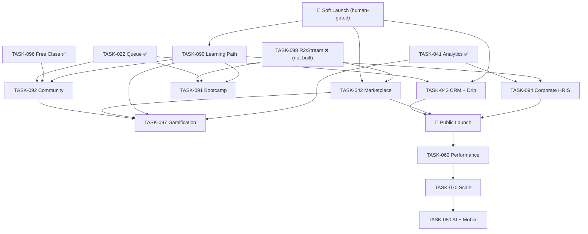

# Phase 6 (Group D) + Group E — Master Architecture Plan

> **Status:** Planning artifact (plan-first). **No feature code, no migrations, no deploy** are produced by this document. Each epic is executed later, **one branch/PR at a time, reviewer-gated, behind feature flags**, only **after 🚀 Soft Launch** (CLAUDE.md §d.3, SSOT §9.2).
>
> Governs: TASK-042, TASK-043, TASK-090, TASK-091, TASK-092, TASK-094, TASK-097 (Group D) and TASK-060/070/080 (Group E — deferred, blueprint only).
> Companion: `docs/adr/0002-phase6-architecture.md` (shared architecture rules), `docs/execution/TASK-042-breakdown.md` (Marketplace subtask split).

---

## 0. Executive summary

Phase 6 turns the 5 launched units into a full platform: a creator **Marketplace**, an internal **CRM + drip automation**, **Learning Paths**, **Bootcamps**, a **Community**, light **Corporate HRIS**, and cross-cutting **Gamification**. All seven reuse existing infrastructure heavily — commerce/DOKU/payout, LMS tenant model, course-progress engine, job queue, feature flags — so the net-new surface is smaller than the prompt implies.

**Two hard constraints shape everything:**

1. **Sequencing (SSOT §9.2 / §d.3):** features are post-Soft-Launch; Group E (060/070/080) is post-Public-Launch. We do not build Group E now.
2. **No mega-dump:** each epic is a discrete PR meeting the repo's own bars — files < 400 lines, ≥80% coverage on money/auth/tenant paths, Zod at every boundary, ADR per deviation, no fabricated data (BL-24/BL-25).

**Recommended build order** (reconciles SSOT §965 `090 → (091 ∥ 092) → 094` with §9.2 `(042 ∥ 043)` and the TASK-097 dependency chain):

```
Soft Launch ✅ (prerequisite — human-gated)
  └─► Wave 1  TASK-090 Learning Path        (reuses progress engine; lowest risk; unlocks 091/092/094 patterns)
  └─► Wave 1  TASK-043 CRM + Drip           (parallel; reuses Lead + queue; no money)
  └─► Wave 2  TASK-042 Marketplace          (split 042a–f; needs R2/TASK-098; money — highest risk)
  └─► Wave 2  TASK-092 Community            (parallel; reuses Event + queue + free-class 096)
  └─► Wave 3  TASK-091 Bootcamp             (reuses LMS batch + Event + Stream + payment)
  └─► Wave 3  TASK-097 Gamification         (needs 041 events; last — depends on the others' events)
  └─► Wave 4  TASK-094 Corporate HRIS       (extends LMS B2B; strictest tenant isolation)
Public Launch 🚀
  └─► Group E  TASK-060 → 070 → 080         (deferred — see §9)
```

Rationale for putting **090 first**: it is the only epic whose backend already largely exists (progress/enrollment/cert engine), so it validates the module pattern (ADR-0002 §1) cheaply. **097 late**: gamification consumes events emitted by the other epics, so building it last maximizes reuse. **094 last in Group D**: it carries the highest security cost (tenant isolation) and depends on 041 analytics.

---

## 1. Reconciled dependency graph

> SSOT §4.1 and §9.2 graph only 040/041/042/043; the EPIC-7 tasks (090/091/092/094/097) appear **only** in the §965 summary. This graph reconciles both (logged as BL-36).



**Critical external blocker:** TASK-042 (Marketplace) and TASK-091 (Bootcamp) both depend on **TASK-098 (Cloudflare R2 + Stream)**, which is **not implemented** (BL-32) and needs Cloudflare credentials (human-gated). Until R2 is verified, 042/091 can build DB + read paths behind flags but cannot ship signed upload / recording features.

---

## 2. Cross-cutting foundations (build once, before/with Wave 1)

These are shared enablers extracted from the epics so they aren't rebuilt 7 times. Each is small and should land as its own PR early.

| # | Foundation | Why | Touches |
|---|-----------|-----|---------|
| F1 | **API-side feature flags** `apps/api/src/config/features.ts` + `requireFeature()` middleware (404 when off) | Web flags can't kill a live endpoint (ADR-0002 §4) | new file + middleware; web `features.ts` gains `crm/hris/bootcamp` |
| F2 | **Notification abstraction** (channel-agnostic `notify()` over email/WA/push, queue-backed) | TASK-043/091/092 all send drip/reminders; OneSignal push is pending (INC-03) | `services/notification/`, reuse queue (TASK-022) |
| F3 | **Domain event bus → queue** (thin `emitDomainEvent(type,payload)` enqueue helper) | Gamification (097) + CRM (043) + analytics react to the same events; avoids point-to-point coupling | `services/events/`, reuse queue |
| F4 | **`OrderItem.itemType` extension points** (`marketplace_item`, `bootcamp_seat`) + fulfillment handlers | 042/091 monetize through the existing checkout, not a fork (ADR-0002 §2) | `checkout.ts`, `webhooks.ts` fulfillment switch |

---

## 3. TASK-090 — Learning Path  ·  Verdict: HAS-FOUNDATION  ·  Effort M  ·  Risk 🟢 Low

**Scope (SSOT §870):** curated ordered course sequence toward a role ("Data Analyst"), aggregate cross-course progress, prerequisites, path-level certificate.

**Reuse:** `Course`, `CourseEnrollment.progressPct`, `CourseLessonProgress`, `enrollmentService.recalculateCourseProgress`, `Certificate`, cert queue job. Path progress is **derived** from per-course progress — no second progress store (ADR-0002 §6). Replaces static `apps/web/lib/e-course/data.ts`.

**Data model (new):**
```prisma
model LearningPath {
  id          String  @id @default(uuid())
  slug        String  @unique
  title       String
  description String? @db.Text
  role        String? // target role label, e.g. "Data Analyst"
  status      String  @default("draft") // draft | published | archived
  coverUrl    String?
  createdAt   DateTime @default(now())
  updatedAt   DateTime @updatedAt
  items       LearningPathItem[]
  enrollments LearningPathEnrollment[]
  @@index([status])
  @@map("learning_paths")
}
model LearningPathItem {
  id           String  @id @default(uuid())
  pathId       String
  courseId     String
  order        Int
  isRequired   Boolean @default(true)
  prereqItemId String? // must complete this item first (nullable = no prereq)
  path         LearningPath @relation(fields: [pathId], references: [id], onDelete: Cascade)
  course       Course       @relation(fields: [courseId], references: [id])
  @@unique([pathId, courseId])
  @@index([pathId, order])
  @@map("learning_path_items")
}
model LearningPathEnrollment {
  id          String   @id @default(uuid())
  pathId      String
  userId      String
  enrolledAt  DateTime @default(now())
  completedAt DateTime?
  certificateId String?
  path        LearningPath @relation(fields: [pathId], references: [id])
  user        User         @relation(fields: [userId], references: [id])
  @@unique([pathId, userId])
  @@index([userId])
  @@map("learning_path_enrollments")
}
```

**API (`modules/learning-path/`):** `GET /api/learning-paths` (public, published), `GET /:slug`, `POST /:id/enroll` (auth), `GET /:id/progress` (auth; aggregates course progress), admin CRUD + item ordering (super_admin). Path completion → enqueue cert job when all `isRequired` items complete.

**Web:** replace static e-course data with DB fetch (`lib/api/learningPath.ts`), path detail page with aggregate progress bar, gate behind `features.learningPath`.

**PR sequence:** `090a` schema+migration → `090b` API read+enroll+progress → `090c` admin CRUD+ordering → `090d` web wiring + flag. **Tests:** progress-aggregation unit test, enroll integration, prereq-lock integration, cert-issue-on-complete.

---

## 4. TASK-043 — CRM + Drip Automation  ·  Verdict: GREENFIELD (+Lead)  ·  Effort M/L  ·  Risk 🟡 Med

**Scope (SSOT §794):** CRM pipeline (Lead/LeadStage/LeadActivity) + admin view; drip campaigns (welcome/nurture/win-back); OneSignal push + preference center. No money.

**Reuse:** existing `Lead` model + `routes/leads.ts` (capture already live), queue (TASK-022), F2 notification abstraction, F3 event bus. Depends on OneSignal (pending, INC-03) — push degrades safe if unconfigured.

**Data model (new; extends Lead):**
```prisma
model LeadActivity {
  id        String   @id @default(uuid())
  leadId    String
  type      String   // note | email_sent | email_opened | stage_change | call | webhook
  payload   Json?
  createdBy String?  // admin userId, null = system
  createdAt DateTime @default(now())
  lead      Lead     @relation(fields: [leadId], references: [id], onDelete: Cascade)
  @@index([leadId, createdAt])
  @@map("lead_activities")
}
model DripCampaign {
  id        String   @id @default(uuid())
  key       String   @unique // welcome | nurture | win_back
  name      String
  isActive  Boolean  @default(false)
  steps     DripStep[]
  createdAt DateTime @default(now())
  updatedAt DateTime @updatedAt
  @@map("drip_campaigns")
}
model DripStep {
  id         String @id @default(uuid())
  campaignId String
  order      Int
  delayHours Int    // send N hours after enrollment / previous step
  channel    String // email | push | wa
  templateId String
  campaign   DripCampaign @relation(fields: [campaignId], references: [id], onDelete: Cascade)
  @@index([campaignId, order])
  @@map("drip_steps")
}
model DripEnrollment {
  id           String   @id @default(uuid())
  campaignId   String
  leadId       String
  currentStep  Int      @default(0)
  status       String   @default("active") // active | completed | unsubscribed
  nextSendAt   DateTime?
  enrolledAt   DateTime @default(now())
  @@unique([campaignId, leadId])
  @@index([status, nextSendAt]) // scheduler poll
  @@map("drip_enrollments")
}
model NotificationPreference {
  id        String  @id @default(uuid())
  userId    String  @unique
  email     Boolean @default(true)
  push      Boolean @default(true)
  wa        Boolean @default(false)
  updatedAt DateTime @updatedAt
  @@map("notification_preferences")
}
```

**Automation engine:** a scheduled worker (reuse BullMQ repeatable job) polls `DripEnrollment` where `nextSendAt <= now && status=active`, sends the step via F2, advances `currentStep`/`nextSendAt`. Lead stage changes emit F3 events that can auto-enroll into campaigns. **Idempotency:** each send keyed by `(enrollmentId, step)` to survive retries.

**API (`modules/crm/`):** admin pipeline board (`GET/PATCH /api/crm/leads`, stage moves, `POST /leads/:id/activities`), campaign CRUD, `GET/PUT /api/crm/preferences` (user preference center + public unsubscribe token). Admin-gated except preference center.

**PR sequence:** `043a` LeadActivity + pipeline API + admin board → `043b` notification abstraction (F2) + preference center → `043c` drip schema + scheduler worker → `043d` campaign templates (welcome/nurture/win-back) + event auto-enroll. **Tests:** scheduler advances only due steps, idempotent send, unsubscribe halts campaign, preference gating.

---

## 5. TASK-092 — Community  ·  Verdict: PARTIAL-SHELL (flag only)  ·  Effort M–L  ·  Risk 🟡 Med

**Scope (SSOT §912):** discussion groups, threads/posts/comments, reactions, mentions, moderation + reporting, notifications, monthly free class/workshop scheduling. Feeds gamification.

**Reuse:** `Event` (free class/workshop via TASK-096), review-style moderation pattern, F2 notifications, F3 events (post/comment → gamification), `User` profile.

**Data model (new):**
```prisma
model CommunityGroup {
  id          String @id @default(uuid())
  slug        String @unique
  name        String
  description String? @db.Text
  visibility  String @default("public") // public | members | private
  createdAt   DateTime @default(now())
  memberships CommunityMembership[]
  posts       CommunityPost[]
  @@map("community_groups")
}
model CommunityMembership {
  id       String @id @default(uuid())
  groupId  String
  userId   String
  role     String @default("member") // member | moderator
  joinedAt DateTime @default(now())
  @@unique([groupId, userId])
  @@index([userId])
  @@map("community_memberships")
}
model CommunityPost {
  id        String @id @default(uuid())
  groupId   String
  authorId  String
  title     String?
  body      String @db.Text
  status    String @default("visible") // visible | hidden | removed
  pinnedAt  DateTime?
  createdAt DateTime @default(now())
  updatedAt DateTime @updatedAt
  comments  CommunityComment[]
  reactions CommunityReaction[]
  @@index([groupId, createdAt])
  @@map("community_posts")
}
model CommunityComment {
  id        String @id @default(uuid())
  postId    String
  authorId  String
  body      String @db.Text
  status    String @default("visible")
  createdAt DateTime @default(now())
  @@index([postId, createdAt])
  @@map("community_comments")
}
model CommunityReaction {
  id       String @id @default(uuid())
  postId   String
  userId   String
  type     String // like | insightful | celebrate
  @@unique([postId, userId, type])
  @@map("community_reactions")
}
model CommunityReport {
  id         String @id @default(uuid())
  targetType String // post | comment
  targetId   String
  reporterId String
  reason     String
  status     String @default("open") // open | actioned | dismissed
  createdAt  DateTime @default(now())
  @@index([status, createdAt])
  @@map("community_reports")
}
```

**Moderation:** posts/comments default `visible`; reports create `CommunityReport`; moderators (membership role or super_admin) hide/remove. Rate-limit post/comment creation (anti-spam). Mentions parsed server-side → F2 notification. **XSS:** post/comment body rendered as text or sanitized markdown (never raw HTML — web/security rule).

**PR sequence:** `092a` groups + membership → `092b` posts/comments/reactions + rate limit → `092c` moderation + reporting → `092d` mentions/notifications + free-class scheduling + web + flag. **Tests:** visibility gating by group, moderation state machine, report flow, rate-limit, mention notification.

---

## 6. TASK-091 — Bootcamp / Live Cohort  ·  Verdict: GREENFIELD (reuse Lms*)  ·  Effort L  ·  Risk 🟠 Med-High

**Scope (SSOT §890):** cohort bootcamp — seat-limited enrollment, scheduled live sessions (link + recording), semi-private mentoring groups, assignment/portfolio submission + mentor feedback, attendance, grading, completion certificate.

**Reuse:** `LmsBatch`/`LmsBatchMember` (cohort primitive), `Event` (live session), `Trainer`, commerce (`bootcamp_seat` itemType via F4), Cloudflare **Stream** for recordings (**needs TASK-098**), cert queue, F2 reminders.

**Data model (new):**
```prisma
model Bootcamp {
  id          String @id @default(uuid())
  slug        String @unique
  title       String
  description String? @db.Text
  price       Decimal @db.Decimal(12,2)
  status      String @default("draft") // draft | published | archived
  cohorts     BootcampCohort[]
  @@map("bootcamps")
}
model BootcampCohort {
  id          String @id @default(uuid())
  bootcampId  String
  name        String // "Batch 1 - Aug 2026"
  seatLimit   Int
  startDate   DateTime
  endDate     DateTime
  status      String @default("open") // open | running | finished | cancelled
  bootcamp    Bootcamp @relation(fields: [bootcampId], references: [id])
  enrollments BootcampEnrollment[]
  sessions    BootcampSession[]
  groups      MentoringGroup[]
  @@index([bootcampId, status])
  @@map("bootcamp_cohorts")
}
model BootcampEnrollment {
  id         String @id @default(uuid())
  cohortId   String
  userId     String
  orderId    String? // links to commerce Order (bootcamp_seat)
  groupId    String?
  status     String @default("active") // active | completed | dropped
  finalGrade Decimal? @db.Decimal(5,2)
  certificateId String?
  enrolledAt DateTime @default(now())
  @@unique([cohortId, userId])
  @@index([cohortId])
  @@map("bootcamp_enrollments")
}
model BootcampSession {
  id          String @id @default(uuid())
  cohortId    String
  title       String
  scheduledAt DateTime
  liveUrl     String?
  recordingId String? // Cloudflare Stream uid (TASK-098)
  @@index([cohortId, scheduledAt])
  @@map("bootcamp_sessions")
}
model MentoringGroup {
  id        String @id @default(uuid())
  cohortId  String
  mentorId  String // Trainer/User id
  name      String
  @@index([cohortId])
  @@map("mentoring_groups")
}
model PortfolioSubmission {
  id           String @id @default(uuid())
  enrollmentId String
  sessionId    String?
  url          String
  note         String? @db.Text
  grade        Decimal? @db.Decimal(5,2)
  feedback     String? @db.Text
  gradedBy     String?
  status       String @default("submitted") // submitted | graded | revise
  createdAt    DateTime @default(now())
  @@index([enrollmentId])
  @@map("portfolio_submissions")
}
```

**Seat concurrency:** enrollment must not oversell — reserve seat in a transaction checking `count(enrollments) < seatLimit` before/at payment fulfillment. Attendance = join records per session. Completion (attendance + graded portfolio ≥ passMark) → cert job.

**PR sequence:** `091a` bootcamp/cohort schema + admin CRUD → `091b` enrollment via commerce (`bootcamp_seat`) + seat-limit txn → `091c` sessions + attendance + Stream recording (gated on 098) → `091d` mentoring groups + portfolio submit/grade → `091e` completion + cert + reminders + web + flag. **Tests:** no oversell under concurrent enroll, payment→seat fulfillment, grading state machine, completion→cert.

---

## 7. TASK-097 — Gamification  ·  Verdict: PARTIAL-SHELL (orphan UI, no data)  ·  Effort M  ·  Risk 🟠 Med-High (abuse)

**Scope (SSOT §800):** real XP/points/streak, badges, leaderboard from real data, missions/challenges; integrate with LMS/Marketplace/Community/Subscription activity. **UI stays flag-OFF until data + anti-abuse ready (TD-27).** No fabricated leaderboard (BL-25).

**Architecture (ADR-0002 §5):** event-sourced. Append-only ledger is truth; stats are a derived projection; awards enqueued from F3 domain events, never synchronous in hot paths.

**Data model (new):**
```prisma
model GamificationEvent {   // append-only ledger — source of truth
  id         String @id @default(uuid())
  userId     String
  type       String // lesson_complete | purchase | post_created | streak_day | mission_complete
  points     Int
  sourceType String // course | order | community_post | ...
  sourceId   String
  dedupeKey  String @unique // e.g. "lesson_complete:userId:lessonId" — blocks double-award
  createdAt  DateTime @default(now())
  @@index([userId, createdAt])
  @@map("gamification_events")
}
model UserGameStat {         // derived projection (recompute from ledger)
  userId      String  @id
  totalXp     Int     @default(0)
  level       Int     @default(1)
  currentStreak Int   @default(0)
  longestStreak Int   @default(0)
  lastActiveOn DateTime?
  updatedAt   DateTime @updatedAt
  @@index([totalXp]) // leaderboard
  @@map("user_game_stats")
}
model Badge {
  id        String @id @default(uuid())
  key       String @unique
  name      String
  description String?
  iconUrl   String?
  criteria  Json   // rule descriptor evaluated by the engine
  @@map("badges")
}
model UserBadge {
  id       String @id @default(uuid())
  userId   String
  badgeId  String
  earnedAt DateTime @default(now())
  @@unique([userId, badgeId])
  @@map("user_badges")
}
model Mission {
  id        String @id @default(uuid())
  key       String @unique
  name      String
  goalType  String // complete_courses | streak_days | community_posts
  goalCount Int
  rewardXp  Int
  isActive  Boolean @default(false)
  @@map("missions")
}
```

**Anti-abuse (gating conditions before flag ON):** `dedupeKey` unique constraint blocks double-award; per-user per-type rate limits; points awarded only from server-side verified domain events (never client-reported); leaderboard reads the derived projection with pagination. **Streak** computed from distinct active days, not raw event count.

**PR sequence:** `097a` ledger + projection + recompute service → `097b` event handlers (subscribe F3: lesson/purchase/post) + dedupe/rate-limit → `097c` badges + missions engine → `097d` leaderboard API (real data) + replace `LeaderboardSection.tsx` sample data → `097e` anti-abuse review + enable flag. **Tests:** dedupe blocks double-award, projection matches ledger sum, streak calc, leaderboard pagination, rate-limit.

---

## 8. TASK-094 — Corporate HRIS (light)  ·  Verdict: GREENFIELD (extend LMS B2B)  ·  Effort L  ·  Risk 🔴 High (tenant isolation)

**Scope (SSOT §933, guarded by TD-26):** **light** performance management as an extension of LMS B2B — KPI monitoring, skill matrix, upskilling recommendation per employee/tenant. **NOT** a standalone full HRIS (no payroll processing, no attendance clock — "ringan" only). The prompt's "payroll/absensi/onboarding" is explicitly **out of scope** per TD-26; captured as future backlog, not built.

**Reuse:** `LmsTenant`, `LmsCourseAssignment`, `LmsEnrollment`, LMS reporting, `UserRole{lms_admin,tenantId}` guards. **Every model is tenant-scoped and every query guarded (ADR-0002 §3 — RISK-SEC3).**

**Data model (new; all `tenantId`-scoped):**
```prisma
model KpiMetric {
  id        String @id @default(uuid())
  tenantId  String
  userId    String // employee
  name      String
  target    Decimal @db.Decimal(12,2)
  actual    Decimal @db.Decimal(12,2) @default(0)
  period    String // 2026-Q3
  createdAt DateTime @default(now())
  tenant    LmsTenant @relation(fields: [tenantId], references: [id])
  @@index([tenantId, userId, period])
  @@map("kpi_metrics")
}
model EmployeeGoal {
  id        String @id @default(uuid())
  tenantId  String
  userId    String
  title     String
  status    String @default("active") // active | met | missed
  dueOn     DateTime?
  tenant    LmsTenant @relation(fields: [tenantId], references: [id])
  @@index([tenantId, userId])
  @@map("employee_goals")
}
model SkillMatrix {
  id        String @id @default(uuid())
  tenantId  String
  userId    String
  skill     String
  level     Int    // 1..5 self/manager assessed
  updatedAt DateTime @updatedAt
  tenant    LmsTenant @relation(fields: [tenantId], references: [id])
  @@unique([tenantId, userId, skill])
  @@map("skill_matrices")
}
model PerformanceReview {
  id         String @id @default(uuid())
  tenantId   String
  userId     String
  reviewerId String
  period     String
  rating     Decimal @db.Decimal(3,2)
  notes      String? @db.Text
  status     String @default("draft") // draft | submitted | acknowledged
  createdAt  DateTime @default(now())
  tenant     LmsTenant @relation(fields: [tenantId], references: [id])
  @@index([tenantId, period])
  @@map("performance_reviews")
}
```

**Upskilling recommendation:** from `SkillMatrix` gaps → suggest `LmsCourse`/`Course` (rule-based first; AI later in TASK-080). All within tenant.

**PR sequence:** `094a` schema + `requireHrisAdmin` guard (tenant-scoped) → `094b` KPI + goals API → `094c` skill matrix + review → `094d` upskilling recommendation + tenant dashboard + flag. **Tests (mandatory):** **tenant A cannot read/write tenant B** for every endpoint (negative test), RBAC gating, recommendation within tenant only.

---

## 9. Group E — deferred (blueprint only, post-Public-Launch)

Per the decision, Group E is **not implemented now** (premature without real production traffic/baseline). Captured as targets:

- **TASK-060 Performance:** establish CWV baseline (LCP<2.5s, INP<200ms, CLS<0.1) via Lighthouse CI; bundle analyzer on `apps/web`; DB query profiling + index review (LMS hot paths already indexed TASK-021); image/CDN optimization; API response caching (Redis cache-aside already exists). **Precondition:** real traffic to profile.
- **TASK-070 Scale:** horizontal scaling of stateless api/web behind LB; externalize session (already JWT); queue/worker autoscale; Postgres read replica + PgBouncer; DR/backup drill (backup scripts exist); observability dashboards (Sentry/pino/requestId already wired TASK-023).
- **TASK-080 AI + Mobile:** API-first/OpenAPI spec for all endpoints; auth/rate-limit/versioning hardening for third-party consumption; AI foundations (semantic search — Meilisearch live; recommendation reuses gamification/progress events; AI assistant over knowledge base). Mobile = consume the same versioned API.

These become full task templates + ADRs when Public Launch is done. Group E "Enterprise Readiness Report" is produced then, against measured baselines — not guessed now.

---

## 10. Execution rules (apply to every epic)

1. **One epic = one feature branch**, sub-PRs per the `NNNx` sequence above; reviewer-gated; **no push/merge to main without confirmation** (§d.2).
2. **Flag-gated:** ship behind `features.<x>` (web) + `FEATURE_<X>` (API, F1). Default OFF. Nothing surfaces until the epic is complete + reviewed.
3. **No deploy** until Soft Launch is live and the epic passes the §9.11 validation ladder (tsc 0 / ESLint 0 / vitest+coverage / E2E / build / self-review).
4. **≥80% coverage** on money (042/091), auth, and tenant-isolation (094) paths; regression test for every bug fix.
5. **No fabricated data** (BL-24/25) — omit empty sections; gamification stays OFF until real.
6. **ADR per deviation** from ADR-0002; docs updated in the same PR (docs-as-code §9.10).
7. **External deps (R2/Stream/OneSignal) degrade safe** behind interfaces; never block the build.

---

## 11. Status ledger (planning stage)

| Task | Domain | Verdict | Effort | Risk | Plan status |
|------|--------|---------|--------|------|-------------|
| TASK-090 | Learning Path | HAS-FOUNDATION | M | 🟢 | ✅ Planned |
| TASK-043 | CRM + Drip | GREENFIELD (+Lead) | M/L | 🟡 | ✅ Planned |
| TASK-092 | Community | PARTIAL-SHELL | M–L | 🟡 | ✅ Planned |
| TASK-042 | Marketplace | PARTIAL-SHELL + commerce core | XL (split 042a–f) | 🔴 | ✅ Planned — see `TASK-042-breakdown.md` |
| TASK-091 | Bootcamp | GREENFIELD (reuse Lms*) | L | 🟠 | ✅ Planned (blocked on R2/Stream) |
| TASK-097 | Gamification | PARTIAL-SHELL | M | 🟠 | ✅ Planned (flag OFF until anti-abuse) |
| TASK-094 | Corporate HRIS | GREENFIELD (extend B2B) | L | 🔴 | ✅ Planned (tenant isolation gate) |
| TASK-060/070/080 | Group E | — | XL | — | ⏸️ Deferred (blueprint §9) |

**Legend:** ✅ Planned = architecture + data model + PR sequence defined here; no code written. Next action = reviewer approves this plan, Soft Launch completes, then execute Wave 1 (090 ∥ 043) as separate PRs.
